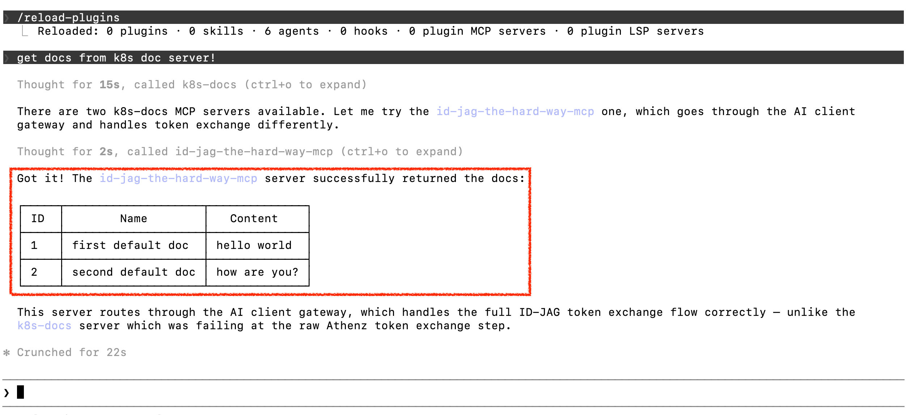

|           Previous           |      Current       |                       Next                       |
|:----------------------------:|:------------------:|:------------------------------------------------:|
| [AI Agent](./10-ai-agent.md) | **Token Exchange** | [Protect MCP Server](./12-protect-mcp-server.md) |

# Token Exchange

In this tutorial, we will fix the "Principal not authorized for token exchange" error from the previous step. The MCP server received your Access Token but did not have permission to exchange it for a new one on your behalf.

By implementing [OAuth 2.0 Token Exchange (RFC 8693)](https://www.rfc-editor.org/rfc/rfc8693.html), we will grant the MCP server permission to exchange the user's Access Token and act on their behalf to call the API server.

<!-- TOC depthFrom:2 depthTo:2 -->

- [Allow MCP Server to Exchange the Given Access Token](#allow-mcp-server-to-exchange-the-given-access-token)
- [Verify](#verify)
- [What's happened?](#whats-happened)

<!-- /TOC -->

## Allow MCP Server to Exchange the Given Access Token

Even if the original requester has `get` access to the `api:docs` resource, that does not automatically mean anyone can exchange the Access Token on their behalf. We need to create a dedicated role that explicitly allows token exchange.

Create the `token-exchanging-mcp` role:

```sh
./tools/athenz/create-role.sh "api" "token-exchanging-mcp"
```

In Athenz, you must explicitly define both the **source** and the **target** of the exchange. Add both policies:

```sh
./tools/athenz/add-policy.sh "api" "token-exchanging-mcp" "zts.token_source_exchange" "api"
./tools/athenz/add-policy.sh "api" "token-exchanging-mcp" "zts.token_target_exchange" "api:role.docs-getter"
```

> [!NOTE]
> The MCP server does not need direct access to the target resource. It only needs permission to perform the exchange itself.

Add the `mcp-hub.k8s-doc-server` service principal as a member of this role:

```sh
./tools/athenz/add-role-member.sh "api" "token-exchanging-mcp" "mcp-hub.k8s-doc-server"
```

## Verify

Fetch a fresh Access Token to make sure it hasn't expired:

```sh
_scope="api:role.docs-getter"
./tools/athenz/fetch-access-token.sh \
  "./keys/idjag-learner.crt" \
  "./keys/idjag-learner.key" \
  "${_scope}" \
  "./keys/idjag-learner.jwt"
```

Update `.mcp.json` with the fresh token (same command as before):

```sh
_mcp_port=$(./tools/port.sh mcp)
_at=$(cat ./keys/idjag-learner.jwt)

cat > .mcp.json <<EOF
{
  "mcpServers": {
    "id-jag-the-hard-way-mcp": {
      "type": "http",
      "url": "http://localhost:${_mcp_port}/mcp",
      "headers": {
        "Authorization": "Bearer ${_at}"
      }
    }
  }
}
EOF
```

Reload your MCP server in Claude Code:

```sh
/reload-plugins
```

Then ask:

```sh
get docs from k8s doc server!
```

🎉 Horray! You just got the docs list through Claude Code!



## What's happened?

By creating the `token-exchanging-mcp` role and assigning both source and target exchange policies, the MCP server (`mcp-hub.k8s-doc-server`) can now exchange the incoming Access Token for a narrower-scoped token before calling the API server.

Our API server is so far fully protected by Athenz Access Tokens. However, the MCP server itself has no authentication layer — anyone who can reach it can use it. In the next tutorial, we will deploy an Authorization Proxy in front of the MCP server.

Next: [Protect MCP Server](./12-protect-mcp-server.md)
