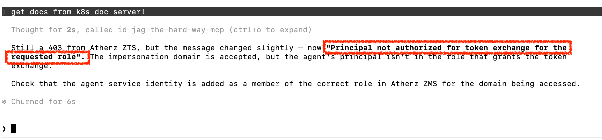

|           Previous           |      Current       |                       Next                       |
|:----------------------------:|:------------------:|:------------------------------------------------:|
| [AI Agent](./10-ai-agent.md) | **Token Exchange** | [Protect MCP Server](./12-protect-mcp-server.md) |

# Token Exchange

In this tutorial, we will fix the "Principal not authorized for token exchange" error from the previous step. The MCP server received your Access Token but did not have permission to exchange it for a new one on your behalf.

By implementing [OAuth 2.0 Token Exchange (RFC 8693)](https://www.rfc-editor.org/rfc/rfc8693.html), we will grant the MCP server permission to exchange the user's Access Token and act on their behalf to call the API server.

> [!NOTE]
> Access Tokens are short-lived. We will fetch a fresh token at the start of this tutorial so Claude does not keep using an expired token from the previous step.

<!-- TOC depthFrom:2 depthTo:2 -->

- [Temporary Same-Domain Token Marker](#temporary-same-domain-token-marker)
- [Refresh the MCP Token](#refresh-the-mcp-token)
- [Allow MCP Server to Exchange the Given Access Token](#allow-mcp-server-to-exchange-the-given-access-token)
- [Allow `api` Domain to Issue `api:role.docs-getter` Tokens](#allow-api-domain-to-issue-apiroledocs-getter-tokens)
- [Verify](#verify)
- [What's happened?](#whats-happened)

<!-- /TOC -->

## Temporary Same-Domain Token Marker

> [!NOTE]
> This step is planned to be removed from tutorial once Athenz supports domain name in scope.

Before fetching a new Access Token, we need to decide why the token is issued from `mcp-hub` instead of `api`.

Today, the client-facing Access Token needs an `mcp-hub` scope because the token is presented to the MCP server first. Since we cannot yet issue a token shaped like `aud=mcp-hub` with `scope=api:role.docs-getter`, we create a temporary `mcp-hub:role.docs-getter` marker. It is not the real API permission; the real API permission remains `api:role.docs-getter`.

Keep this section isolated so it can be removed later as one block. Once Athenz supports `aud=mcp-hub` with `scope=api:role.docs-getter`, we will delete this section and fetch the client token with the real API docs scope instead.

```sh
./tools/athenz/create-role.sh "mcp-hub" "docs-getter"
./tools/athenz/add-role-member.sh "mcp-hub" "docs-getter" "human.idjag-learner"
```

```sh
#   ·  Creating Role: mcp-hub:role.docs-getter...
#   ✔  Role created: mcp-hub:role.docs-getter
#   ·  Adding Member human.idjag-learner to Role: mcp-hub:role.docs-getter...
#   ✔  human.idjag-learner  →  mcp-hub:role.docs-getter
```

## Refresh the MCP Token

Let's fetch a fresh Access Token in case the token from the previous tutorial has expired. For now, fetch the temporary marker scope.

When the temporary same-domain marker is removed, this scope should move back to the real API permission: `api:role.docs-getter`.

```sh
_scope="mcp-hub:role.docs-getter"
./tools/athenz/fetch-access-token.sh \
  "./keys/idjag-learner.crt" \
  "./keys/idjag-learner.key" \
  "${_scope}" \
  "./keys/idjag-learner.jwt"
```

Update `.mcp.json` with the fresh token:

```sh
_mcp_port=$(./tools/port.sh mcp)
_at=$(cat ./keys/idjag-learner.jwt)

cat > .mcp.json <<EOF
{
  "mcpServers": {
    "id-jag-the-hard-way-mcp": {
      "type": "http",
      "url": "http://localhost:${_mcp_port}/mcp",
      "headers": {
        "Authorization": "Bearer ${_at}"
      }
    }
  }
}
EOF
```

## Allow MCP Server to Exchange the Given Access Token

Even if the original requester has `get` access to the `api:docs` resource, that does not automatically mean anyone can exchange the Access Token on their behalf. We need explicit source and target exchange policies.

From this point on, we will give the MCP server an incoming token from the `mcp-hub` domain. This keeps the client-facing token aligned with the MCP server that receives it. The MCP server will then exchange that token into the real API permission, `api:role.docs-getter`, before calling the API server.

Create the source-side exchange permission in `mcp-hub`.

Here, the policy lives in `mcp-hub` because the incoming Access Token has `aud=mcp-hub`. The resource argument is `api` because this source token is allowed to be exchanged into the `api` domain.

```sh
./tools/athenz/create-role.sh "mcp-hub" "to-api-exchanger"
./tools/athenz/add-role-member.sh "mcp-hub" "to-api-exchanger" "mcp-hub.api-mcp"
./tools/athenz/add-policy.sh "mcp-hub" "to-api-exchanger" "zts.token_source_exchange" "api"
```

```sh
#   ·  Creating Role: mcp-hub:role.to-api-exchanger...
#   ✔  Role created: mcp-hub:role.to-api-exchanger
#   ·  Adding Member mcp-hub.api-mcp to Role: mcp-hub:role.to-api-exchanger...
#   ✔  mcp-hub.api-mcp  →  mcp-hub:role.to-api-exchanger
#   ·  Creating Policy: mcp-hub:policy.to-api-exchanger_zts_token_source_exchange_api...
#   ✔  Policy created: mcp-hub:policy.to-api-exchanger_zts_token_source_exchange_api
```

Try asking Claude again:

```sh
get docs from k8s doc server!
```



This still fails with a token exchange permission error. That is expected: `mcp-hub` now allows this source token to be exchanged toward `api`, but `api` has not yet said who may receive `api:role.docs-getter` as the target token.

## Allow `api` Domain to Issue `api:role.docs-getter` Tokens

The previous step only answered the source-side question: can an `mcp-hub` token be used as a source token for exchange toward `api`?

Now the `api` domain must answer the target-side question: who is allowed to receive an `api:role.docs-getter` token from token exchange? This decision belongs in `api` because `api` owns the `docs-getter` role and the protected docs resource.

Create a narrowly scoped exchanger role in `api`. Only members of this role can exchange into `api:role.docs-getter`:

```sh
./tools/athenz/create-role.sh "api" "docs-getter-exchanger"
./tools/athenz/add-role-member.sh "api" "docs-getter-exchanger" "mcp-hub.api-mcp"
./tools/athenz/add-policy.sh "api" "docs-getter-exchanger" "zts.token_target_exchange" "api:role.docs-getter"
```

```sh
#   ·  Creating Role: api:role.docs-getter-exchanger...
#   ✔  Role created: api:role.docs-getter-exchanger
#   ·  Adding Member mcp-hub.api-mcp to Role: api:role.docs-getter-exchanger...
#   ✔  mcp-hub.api-mcp  →  api:role.docs-getter-exchanger
#   ·  Creating Policy: api:policy.docs-getter-exchanger_zts_token_target_exchange_api_role_docs-getter...
#   ✔  Policy created: api:policy.docs-getter-exchanger_zts_token_target_exchange_api_role_docs-getter
```

After this, `mcp-hub.api-mcp` can receive only the `api:role.docs-getter` target token. It still cannot exchange into other API roles unless `api` explicitly creates and grants separate target-side exchange permissions for those roles.

> [!NOTE]
> The MCP server does not need direct access to the target resource. It only needs permission to perform the exchange itself.

## Verify

Reload your MCP server in Claude Code:

```sh
/reload-plugins
```

Then ask:

```sh
get docs from k8s doc server!
```

🎉 Horray! You just got the docs list through Claude Code!


## What's happened?

By creating source-exchange permission in `mcp-hub` and target-exchange permission in `api`, the MCP server (`mcp-hub.api-mcp`) can now exchange the incoming `mcp-hub` Access Token for a narrower-scoped `api` Access Token before calling the API server.

Our API server is so far fully protected by Athenz Access Tokens. However, the MCP server itself has no authentication layer — anyone who can reach it can use it. In the next tutorial, we will deploy an Authorization Proxy in front of the MCP server.

Next: [Protect MCP Server](./12-protect-mcp-server.md)
