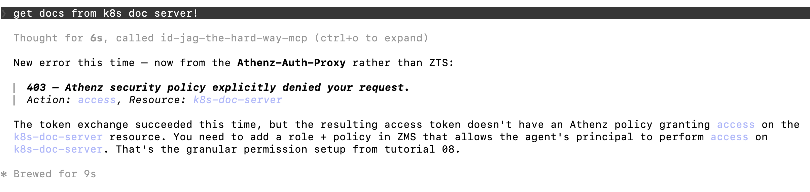
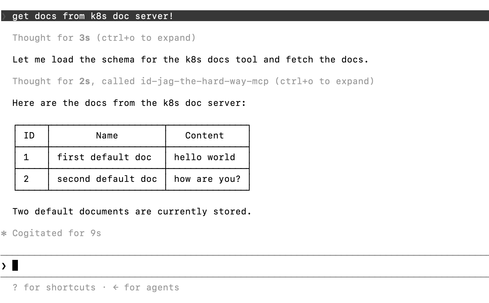

|                 Previous                 |        Current         |                      Next                      |
|:----------------------------------------:|:----------------------:|:----------------------------------------------:|
| [Token Exchange](./11-token-exchange.md) | **Protect MCP Server** | [Identity Provider](./13-identity-provider.md) |

# Protect MCP Server

In this tutorial, we will secure the MCP server using an Authorization Proxy — exactly as we protected the API server with Athenz in earlier tutorials.

<!-- TOC depthFrom:2 depthTo:2 -->

- [Run Authorization Proxy for MCP Hub](#run-authorization-proxy-for-mcp-hub)
- [Service Cert for MCP Hub ZPU](#service-cert-for-mcp-hub-zpu)
- [Update the MCP Service to Point to the Proxy](#update-the-mcp-service-to-point-to-the-proxy)
- [Verify (Expected Failure)](#verify-expected-failure)
- [Fix Insufficient Permission](#fix-insufficient-permission)
- [Fetch a New Access Token for the New Role](#fetch-a-new-access-token-for-the-new-role)
- [Update .mcp.json with the New Token](#update-mcpjson-with-the-new-token)
- [Verify](#verify)
- [Review Summary of Changes](#review-summary-of-changes)
- [What's next?](#whats-next)

<!-- /TOC -->

## Run Authorization Proxy for MCP Hub

Deploy the authorization proxy as a sidecar container in the `api-mcp` deployment. It will intercept all incoming requests and verify the Athenz Access Token before forwarding to the real MCP server:

```sh
kubectl patch deploy api-mcp -n mcp-hub --patch "$(cat <<'EOF'
spec:
  template:
    spec:
      containers:
        - name: auth-proxy
          image: ghcr.io/mlajkim/mcp-authorization-proxy:latest
          imagePullPolicy: Always
          env:
            - name: SERVER_PORT
              value: "8082"
            - name: MCP_TARGET_URL
              value: "http://localhost:8081"
            - name: MCP_RESOURCE
              value: "api-mcp"
          ports:
            - containerPort: 8082
EOF
)"
```

## Service Cert for MCP Hub ZPU

The ZPU sidecar needs a service identity in the `mcp-hub` domain so it can fetch and evaluate the MCP Hub policies locally.

```sh
./tools/athenz/create-private-key.sh "./keys/zpu"
./tools/athenz/create-service.sh "mcp-hub" "zpu" "./keys/zpu.public.key"
./tools/athenz/enable-cert-provider.sh "mcp-hub" "zpu"
./tools/athenz/fetch-cert.sh "mcp-hub" "zpu" "./keys/zpu.key" "v1"

kubectl -n mcp-hub delete secret mcp-hub-zpu-cert --ignore-not-found
kubectl -n mcp-hub create secret generic mcp-hub-zpu-cert \
  --from-file=cert=./keys/zpu.crt \
  --from-file=key=./keys/zpu.key \
  --from-file=ca=./athenz_dist/certs/ca.cert.pem
```

```sh
#   ·  Generating RSA key pair for: ./keys/zpu...
#   ✔  Keys generated: ./keys/zpu.key, ./keys/zpu.public.key
#   ·  Registering Service: mcp-hub.zpu...
#   ✔  Service registered: mcp-hub.zpu
#   ·  Enabling ZTS Certificate Provider for mcp-hub.zpu...
# [Template(s) successfully applied to domain]
#   ✔  ZTS Certificate Provider enabled for mcp-hub.zpu
#   ·  Fetching X.509 Certificate for mcp-hub.zpu...
# command terminated with exit code 1
#   ⚠  Certificate fetch attempt 1/5 failed; retrying in 3s...
#   ✔  Certificate saved to: ./keys/zpu.crt
# secret/mcp-hub-zpu-cert created
```

Attach the ZPU sidecar so the proxy can evaluate policies locally:

```sh
kubectl patch deploy api-mcp -n mcp-hub --patch "$(cat <<'EOF'
spec:
  template:
    spec:
      containers:
        - name: auth-proxy
          volumeMounts:
            - name: mcp-hub-policies
              mountPath: /app/policies
              readOnly: true
        - name: zpu
          image: ghcr.io/mlajkim/zpu:latest
          imagePullPolicy: Always
          env:
            - name: ZPU_DOMAIN
              value: "mcp-hub"
            - name: ZTS_URL
              value: "https://athenz-zts-server.athenz:4443/zts/v1"
            - name: ZPU_INTERVAL_SECONDS
              value: "5"
          volumeMounts:
            - name: mcp-hub-policies
              mountPath: /policies
            - name: mcp-hub-zpu-cert
              mountPath: /var/run/athenz/zpu
              readOnly: true
      volumes:
        - name: mcp-hub-policies
          emptyDir: {}
        - name: mcp-hub-zpu-cert
          secret:
            secretName: mcp-hub-zpu-cert
            defaultMode: 0400
EOF
)"
```

```sh
# deployment.apps/api-mcp patched
```

## Update the MCP Service to Point to the Proxy

The `api-mcp` service currently routes traffic directly to the MCP container on port `8081`. We need to re-point it to the proxy on port `8082`:

```sh
kubectl delete svc api-mcp -n mcp-hub
kubectl expose deploy api-mcp -n mcp-hub --port 8081 --target-port 8082 --name api-mcp
```

## Verify (Expected Failure)

> [!WARNING]
> This step will intentionally fail — that is the point, and you will fix it in the next section.

Reload the plugin in Claude Code, then ask:

```sh
/reload-plugins
```

```sh
get docs from k8s doc server!
```



This fails because the proxy requires `access` on the `mcp-hub:api-mcp` resource, and we haven't created that policy yet.

You can also see from the log of the `auth-proxy` container that the request was rejected:

```sh
kubectl logs deploy/api-mcp -n mcp-hub -c auth-proxy
```

```sh
# =========================================================
# 🚀 OpenAPI MCP Auth Proxy Server listening on: http://0.0.0.0:8082
# 🔗 Upstream API: http://localhost:8081
# 📄 OpenAPI Spec available at: http://0.0.0.0:8082/openapi.json
# 📄 MCP endpoint available at: http://0.0.0.0:8082/mcp
# =========================================================

# [2026-06-21 01:38:33] [WARN] [MCP-Auth-Proxy] ❌ REJECTED: Policy denied access. (Action: 'access', Resource: 'api-mcp', Token: eyJraWQiOi...)
```

## Fix Insufficient Permission

Create the `api-mcp-accessor` role and attach the required policy.

For now, also create a temporary `docs-getter` role in `mcp-hub`. This keeps the client-facing Access Token in a single Athenz domain while the current Athenz server does not support multi-domain scopes in one token. The real API permission remains `api:role.docs-getter`; the MCP server will exchange into that API-domain role before calling the API server.

```sh
./tools/athenz/create-role.sh "mcp-hub" "api-mcp-accessor"
./tools/athenz/create-role.sh "mcp-hub" "docs-getter"
./tools/athenz/create-role.sh "mcp-hub" "token-exchanging-mcp"
./tools/athenz/add-policy.sh "mcp-hub" "api-mcp-accessor" "access" "api-mcp"
```

```sh
#   ·  Creating Role: mcp-hub:role.api-mcp-accessor...
#   ✔  Role created: mcp-hub:role.api-mcp-accessor
#   ·  Creating Role: mcp-hub:role.docs-getter...
#   ✔  Role created: mcp-hub:role.docs-getter
#   ·  Creating Role: mcp-hub:role.token-exchanging-mcp...
#   ✔  Role created: mcp-hub:role.token-exchanging-mcp
#   ·  Creating Policy: mcp-hub:policy.api-mcp-accessor_access_api-mcp...
#   ✔  Policy created: mcp-hub:policy.api-mcp-accessor_access_api-mcp
```

Add `human.idjag-learner` (the identity whose token we are using) as a member of both client-facing roles, and add the MCP server service identity to the source exchange role:

```sh
./tools/athenz/add-role-member.sh "mcp-hub" "api-mcp-accessor" "human.idjag-learner"
./tools/athenz/add-role-member.sh "mcp-hub" "docs-getter" "human.idjag-learner"
./tools/athenz/add-role-member.sh "mcp-hub" "token-exchanging-mcp" "mcp-hub.api-mcp"
```

```sh
#   ·  Adding Member human.idjag-learner to Role: mcp-hub:role.api-mcp-accessor...
#   ✔  human.idjag-learner  →  mcp-hub:role.api-mcp-accessor
#   ·  Adding Member human.idjag-learner to Role: mcp-hub:role.docs-getter...
#   ✔  human.idjag-learner  →  mcp-hub:role.docs-getter
#   ·  Adding Member mcp-hub.api-mcp to Role: mcp-hub:role.token-exchanging-mcp...
#   ✔  mcp-hub.api-mcp  →  mcp-hub:role.token-exchanging-mcp
```

Allow the MCP server to exchange from an `mcp-hub` token into an `api` token. ZTS checks source exchange in the source domain (`mcp-hub:api`) and target exchange in the target domain (`api:mcp-hub:role.docs-getter`):

```sh
./tools/athenz/add-policy.sh "mcp-hub" "token-exchanging-mcp" "zts.token_source_exchange" "api"
./tools/athenz/add-policy.sh "api" "token-exchanging-mcp" "zts.token_target_exchange" "mcp-hub:role.docs-getter"
```

```sh
#   ·  Creating Policy: mcp-hub:policy.token-exchanging-mcp_zts_token_source_exchange_api...
#   ✔  Policy created: mcp-hub:policy.token-exchanging-mcp_zts_token_source_exchange_api
#   ·  Creating Policy: api:policy.token-exchanging-mcp_zts_token_target_exchange_mcp-hub_role_docs-getter...
#   ✔  Policy created: api:policy.token-exchanging-mcp_zts_token_target_exchange_mcp-hub_role_docs-getter
```

## Fetch a New Access Token for the New Role

> [!NOTE]
> 🟡 TODO: The current Athenz Server does NOT support multi-domain scopes. The temporary `mcp-hub:role.docs-getter` role can be removed once that is fixed.

The Access Token must now include both `mcp-hub` scopes — one to pass through the MCP proxy, and one to represent the downstream docs permission before token exchange:

```sh
_scope="mcp-hub:role.api-mcp-accessor mcp-hub:role.docs-getter"
./tools/athenz/fetch-access-token.sh \
  "./keys/idjag-learner.crt" \
  "./keys/idjag-learner.key" \
  "${_scope}" \
  "./keys/idjag-learner.jwt"
```

Verify that the token's `scp` claim contains both roles:

```json
"scp": [
  "docs-getter",
  "api-mcp-accessor"
],
```

## Update .mcp.json with the New Token

```sh
_mcp_port=$(./tools/port.sh mcp)
_at=$(cat ./keys/idjag-learner.jwt)

cat > .mcp.json <<EOF
{
  "mcpServers": {
    "id-jag-the-hard-way-mcp": {
      "type": "http",
      "url": "http://localhost:${_mcp_port}/mcp",
      "headers": {
        "Authorization": "Bearer ${_at}"
      }
    }
  }
}
EOF
```

## Verify

Reload in Claude Code, then ask:

```sh
/reload-plugins
```

```sh
get docs from k8s doc server!
```



Check the MCP server logs to confirm the proxy authorized the request:

```sh
kubectl logs deploy/api-mcp -n mcp-hub -c auth-proxy
```

```sh
# ✅ AUTHORIZED: 'access' on 'api-mcp' (Token: eyJraWQi...)
# ➡️  Forwarding to downstream MCP Server
```

## Review Summary of Changes

We deployed the Authorization Proxy in front of the MCP server. Only callers whose Access Token carries the `mcp-hub:role.api-mcp-accessor` scope can reach the MCP server. Everything else is rejected at the proxy — the MCP server itself never sees an unauthorized request.

## What's next?

We have been using the `human.idjag-learner` certificate to fetch Access Tokens — a static X.509 identity that represents a human user in Athenz. In a real enterprise environment, users sign in through an Identity Provider. In the next tutorial, we will deploy Keycloak so that individual users can sign in with their own credentials and receive a proper ID token.

Next: [Identity Provider](./13-identity-provider.md)
