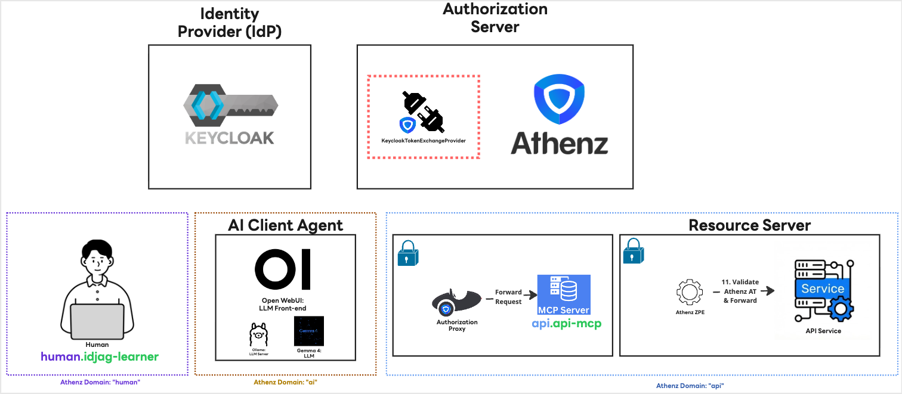
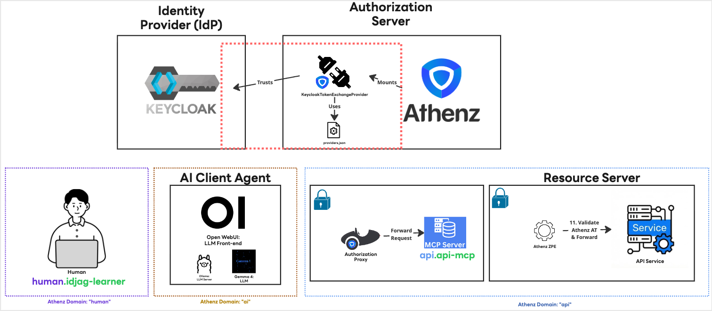

|                    Previous                    |            Current            |           Next           |
|:----------------------------------------------:|:-----------------------------:|:------------------------:|
| [Identity Provider](./11-identity-provider.md) | **Trusted Identity Provider** | [ID-JAG](./13-id-jag.md) |

# Trusted Identity Provider

In this tutorial, we will configure the authorization server (Athenz) to trust Keycloak as an Identity Provider (IdP).

## Learn What to Do

So far, we have been running Athenz and Keycloak locally. However, Athenz does not trust any IdP by default unless explicitly configured. To exchange a Keycloak-generated ID token for an ID-JAG token, the Athenz server must be able to trust and verify the Keycloak server. Additionally, Athenz needs to be instructed on how to handle the specific token formats of external IdPs.

Therefore, our goals are to:

- Instruct Athenz on how to verify our specific IdP (Keycloak).
- Establish trust between Athenz and the IdP.
- Provide Athenz with the endpoint (`jwks_uri`) to fetch the public keys required to verify the IdP-signed tokens.

## Install Plugin into the ZTS Server

The Authorization Server does not natively know how to handle tokens generated by a specific IdP. We need to install a plugin that teaches it how to process these tokens. The plugin files are located in the `keycloak_token_exchange_provider` directory. Let's apply a patch to our Athenz server to mount and use this plugin:

```sh
kubectl patch deployment athenz-zts-server -n athenz --patch-file keycloak_token_exchange_provider/hack/static/zts-plugin-jar-mount-patch.yaml
```

> [!NOTE]
> This command applies the following patch YAML: [zts-providers-config-patch.yaml](https://github.com/athenz-community/keycloak-token-exchange-identity-provider-manifest/blob/main/hack/static/zts-providers-config-patch.yaml)

Verify that the JAR file has been successfully mounted inside the Athenz server container:

```sh
kubectl -n athenz exec deployment/athenz-zts-server -c athenz-zts-server -- sh -c "ls -al /opt/athenz/zts/lib/jars | grep keycloak"

# -rw-r--r-- 1 root   root      3237 May  1 14:26 keycloak-token-provider.jar
```

As shown in the diagram below, we have just deployed the plugin (indicated by the red box):



## Connect Keycloak with the Plugin

Although the plugin is installed, it doesn't automatically know where our IdP is located. We need to provide it with the IdP's connection details. In Athenz, this is done by creating a `providers.json` file. This file links the IdP's endpoints to the plugin's Java class name (`com.mlajkim.athenz.KeycloakTokenExchangeProvider`).

First, let's create this configuration file as a Kubernetes ConfigMap:

```sh
cat <<EOF | kubectl apply -f -
apiVersion: v1
kind: ConfigMap
metadata:
  name: zts-providers-config
  namespace: athenz
data:
  providers.json: |
    [
      {
        "issuerUri": "http://localhost:9090/realms/master",
        "jwksUri": "http://host.docker.internal:9090/realms/master/protocol/openid-connect/certs",
        "providerClassName": "com.mlajkim.athenz.KeycloakTokenExchangeProvider"
      }
    ]
EOF

# configmap/zts-providers-config created
```

> [!NOTE]
> You can verify that the ZTS server has access to the `jwksUri` by running:
>
> ```sh
> kubectl -n athenz exec deployment/athenz-zts-server -c athenz-zts-server -- sh -c "curl -k http://host.docker.internal:9090/realms/master/protocol/openid-connect/certs | jq ."
>
> # {
> #  "keys": [
> #    {
> #      "kid": "LFe-YnLUWVVdHDlDZ1U7vBTDnuv7H5gn0FRQLij-d4Y",
> # ...
> ```

Next, patch the Athenz ZTS deployment to mount this configuration map:

```sh
kubectl patch deployment athenz-zts-server -n athenz --patch-file keycloak_token_exchange_provider/hack/static/zts-providers-config-patch.yaml

# deployment.apps/athenz-zts-server patched
```

Wait a few seconds, then verify that the file is present in the container:

```sh
kubectl -n athenz exec deployment/athenz-zts-server -c athenz-zts-server -- sh -c "cat /opt/athenz/zts/conf/providers.json"

# [
#   {
#     "issuerUri": "https://localhost:9090/realms/master",
#     "jwksUri": "http://host.docker.internal:9090/realms/master/protocol/openid-connect/certs",
#     "providerClassName": "com.mlajkim.athenz.KeycloakTokenExchangeProvider"
#   }
# ]
```

Simply mounting the file isn't enough; we must also explicitly tell the Athenz server where to find this configuration. Update the Athenz properties in the UI or configuration files to include the `athenz.zts.oauth_provider_config_file` setting pointing to our mounted path:

```sh
athenz.zts.oauth_provider_config_file=/opt/athenz/zts/conf/providers.json
```


Finally, restart the ZTS server so it can load the new configuration:

```sh
kubectl -n athenz rollout restart deployment athenz-zts-server

# deployment.apps/athenz-zts-server restarted
```

> [!NOTE]
> If the configuration is loaded successfully, you will see a log entry similar to the following:
>
> ```sh
> # 12:34:56.233 [main] INFO  c.y.a.c.s.util.config.ConfigManager - configuration "athenz.zts.oauth_provider_config_file" created
> ```

Please note that the plugin we installed automatically formats the `preferred_username` claim from the OAuth token into the Athenz principal format `human.[preferred_username]`. You can customize the plugin's source code if your environment requires a different mapping behavior.

## Summary of Changes

We installed the `KeycloakTokenExchangeProvider` plugin, which takes the ID token generated by Keycloak, validates its claims, and securely returns the authenticated identity to Athenz:



## What's next?

We have successfully established trust relationships between:

- Authorization Server (Athenz) and Identity Provider (Keycloak)
- AI Client Agent (Open WebUI) and Identity Provider (Keycloak)

In the next tutorial, we will put this all together. You will log in as a human user via Keycloak. The resulting ID token will be sent to the Authorization Server (Athenz), which will validate it against Keycloak and exchange it for an ID-JAG token. We will then exchange this ID-JAG token for an Access Token representing you, the user. Finally, we will use this Access Token to make an authenticated API call to the MCP server, proving our identity chain works end-to-end.

Next: [ID-JAG](./13-id-jag.md)
