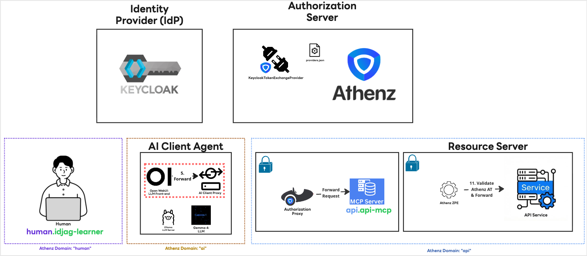
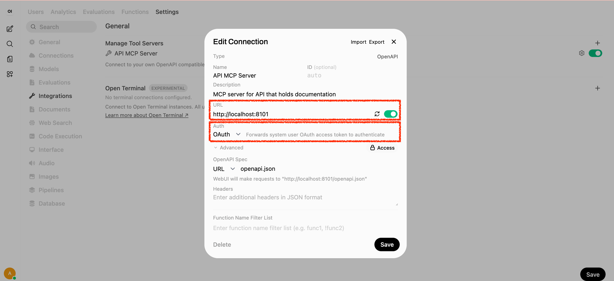
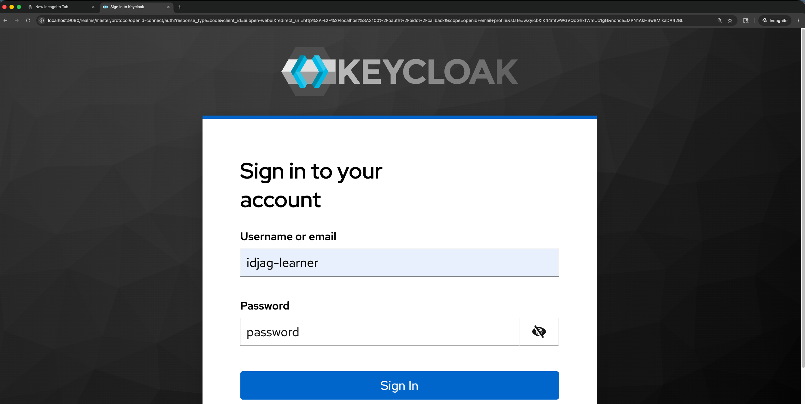
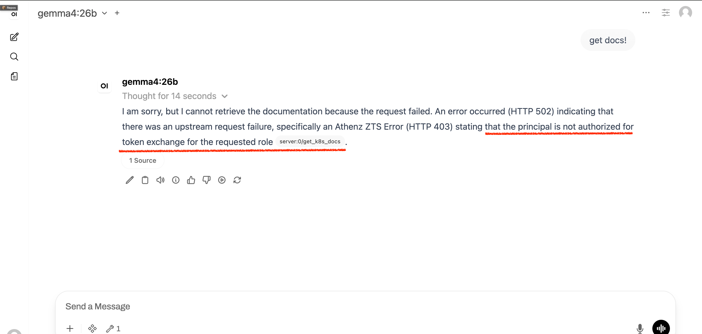
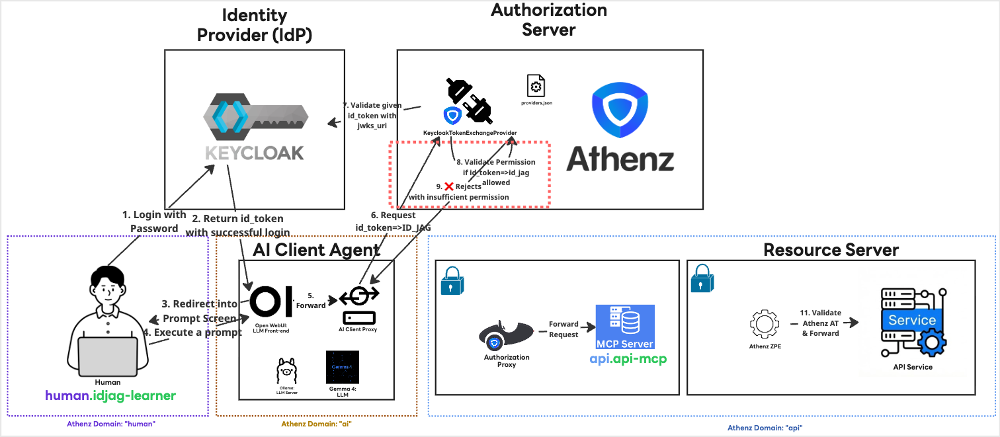

|                    Previous                    |        Current        |           Next           |
|:----------------------------------------------:|:---------------------:|:------------------------:|
| [Identity Provider](./11-identity-provider.md) | **AI Client Gateway** | [ID-JAG](./14-id-jag.md) |

# AI Client Gateway

In this tutorial, we will deploy the `AI Client Gateway`, which acts as an intermediary layer between:

- Open WebUI (The AI Client Agent)
- MCP Server (Authorization Proxy)

## What is ID-JAG?

ID-JAG (Identity Assertion JWT Authorization Grant) is a proposed authorization standard, primarily championed by companies like Okta. It extends the trust model of Single Sign-On (SSO) into the realm of API access. In short, it applies the trust established with an Identity Provider (IdP) during SSO to secure API access between applications, or between an AI agent and a backend service.

You can learn more about the specifics here:

- [Identity Assertion JWT Authorization Grant - IETF](https://datatracker.ietf.org/doc/draft-ietf-oauth-identity-assertion-authz-grant/)
- [Why ID-JAG is the future of AI agent security - LY Corp. Tech Blog](https://techblog.lycorp.co.jp/en/20260417a)

## How the ID-JAG Specification Helps Us

When you log in via `Keycloak`, it generates an ID Token that represents your identity. Through the ID-JAG process, we can dynamically handle permissions without manual token management. Specifically, we can:

1. Exchange the initial ID Token for an ID-JAG token scoped to a new audience, `ai.open-webui`.
1. Fetch an Access Token with the audience `api` (and its required scopes) using the `ai.open-webui` ID-JAG token.

This means we no longer have to manually insert an Access Token for each tool in the UI. Furthermore, tools can be securely shared among all users in the AI Client Agent without any manual intervention.

## Run the AI Client Proxy

Because ID-JAG is relatively new, not all AI client agents support it natively yet. Additionally, using an AI Client Proxy provides an extra layer of security by preventing the final Access Token from being handed directly to the AI Client Agent.

The proxy is included in this project. Let's try running it:

```sh
_mcp_auth_proxy_port=8102
make -C ai_client_gateway local PROXY_TARGET=http://localhost:$_mcp_auth_proxy_port
```

You will likely encounter an error similar to this:

```sh
# Error: ENOENT: no such file or directory, open '~/id_jag_the_hard_way_workspace/ai_client_gateway/certs/open-webui.crt'
#     at Object.openSync (node:fs:563:18)
#     at Object.readFileSync (node:fs:447:35)
#     at file:///Users/jekim/id_jag_the_hard_way_workspace/ai_client_gateway/src/utils/idtokenIntoIdjag.js:17:12
```

This happens because the AI Client Proxy requires a TLS certificate to identify itself securely.

## Generate the Required Certificates

Let's generate the necessary keys and certificates. First, create a directory and generate the RSA key pair:

```sh
mkdir -p ./ai_client_gateway/certs
./my_tools/create-private-key.sh "./ai_client_gateway/certs/open-webui"
```

```sh
# Generating RSA key pair for: ./ai_client_gateway/certs/open-webui...
# Done! Keys generated: ./ai_client_gateway/certs/open-webui.key, ./ai_client_gateway/certs/open-webui.public.key
```

Next, we will create a Top-Level Domain (TLD) named `ai` since we haven't created it yet:

```sh
./my_tools/create-tld.sh "ai"
```

```sh
# Creating TLD: ai...
# {"description":"TLD for ai","org":"ajkimkim","auditEnabled":false,"ypmId":0,"autoDeleteTenantAssumeRoleAssertions":false,"name":"ai","modified":"2026-05-16T07:44:39.295Z","id":"17e2d0f0-50fb-11f1-8af4-88f84977247b"}
# Done!
```

Now, register the service open-webui under the `ai` domain using the public key we just generated:

```sh
./my_tools/create-service.sh "ai" "open-webui" "./ai_client_gateway/certs/open-webui.public.key"
```

```sh
# Registering Service: ai.open-webui...
```

Enable the certificate provider for this service:

```sh
./my_tools/enable-cert-provider.sh "ai" "open-webui"
```

```sh
# [Template(s) successfully applied to domain]
```

Generate the X.509 Certificate:

```sh
./my_tools/fetch-cert.sh "ai" "open-webui" "./ai_client_gateway/certs/open-webui.key" "v1"
```

```sh
# Fetching X.509 Certificate for ai.open-webui...
# Done! Certificate saved to: ./ai_client_gateway/certs/open-webui.crt
```

Finally, the `ai_client_gateway` requires the Athenz CA certificate. Copy it from the `athenz_dist/certs` directory:

```sh
cp ./athenz_dist/certs/ca.cert.pem ./ai_client_gateway/certs/ca.crt
```

Verify that all necessary certificates have been created:

```sh
ls -al ./ai_client_gateway/certs/
```

```sh
# total 24
# drwxr-xr-x   5 mlajkim  staff   160 May 2 16:47 .
# drwxr-xr-x  13 mlajkim  staff   416 May 2 16:43 ..
# -rw-r--r--   1 mlajkim  staff  1834 May 2 16:49 ca.crt
# -rw-r--r--   1 mlajkim  staff  1716 May 2 16:47 open-webui.crt
# -rw-------   1 mlajkim  staff  1675 May 2 16:43 open-webui.key
# -rw-r--r--   1 mlajkim  staff   451 May 2 16:43 open-webui.public.key
```

## Run the Server Again

With the certificates in place, the `ai_client_gateway` should now start successfully.

```sh
_mcp_auth_proxy_port=8102
make -C ai_client_gateway local PROXY_TARGET=http://localhost:$_mcp_auth_proxy_port
```

```sh
# ...
# 🚀 OpenWebUI OpenAPI Gateway listening on 0.0.0.0:3101
# 🔗 Upstream API: http://localhost:8102
# 🌍 Public Base URL: http://localhost:3101
```

## What we have done

We just installed `AI Client Agent` (Highlighted in Red) which Open WebUI can talk to as a tool :



## Modify the Tool Target

Instead of pointing the Open WebUI directly to the MCP server, we will route it through our new `ai_client_gateway`.

1. Log in to Open WebUI using an admin account (required to modify integrations).
1. Navigate to `User Icon` > `Admin Panel` > `Settings` > `Integrations`.
1. Click the configuration icon for the API MCP Server.
1. Make the following changes:
  - Change the MCP Authorization Server URL to the proxy URL: http://localhost:3101
  - Change the `Auth` to `Oauth`



## Verification

Log out of the admin account and log back in as the non-admin user (idjag-learner) via Keycloak.



Now, test the setup by asking the AI Agent:

```
Get docs!
```

The request will deliberately fail as following:



## What's happened?

We created a certificate for `ai.open-webui`, but this service does not yet have the necessary permissions in Athenz to exchange your Keycloak ID Token into an ID-JAG token (indicated by the red box in your architecture diagram). Because the gateway cannot assert your identity, the request is denied.



## What's next?

In the next tutorial, we will fix this permission error by granting the proper token exchange policies, allowing us to successfully execute the end-to-end prompt.

Next: [ID-JAG](./14-id-jag.md)
