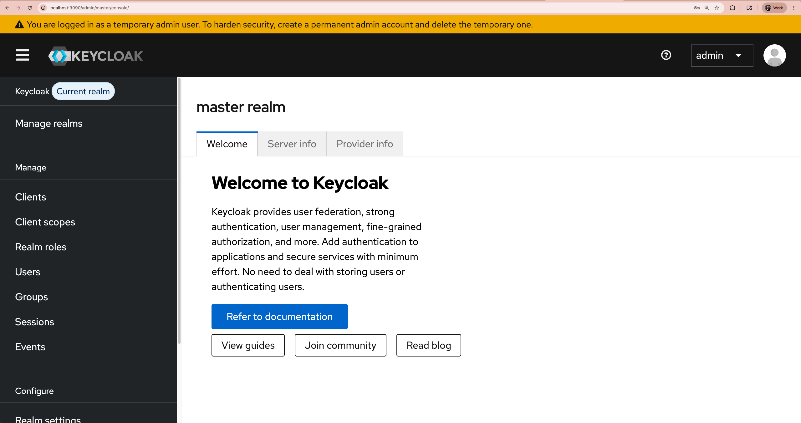
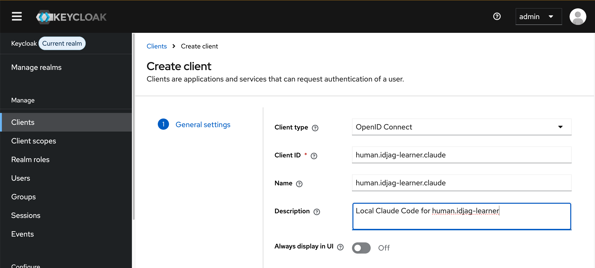
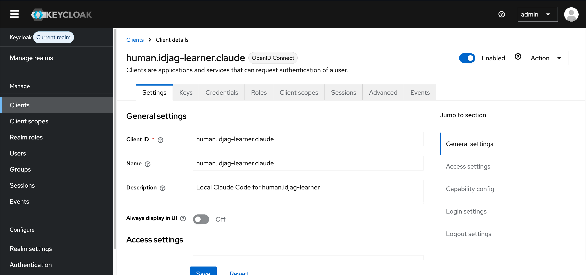
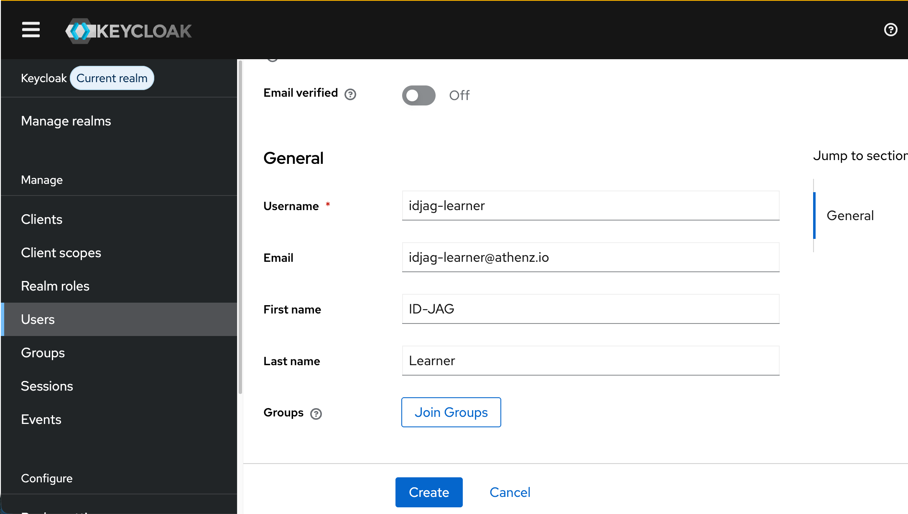
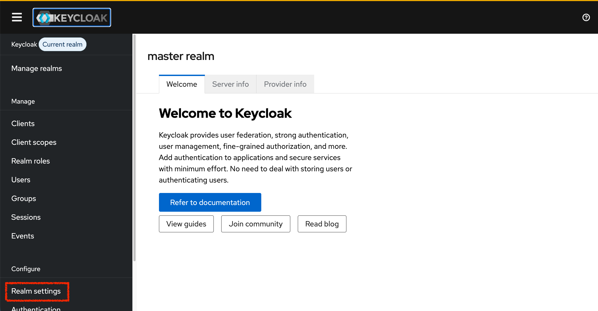
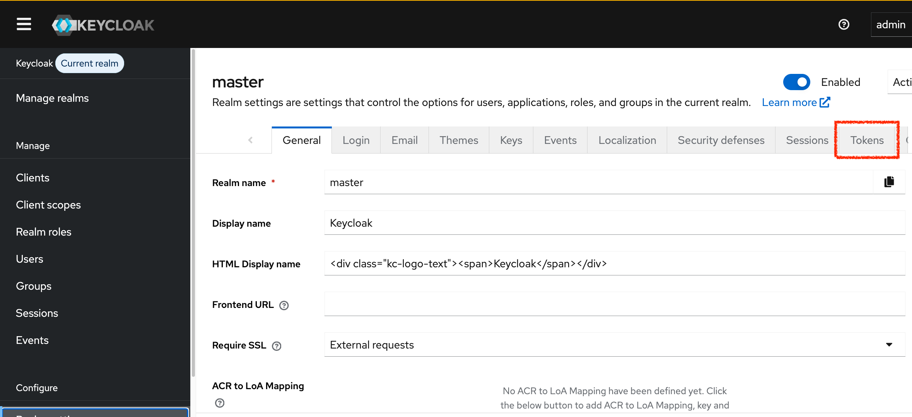
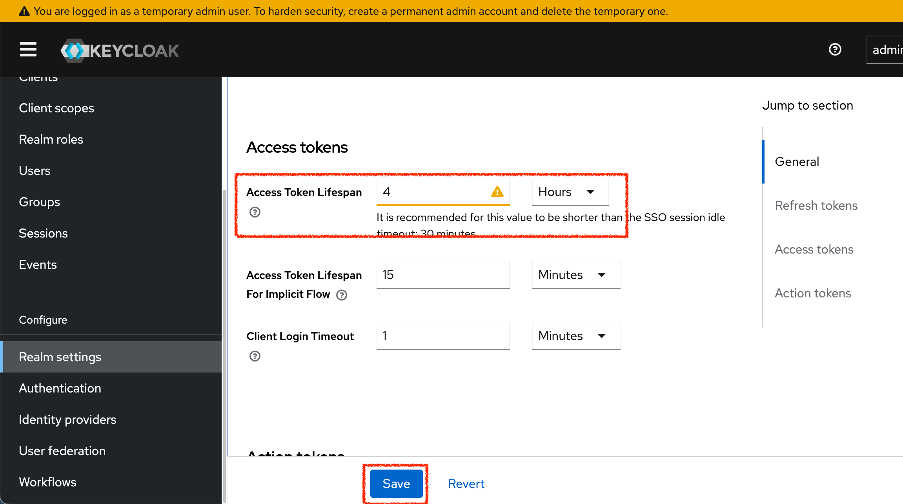

|                     Previous                     |        Current        |                              Next                              |
|:------------------------------------------------:|:---------------------:|:--------------------------------------------------------------:|
| [Protect MCP Server](./12-protect-mcp-server.md) | **Identity Provider** | [Trusted Identity Provider](./14-trusted-identity-provider.md) |

# Identity Provider

In this tutorial, we will deploy [Keycloak](https://www.keycloak.org/) as an Identity Provider (IdP) so that individual users — not the admin certificate — can log in and have their own identity.

<!-- TOC depthFrom:2 depthTo:2 -->

- [Docker pull keycloak](#docker-pull-keycloak)
- [Deploy Keycloak in K8s](#deploy-keycloak-in-k8s)
- [Open Keycloak on Browser](#open-keycloak-on-browser)
- [Setup Client](#setup-client)
- [Setup User](#setup-user)
- [Setup id_token Expiration](#setup-id_token-expiration)
- [What's done?](#whats-done)
- [What's next?](#whats-next)

<!-- /TOC -->

## Docker pull keycloak

If you are using **kind**, do the following:

```sh
docker pull quay.io/keycloak/keycloak:latest
kind load docker-image quay.io/keycloak/keycloak:latest
```

## Deploy Keycloak in K8s

Create the `idp` namespace:

```sh
kubectl create ns idp
```

Deploy Keycloak:

```sh
kubectl create deployment keycloak --image=quay.io/keycloak/keycloak:latest -n idp
```

Set the admin credentials and start in dev mode:

```sh
kubectl patch deploy keycloak -n idp --patch "$(cat <<'EOF'
spec:
  template:
    spec:
      containers:
        - name: keycloak
          imagePullPolicy: IfNotPresent
          args:
            - start-dev
          env:
            - name: KEYCLOAK_ADMIN
              value: "admin"
            - name: KEYCLOAK_ADMIN_PASSWORD
              value: "admin"
EOF
)"
```

Create a PVC so Keycloak data survives pod restarts:

```sh
cat <<EOF | kubectl apply -f -
apiVersion: v1
kind: PersistentVolumeClaim
metadata:
  name: keycloak-data-pvc
  namespace: idp
spec:
  accessModes: [ "ReadWriteOnce" ]
  resources:
    requests:
      storage: 1Gi
EOF
```

Mount the PVC:

```sh
kubectl patch deploy keycloak -n idp --patch "$(cat <<'EOF'
spec:
  template:
    spec:
      containers:
        - name: keycloak
          volumeMounts:
            - name: keycloak-data
              mountPath: /opt/keycloak/data
      volumes:
        - name: keycloak-data
          persistentVolumeClaim:
            claimName: keycloak-data-pvc
EOF
)"
```

Expose the deployment:

```sh
kubectl expose deployment keycloak --port=8080 -n idp
```

## Open Keycloak on Browser

Wait for the pod to be ready:

```sh
kubectl wait -n idp \
  --for=condition=ready pod \
  --selector=app=keycloak \
  --timeout=180s
```

Open Keycloak in your browser (username: `admin`, password: `admin`):

```sh
_keycloak_port=$(./tools/port.sh keycloak)
./tools/open.sh "http://localhost:${_keycloak_port}"
```



## Setup Client

In Keycloak, a **Client** represents an application that requests authentication on behalf of a user. We use the default `master` realm.

First, run the following command to get all the values you will need for each step:

```sh
./tools/keycloak-client-settings.sh
```

```sh
# Step 1: General Settings
# +-------------+-------------------------------------------+
# | Field       | Value                                     |
# +-------------+-------------------------------------------+
# | Client type | OpenID Connect (no change)                |
# | Client ID   | human.idjag-learner.claude                |
# ...
```

Then open the add-client page:

```sh
_keycloak_port=$(./tools/port.sh keycloak)
./tools/open.sh "http://localhost:${_keycloak_port}/admin/master/console/#/master/clients/add-client"
```

Fill in the **Step 1** values and click **Next**.



Fill in the **Step 2** values and click **Next**.

Fill in the **Step 3** values and click **Save**.

> [!NOTE]
> The redirect URI must exactly match `PUBLIC_BASE_URL/oauth/callback` of the human gateway. Port `44443` is the default from `tools/config.yaml`. If you changed it via `config.local.yaml`, update the URI accordingly.



## Setup User

Create a human user account to represent a learner.

Open the add-user page:

```sh
_keycloak_port=$(./tools/port.sh keycloak)
./tools/open.sh "http://localhost:${_keycloak_port}/admin/master/console/#/master/users/add-user"
```

Fill in:

- **Username**: `idjag-learner`
- **Email**: `idjag-learner@athenz.io`
- **First Name**: `ID-JAG`
- **Last Name**: `Learner`



Click **Create**.

Go to the **Credentials** tab, click **Set password**, and configure:

- **Password**: `password`
- **Temporary**: `off`

Click **Save**.

## Setup id_token Expiration

> [!TIP]
> For this tutorial, setting the `id_token` lifespan to `4 hours` is fine. In production, set it based on your security requirements.

Navigate to `Realm settings`:



Then go to `Tokens`:



Find `Access Token Lifespan` and set it to `4 hours`.



## What's done?

We have deployed Keycloak and created:

- A client `human.idjag-learner.claude` that will represent our AI client (Claude Code)
- A user `idjag-learner` who represents a real human employee

At this point, Keycloak is running and configured, but our Authorization Server (Athenz) does not yet trust it. The next tutorial establishes that trust.

## What's next?

We have set up the Identity Provider. Now we need to configure Athenz to accept and verify tokens issued by Keycloak.

Next: [Trusted Identity Provider](./14-trusted-identity-provider.md)
