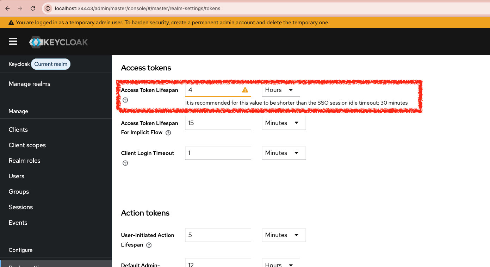

|                     Previous                     |        Current        |                              Next                              |
|:------------------------------------------------:|:---------------------:|:--------------------------------------------------------------:|
| [Protect MCP Server](./12-protect-mcp-server.md) | **Identity Provider** | [Trusted Identity Provider](./14-trusted-identity-provider.md) |

# Identity Provider

In this tutorial, we will deploy [Keycloak](https://www.keycloak.org/) as an Identity Provider (IdP) so that individual users — not the admin certificate — can log in and have their own identity.

<!-- TOC depthFrom:2 depthTo:2 -->

- [Docker pull keycloak](#docker-pull-keycloak)
- [Deploy Keycloak in K8s](#deploy-keycloak-in-k8s)
- [Open Keycloak on Browser](#open-keycloak-on-browser)
- [Setup Client](#setup-client)
- [Setup User](#setup-user)
- [Setup id_token Expiration](#setup-id_token-expiration)
- [What's done?](#whats-done)
- [What's next?](#whats-next)

<!-- /TOC -->

## Docker pull keycloak

If you are using **kind**, do the following:

> [!NOTE]
> On **Apple Silicon (arm64)**, `kind load docker-image` fails with multi-platform manifest images. Build a single-platform image first:
>
> ```sh
> docker buildx build --platform linux/arm64 --load --provenance=false \
>   -t keycloak:kind-load - <<'EOF'
> FROM quay.io/keycloak/keycloak:latest
> EOF
> kind load docker-image keycloak:kind-load
> ```
>
> Then replace `quay.io/keycloak/keycloak:latest` with `keycloak:kind-load` in the `kubectl create deployment` command below.

On **amd64** (or if unsure), the standard pull works:

```sh
docker pull quay.io/keycloak/keycloak:latest
kind load docker-image quay.io/keycloak/keycloak:latest
```

## Deploy Keycloak in K8s

Create the `idp` namespace:

```sh
kubectl create ns idp
```

Deploy Keycloak:

```sh
kubectl create deployment keycloak --image=quay.io/keycloak/keycloak:latest -n idp
```

Set the admin credentials and start in dev mode:

```sh
_keycloak_admin=$(./tools/config.sh keycloak admin)
_keycloak_admin_password=$(./tools/config.sh keycloak admin-password)

kubectl patch deploy keycloak -n idp --patch "$(cat <<EOF
spec:
  template:
    spec:
      containers:
        - name: keycloak
          imagePullPolicy: IfNotPresent
          args:
            - start-dev
          env:
            - name: KEYCLOAK_ADMIN
              value: "${_keycloak_admin}"
            - name: KEYCLOAK_ADMIN_PASSWORD
              value: "${_keycloak_admin_password}"
EOF
)"
```

Create a PVC so Keycloak data survives pod restarts:

```sh
cat <<EOF | kubectl apply -f -
apiVersion: v1
kind: PersistentVolumeClaim
metadata:
  name: keycloak-data-pvc
  namespace: idp
spec:
  accessModes: [ "ReadWriteOnce" ]
  resources:
    requests:
      storage: 1Gi
EOF
```

Mount the PVC:

```sh
kubectl patch deploy keycloak -n idp --patch "$(cat <<'EOF'
spec:
  template:
    spec:
      containers:
        - name: keycloak
          volumeMounts:
            - name: keycloak-data
              mountPath: /opt/keycloak/data
      volumes:
        - name: keycloak-data
          persistentVolumeClaim:
            claimName: keycloak-data-pvc
EOF
)"
```

Expose the deployment:

```sh
kubectl expose deployment keycloak --port=8080 -n idp
```

## Open Keycloak on Browser

Wait for the pod to be ready:

```sh
kubectl wait -n idp \
  --for=condition=ready pod \
  --selector=app=keycloak \
  --timeout=180s
```

Open Keycloak in your browser (username: `admin`, password: `admin`):

```sh
_keycloak_port=$(./tools/port.sh keycloak)
./tools/open.sh "http://localhost:${_keycloak_port}"
```


## Setup Client

In Keycloak, a **Client** represents an application that requests authentication on behalf of a user. We use the default `master` realm.

Register the AI client (`human.idjag-learner.claude`) with Keycloak:

```sh
_acg_port=$(./tools/port.sh ai-client-gateway)
./tools/keycloak/create-client.sh \
  human.idjag-learner.claude \
  "http://localhost:${_acg_port}/oauth/callback" \
  "http://localhost:${_acg_port}"
```


## Setup User

Create a human user account to represent a learner:

```sh
OPEN_UI=true ./tools/keycloak/create-user.sh \
  idjag-learner \
  idjag-learner@athenz.io \
  ID-JAG \
  Learner
```


## Setup id_token Expiration

> [!TIP]
> For this tutorial, setting the `id_token` lifespan to `4 hours` is fine. In production, set it based on your security requirements.

```sh
./tools/keycloak/set-token-lifespan.sh 14400
```

```sh
#   ·  Fetching Keycloak admin token...
#   ·  Setting access token lifespan to 14400s in realm master...
#   ✔  Access token lifespan set to 14400s (4h)
#   ✔  Opened: http://localhost:34443/admin/master/console/#/master/realm-settings/tokens
```



## What's done?

We have deployed Keycloak and created:

- A client `human.idjag-learner.claude` that will represent our AI client (Claude Code)
- A user `idjag-learner` who represents a real human employee

At this point, Keycloak is running and configured, but our Authorization Server (Athenz) does not yet trust it. The next tutorial establishes that trust.

## What's next?

We have set up the Identity Provider. Now we need to configure Athenz to accept and verify tokens issued by Keycloak.

Next: [Trusted Identity Provider](./14-trusted-identity-provider.md)
