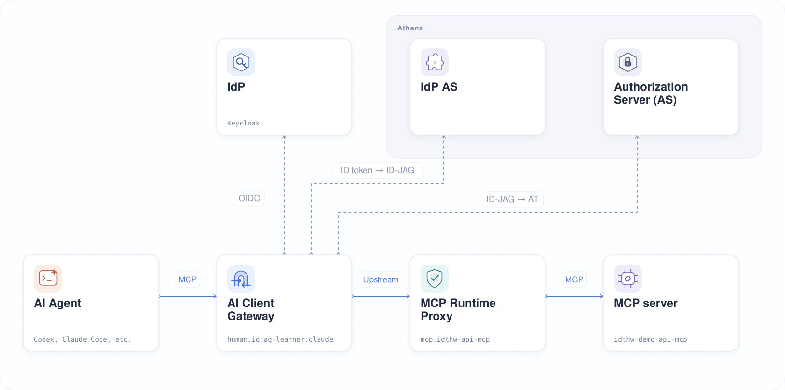
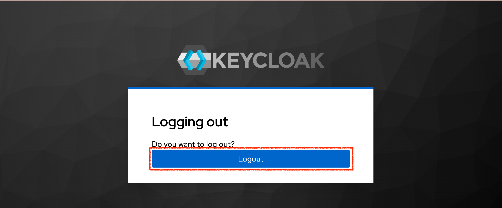
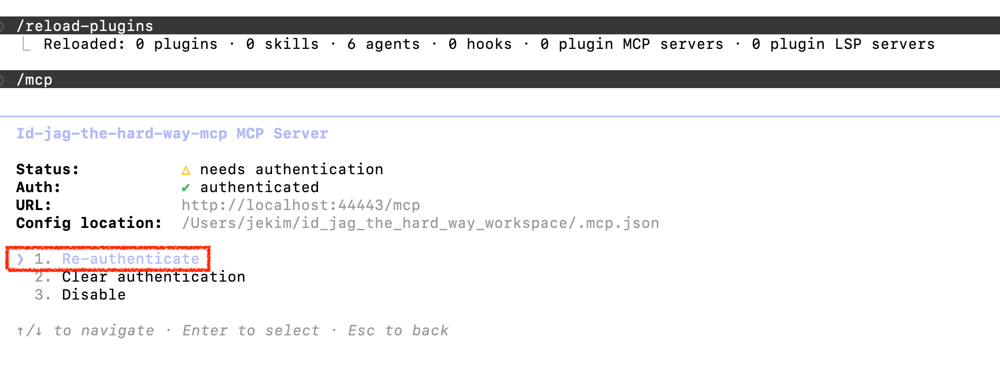
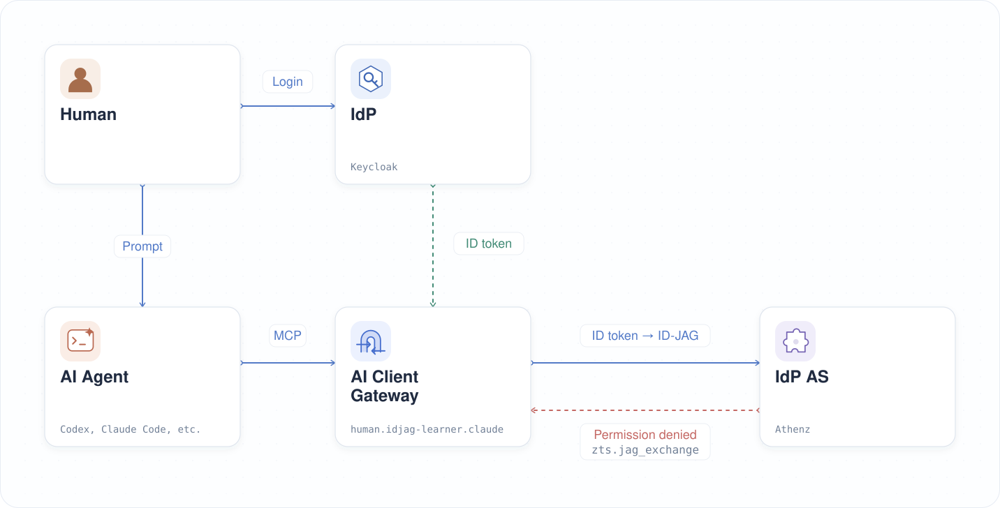

|                            Previous                            |        Current        |           Next           |
|:--------------------------------------------------------------:|:---------------------:|:------------------------:|
| [Trusted Identity Provider](./13-trusted-identity-provider.md) | **AI Client Gateway** | [ID-JAG](./15-id-jag.md) |

# AI Client Gateway

Deploy AI Client Gateway between Claude Code and the MCP service with the following steps. The gateway uses the signed-in user's Keycloak ID token to obtain an Athenz access token. MCP Runtime Proxy performs the later exchange for API access.

<!-- TOC depthFrom:2 depthTo:2 -->

- [Deploy AI Client Gateway in K8s](#deploy-ai-client-gateway-in-k8s)
- [Generate the Required Certificates](#generate-the-required-certificates)
- [Mount the Certificates](#mount-the-certificates)
- [Create the Keycloak Client Secret](#create-the-keycloak-client-secret)
- [Configure the Gateway](#configure-the-gateway)
- [Sign Out of Keycloak](#sign-out-of-keycloak)
- [Verify](#verify)
- [Next Steps](#next-steps)

<!-- /TOC -->

## Deploy AI Client Gateway in K8s

The gateway belongs in the `human` namespace — it represents the human-controlled, client side of the architecture.

Create the `human` namespace:

```sh
kubectl create ns human
```

```sh
# namespace/human created
```

Deploy the gateway with name `claude-idjag-learner-ai-client-gateway`:

```sh
kubectl create deploy claude-idjag-learner-ai-client-gateway -n human \
  --image=ghcr.io/mlajkim/ai-client-gateway:latest
```

```sh
# deployment.apps/claude-idjag-learner-ai-client-gateway created
```

Check the logs from the `ai-client-gateway` container:

```sh
kubectl logs deploy/claude-idjag-learner-ai-client-gateway -n human -c ai-client-gateway
```

```sh
# ...
# Error: ENOENT: no such file or directory, open '/app/certs/ai-client-gateway.crt'
# ...
```

This is expected. The gateway needs an X.509 certificate to identify itself to Athenz ZTS, and we have not provided one yet. The next two sections take care of that.

> [!NOTE]
> If the result is `ContainerCreating`, the current container instance has not started yet. Wait briefly and retry, or add `--previous` to the command above if an earlier instance has already terminated.

## Generate the Required Certificates

Create the service identity and fetch its X.509 certificate:

```sh
./tools/athenz/create-private-key.sh "./keys/human-idjag-learner-claude"
./tools/athenz/create-subdomain.sh "human" "idjag-learner"
./tools/athenz/create-service.sh "human.idjag-learner" "claude" "./keys/human-idjag-learner-claude.public.key"
./tools/athenz/enable-cert-provider.sh "human.idjag-learner" "claude"
./tools/athenz/fetch-cert.sh "human.idjag-learner" "claude" "./keys/human-idjag-learner-claude.key" "v1"
```

```sh
#   ·  Generating RSA key pair for: ./keys/human-idjag-learner-claude...
#   ✔  Keys generated: ./keys/human-idjag-learner-claude.key, ./keys/human-idjag-learner-claude.public.key
#   ·  Creating Subdomain: human.idjag-learner...
#   ✔  Subdomain created: human.idjag-learner
#   ·  Registering Service: human.idjag-learner.claude...
#   ✔  Service registered: human.idjag-learner.claude
#   ·  Enabling ZTS Certificate Provider for human.idjag-learner.claude...
# [Template(s) successfully applied to domain]
#   ✔  ZTS Certificate Provider enabled for human.idjag-learner.claude
#   ·  Fetching X.509 Certificate for human.idjag-learner.claude...
#   ✔  Certificate saved to: ./keys/human-idjag-learner-claude.crt
```

## Mount the Certificates

Store the certificate, private key, and CA certificate in a Kubernetes Secret:

```sh
kubectl delete -n human secret human-idjag-learner-claude-cert --ignore-not-found=true
kubectl -n human create secret generic human-idjag-learner-claude-cert \
  --from-file=ai-client-gateway.crt=./keys/human-idjag-learner-claude.crt \
  --from-file=ai-client-gateway.key=./keys/human-idjag-learner-claude.key \
  --from-file=ca.crt=./athenz_dist/certs/ca.cert.pem
```

```sh
# secret/human-idjag-learner-claude-cert created
```

Mount the secret into the gateway pod so the application can read the certificate files at `/app/certs`:

```sh
kubectl patch deploy claude-idjag-learner-ai-client-gateway -n human --patch "$(cat <<'EOF'
spec:
  template:
    spec:
      containers:
        - name: ai-client-gateway
          volumeMounts:
            - name: certs
              mountPath: /app/certs
              readOnly: true
      volumes:
        - name: certs
          secret:
            secretName: human-idjag-learner-claude-cert
EOF
)"
```

```sh
# deployment.apps/claude-idjag-learner-ai-client-gateway patched
```

Wait for the new pod with the certificate mount to become available:

```sh
kubectl rollout status deployment/claude-idjag-learner-ai-client-gateway -n human --timeout=180s
```

```sh
# deployment "claude-idjag-learner-ai-client-gateway" successfully rolled out
```

Check the current container's logs to verify the gateway started successfully:

```sh
kubectl logs deploy/claude-idjag-learner-ai-client-gateway -n human -c ai-client-gateway
```

```sh
# 🚀 OpenWebUI OpenAPI Gateway listening on 0.0.0.0:3101
# 🔗 Upstream API: http://mcp.mcp:8081
# 🌍 Public Base URL: http://localhost:44443
# 🔑 Athenz ZTS Endpoint: https://athenz-zts-server.athenz:4443/zts/v1
```

<a id="deploy-the-human-gateway"></a>

## Create the Keycloak Client Secret

Now that the certificate is in place, configure the gateway with the Keycloak credentials it needs to drive the OAuth2 login flow.

Create the Kubernetes Secret from the Keycloak client credentials:

```sh
./tools/keycloak/create-client-k8s-secret.sh \
  "human.idjag-learner.claude" \
  "human" \
  "human-idjag-learner-claude-keycloak"
```

```sh
#   ·  Fetching Keycloak admin token...
#   ·  Looking up UUID for client human.idjag-learner.claude...
#   ·  Fetching client secret...
#   ·  Creating K8s secret human/human-idjag-learner-claude-keycloak...
# secret/human-idjag-learner-claude-keycloak created
#   ✔  Secret created: human/human-idjag-learner-claude-keycloak
```

Configure `KEYCLOAK_CLIENT_ID` and `KEYCLOAK_CLIENT_SECRET` so the gateway can authenticate to Keycloak as the registered OAuth2 client. Reference the `client-id` and `client-secret` keys in the `human-idjag-learner-claude-keycloak` Secret just created:

```sh
kubectl patch deploy claude-idjag-learner-ai-client-gateway -n human --type=strategic --patch "$(cat <<'EOF'
spec:
  template:
    spec:
      containers:
        - name: ai-client-gateway
          env:
            - name: KEYCLOAK_CLIENT_ID
              valueFrom:
                secretKeyRef:
                  name: human-idjag-learner-claude-keycloak
                  key: client-id
            - name: KEYCLOAK_CLIENT_SECRET
              valueFrom:
                secretKeyRef:
                  name: human-idjag-learner-claude-keycloak
                  key: client-secret
EOF
)"
```

```sh
# deployment.apps/claude-idjag-learner-ai-client-gateway patched
```

<a id="set-env-vars-for-the-gateway"></a>

## Configure the Gateway

Configure the gateway one connection at a time. Each command updates only the named variables, so settings from earlier steps remain in place.

### 1. Set the MCP Server Address

First, tell the gateway where to forward MCP requests. Set `UPSTREAM_BASE_URL` to the in-cluster address of the MCP Service deployed earlier:

```sh
kubectl set env deployment/claude-idjag-learner-ai-client-gateway -n human \
  --containers=ai-client-gateway \
  UPSTREAM_BASE_URL=http://mcp.mcp:8081
```

```sh
# deployment.apps/claude-idjag-learner-ai-client-gateway env updated
```

### 2. Configure Token Issuance through Athenz

Next, configure where the gateway obtains access tokens for MCP requests. `ZTS_URL` is the Athenz ZTS endpoint for the ID token → ID-JAG → access token exchanges. `ATHENZ_ACCESS_TOKEN_AUDIENCE=mcp` specifies the recipient of the resulting access token. The ID-JAG audience remains the ZTS URL:

```sh
kubectl set env deployment/claude-idjag-learner-ai-client-gateway -n human \
  --containers=ai-client-gateway \
  ZTS_URL=https://athenz-zts-server.athenz:4443/zts/v1 \
  ATHENZ_ACCESS_TOKEN_AUDIENCE=mcp
```

```sh
# deployment.apps/claude-idjag-learner-ai-client-gateway env updated
```

### 3. Connect to the Keycloak Login Server

After the user signs in, the gateway exchanges the authorization code from Keycloak for tokens. Set `KEYCLOAK_URL` to the in-cluster address for that server-to-server request, and `KEYCLOAK_REALM` to the realm where the client was registered:

```sh
kubectl set env deployment/claude-idjag-learner-ai-client-gateway -n human \
  --containers=ai-client-gateway \
  KEYCLOAK_URL=http://keycloak.idp:8080 \
  KEYCLOAK_REALM=master
```

```sh
# deployment.apps/claude-idjag-learner-ai-client-gateway env updated
```

### 4. Set the Browser-Facing Addresses

Set the port-forwarded addresses the browser can reach. `KEYCLOAK_PUBLIC_URL` points to the Keycloak login page. `PUBLIC_BASE_URL` is the gateway address used for the `/oauth/callback` after login; the AI client also connects through this address:

```sh
_gateway_port=$(./tools/port.sh ai-client-gateway)
_keycloak_port=$(./tools/port.sh keycloak)

kubectl set env deployment/claude-idjag-learner-ai-client-gateway -n human \
  --containers=ai-client-gateway \
  PUBLIC_BASE_URL="http://localhost:${_gateway_port}" \
  KEYCLOAK_PUBLIC_URL="http://localhost:${_keycloak_port}"
```

```sh
# deployment.apps/claude-idjag-learner-ai-client-gateway env updated
```

### 5. Expose and Verify the Gateway

Expose the deployment as a Service:

```sh
kubectl delete -n human svc ai-client-gateway --ignore-not-found=true
kubectl expose deploy claude-idjag-learner-ai-client-gateway -n human --port 3101 --name ai-client-gateway
```

```sh
# service/ai-client-gateway exposed
```

Wait for the rollout to apply the gateway configuration:

```sh
kubectl rollout status deployment/claude-idjag-learner-ai-client-gateway -n human --timeout=180s
```

```sh
# deployment "claude-idjag-learner-ai-client-gateway" successfully rolled out
```

Check the current container's startup logs:

```sh
kubectl logs deploy/claude-idjag-learner-ai-client-gateway -n human -c ai-client-gateway --tail=5
```

```sh
# 🚀 OpenWebUI OpenAPI Gateway listening on 0.0.0.0:3101
# 🔗 Upstream API: http://mcp.mcp:8081
# 🌍 Public Base URL: http://localhost:44443
# 🔑 Athenz ZTS Endpoint: https://athenz-zts-server.athenz:4443/zts/v1
```



<a id="verification-prerequisite"></a>

## Sign Out of Keycloak

Before verifying, sign out of Keycloak so you start with a clean session. You may still be logged in as `admin` or `idjag-learner` from a previous tutorial.

```sh
_keycloak_port=$(./tools/port.sh keycloak)
./tools/open.sh "http://localhost:${_keycloak_port}/realms/master/protocol/openid-connect/logout"
```

If Keycloak asks **"Do you want to log out?"**, click **Logout** to confirm.



Then you will see the following after successful logout:


## Verify

Point Claude Code at the gateway by writing an `.mcp.json` configuration file. The gateway now handles the entire ID-JAG flow, so you no longer need to obtain an access token in advance and manually add it to the `Authorization` header:

```sh
_gateway_port=$(./tools/port.sh ai-client-gateway)

cat > .mcp.json <<EOF
{
  "mcpServers": {
    "id-jag-the-hard-way-mcp": {
      "type": "http",
      "url": "http://localhost:${_gateway_port}/mcp"
    }
  }
}
EOF
```

> [!NOTE]
> This configuration has no manually supplied Athenz access token. Claude Code authenticates through the gateway, which obtains the access token for upstream requests.

Then reload the plugin:

```sh
/reload-plugins
```

Open the MCP connection menu:

```sh
/mcp
```

Then select **1. Re-authenticate**.



Claude Code will detect that the gateway requires a login and prompt you to authenticate:


Open the link (Claude Code may open it automatically). You will be redirected to Keycloak and asked to sign in. Use

- username `idjag-learner`
- password `password`


After signing in, you will see the authentication succeed but the MCP connection fail immediately — this is intentional and will be fixed in the next tutorial:

`Got new credentials, but reconnecting to id-jag-the-hard-way-mcp failed: HTTP 502 at http://localhost:44443/mcp`


The sign-in succeeded, but Athenz rejected the delegation request. The gateway service, `human.idjag-learner.claude`, needs `zts.jag_exchange` permission for the requested MCP role. The learner's own role memberships do not grant that permission to the gateway.



In another terminal, inspect the last 8 lines of the AI Client Gateway log to see where the exchange failed:

```sh
kubectl logs deploy/claude-idjag-learner-ai-client-gateway -n human -c ai-client-gateway --tail=8
```

Example output:

```sh
# [Athenz ID-JAG] 🔑 Resolved ID token from bearer session (Claude Code path)
# [Athenz ID-JAG] 🔄 Attempting to exchange new ID-JAG with id-token for scope [mcp:role.mcp-accessor] ...
# [Athenz ID-JAG] 🎯 Target ZTS for ID-JAG: https://athenz-zts-server.athenz:4443/zts/v1/oauth2/token
# [2026-09-26T10:45:04.305Z] Proxy request failed: Error: Athenz ZTS Error: HTTP 403 - {"code":403,"message":"Principal not authorized for token exchange for the requested role"}
#     at IncomingMessage.<anonymous> (file:///app/src/utils/idtokenIntoIdjag.js:63:18)
#     at IncomingMessage.emit (node:events:531:35)
#     at endReadableNT (node:internal/streams/readable:1698:12)
#     at process.processTicksAndRejections (node:internal/process/task_queues:89:21)
```

The log shows how far the request progressed:

- `Resolved ID token from bearer session`: the gateway found the signed-in user's ID token in its session
- `scope [mcp:role.mcp-accessor]`: the gateway requested an ID-JAG for the MCP role from the ZTS `/oauth2/token` endpoint
- `HTTP 403` and `Principal not authorized for token exchange for the requested role`: ZTS denied the gateway's exchange request. In addition to the user's role membership, `human.idjag-learner.claude` needs `zts.jag_exchange` permission for that role

<a id="whats-next"></a>

## Next Steps

Sign-in succeeds, but Athenz rejects the gateway's ID-JAG request. In the next chapter, you will grant the gateway the required exchange permissions and retry the document request.

Next: [ID-JAG](./15-id-jag.md)
