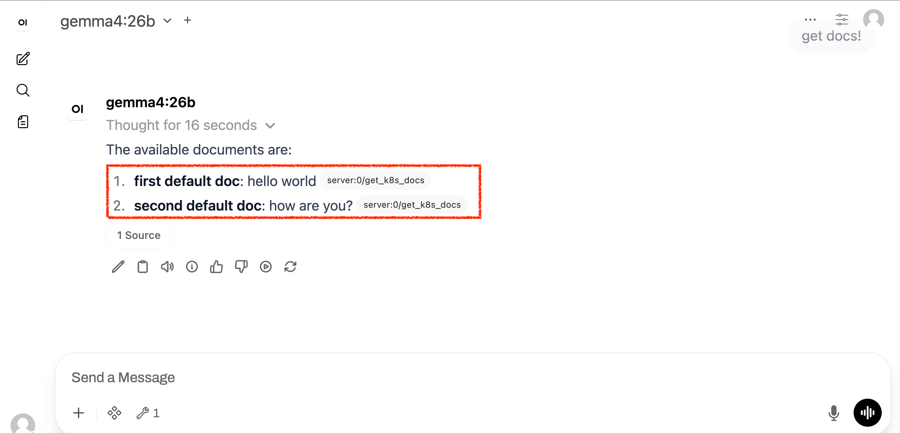
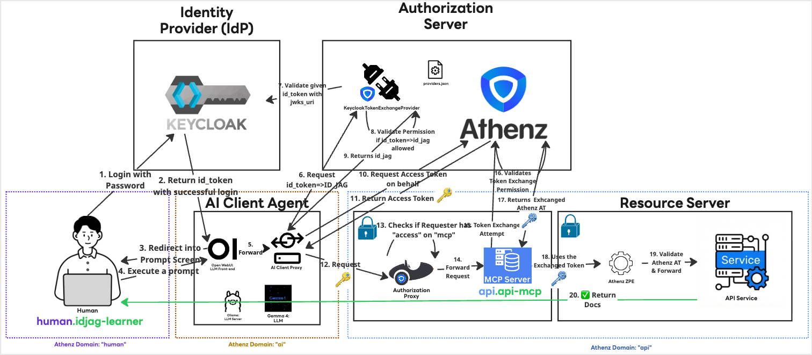

|                    Previous                    |  Current   |                                  Next                                  |
|:----------------------------------------------:|:----------:|:----------------------------------------------------------------------:|
| [AI Client Gateway](./13-ai-client-gateway.md) | **ID-JAG** | [Challenge: Successfully post documents](./challenges/01-post-docs.md) |

# ID-JAG

In this tutorial, we will finally resolve the authorization issues encountered in the previous step. We will configure the proper token exchange policies in Athenz, allowing the AI Client Gateway to successfully exchange your Keycloak ID Token for an ID-JAG token. Once these permissions are in place, we will execute the end-to-end prompt to confirm the integration works seamlessly.

## Grant Permissions to `ai.open-webui`

Because `ai.open-webui` acts on behalf of our user (`human.idjag-learner`), we need to explicitly authorize it to exchange the login ID Token for an ID-JAG token. We must also grant it the necessary access within the `api` domain.

First, create a role under domain `api`:

```sh
./my_tools/create-role.sh "api" "token-exchangable-ai-agents"
```

In Athenz, you must allow the `zts.jag_exchange` action on the target roles. First, attach this policy for `role.docs-getter`:

```sh
./my_tools/add-policy.sh "api" "token-exchangable-ai-agents" "zts.jag_exchange" "role.docs-getter"
```

```sh
# Creating Policy: api:policy.zts.jag_exchange...
```

The `ai.open-webui` (AI Agent) also needs permission to perform a token exchange into the `api:role.mcp-accessor` role. Add that policy as well:

```sh
./my_tools/add-policy.sh "api" "token-exchangable-ai-agents" "zts.jag_exchange" "role.mcp-accessor"
```

Next, add the `ai.open-webui` as a member of this new token exchange role:

```sh
./my_tools/add-role-member.sh "api" "token-exchangable-ai-agents" "ai.open-webui"
```

```sh
# Adding Member ai.open-webui to Role: api:role.token-exchangable-ai-agents...
```

> [!NOTE]
> Notice that the `ai.open-webui` client agent does not require direct permissions to fetch an Access Token against `api:role.docs-getter` or `api:role.mcp-accessor`. It only needs the `zts.jag_exchange` permission to perform the token exchange on the user's behalf.

## Verify

Follow the steps below to verify the setup.

Now, return to the AI Agent UI and test the exact same prompt that failed previously:

```
get docs!
```



## What's happened?

Here is a brief overview of the completed flow: The API server successfully returns its data because the proper trust chain was established. The ID-JAG token exchange allowed the Gateway to act on your behalf, all while maintaining the Principle of Least Privilege for every component involved in the architecture.



## What's next?

Congratulations🎉. You have successfully configured your AI Agent to communicate and retrieve data protected by multiple layers of security, all while strictly adhering to the Principle of Least Privilege for each component.

Ready to test your new **ID-JAG** skills? Take on the final challenge! In this next section, the step-by-step instructions are removed. You will need to apply everything you've learned so far to troubleshoot and solve the problem on your own.

Next: [Challenge: Successfully post documents](./challenges/01-post-docs.md)
