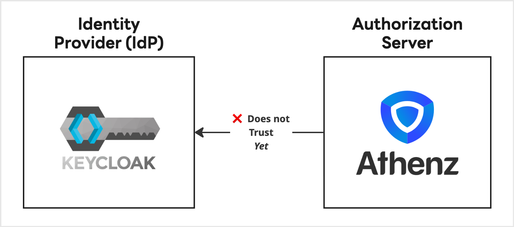
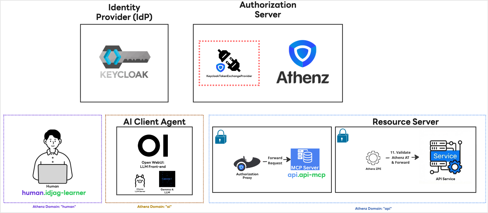
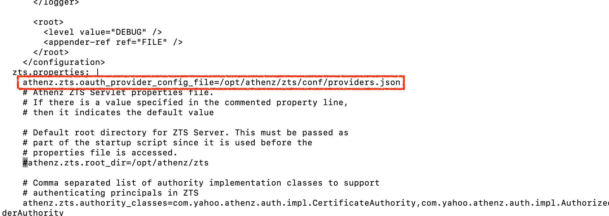
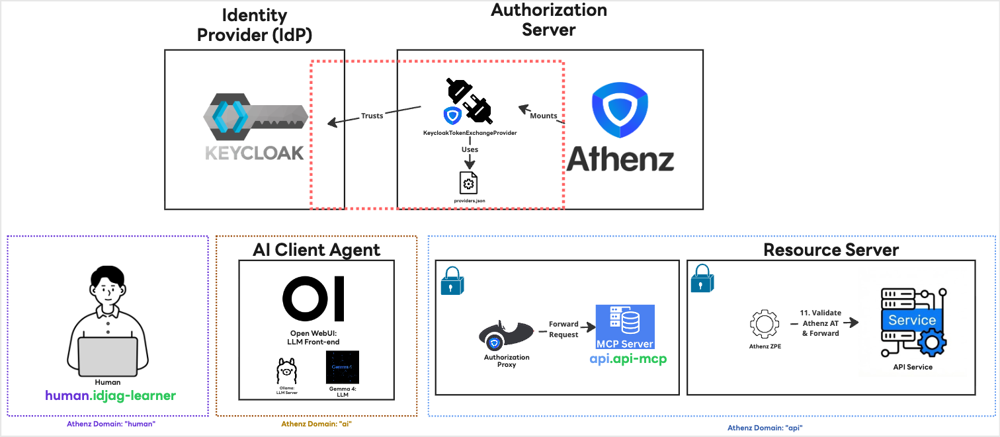

|                    Previous                    |            Current            |                      Next                      |
|:----------------------------------------------:|:-----------------------------:|:----------------------------------------------:|
| [Identity Provider](./13-identity-provider.md) | **Trusted Identity Provider** | [AI Client Gateway](./15-ai-client-gateway.md) |

# Trusted Identity Provider

In this tutorial, we will configure the Authorization Server (Athenz) to trust Keycloak as an Identity Provider (IdP). Without this, Athenz has no way to verify tokens issued by Keycloak and will reject them.

<!-- TOC depthFrom:2 depthTo:2 -->

- [Understand What We Need to Do](#understand-what-we-need-to-do)
- [Install Plugin into the ZTS Server](#install-plugin-into-the-zts-server)
- [Connect Keycloak with the Plugin](#connect-keycloak-with-the-plugin)
- [Configure ZTS to Load the Plugin](#configure-zts-to-load-the-plugin)
- [Review Summary of Changes](#review-summary-of-changes)
- [What's next?](#whats-next)

<!-- /TOC -->

## Understand What We Need to Do

Athenz does not trust any IdP by default. To exchange a Keycloak-issued ID token for an Athenz token, we must:

1. Install a plugin that teaches Athenz how to validate Keycloak tokens.
2. Provide the plugin with Keycloak's `jwks_uri` so it can verify token signatures.
3. Tell the ZTS server where to find the plugin configuration.



## Install Plugin into the ZTS Server

Apply the patch that mounts the Keycloak token exchange provider JAR into the ZTS server:

```sh
kubectl patch deployment athenz-zts-server \
  -n athenz \
  --patch-file keycloak_token_exchange_provider/hack/static/zts-plugin-jar-mount-patch.yaml
```

Wait for the rollout:

```sh
kubectl rollout status deployment/athenz-zts-server -n athenz
```

> [!NOTE]
> This applies: [zts-plugin-jar-mount-patch.yaml](../keycloak_token_exchange_provider/hack/static/zts-plugin-jar-mount-patch.yaml)

Verify the JAR was mounted:

```sh
kubectl -n athenz exec deployment/athenz-zts-server \
  -c athenz-zts-server \
  -- sh -c "ls -al /opt/athenz/zts/lib/jars | grep keycloak"
```

```sh
# -rw-r--r-- 1 root root 3237 May 1 14:26 keycloak-token-provider.jar
```



## Connect Keycloak with the Plugin

Create a `providers.json` ConfigMap that points the plugin at our Keycloak instance:

```sh
cat <<EOF | kubectl apply -f -
apiVersion: v1
kind: ConfigMap
metadata:
  name: zts-providers-config
  namespace: athenz
data:
  providers.json: |
    [
      {
        "issuerUri": "http://localhost:34443/realms/master",
        "jwksUri": "http://keycloak.idp:8080/realms/master/protocol/openid-connect/certs",
        "providerClassName": "com.mlajkim.athenz.KeycloakTokenExchangeProvider"
      }
    ]
EOF
```

```sh
# configmap/zts-providers-config created
```

Verify the ZTS server can reach Keycloak's JWKS endpoint:

```sh
kubectl -n athenz exec deployment/athenz-zts-server -c athenz-zts-server -- \
  sh -c "curl -k http://keycloak.idp:8080/realms/master/protocol/openid-connect/certs | jq ."
```

You should see a list of public keys similar to:

```json
{
  "keys": [
    {
      "kid": "LFe-YnLUWVVdHDlDZ1U7vBTDnuv7H5gn0FRQLij-d4Y",
      ...
    }
  ]
}
```

Mount the ConfigMap into the ZTS server:

```sh
kubectl patch deployment athenz-zts-server \
  -n athenz \
  --patch-file keycloak_token_exchange_provider/hack/static/zts-providers-config-patch.yaml
```

Verify the file is present inside the container:

```sh
kubectl -n athenz exec deployment/athenz-zts-server \
  -c athenz-zts-server \
  -- sh -c "cat /opt/athenz/zts/conf/providers.json"
```

## Configure ZTS to Load the Plugin

Mounting the file is not enough — we must tell the ZTS server where to look for it. Edit the ZTS ConfigMap with `kubectl edit`:

```sh
kubectl edit configmap athenz-zts-conf -n athenz
```

Follow these steps inside `vim`:

1. Type `/zts.prop` and press **Enter** to jump to the properties section.
2. Press `o` to open a new line below in Insert mode.
3. Press **Spacebar exactly 4 times** to match the YAML indentation.
4. Paste the following line:

```
athenz.zts.oauth_provider_config_file=/opt/athenz/zts/conf/providers.json
```

5. Press **Esc**, then type `:wq!` and press **Enter** to save.

You should see:

```sh
# configmap/athenz-zts-conf edited
```



Restart the ZTS server to load the new configuration:

```sh
kubectl -n athenz rollout restart deployment athenz-zts-server
```

Verify the configuration was picked up:

```sh
kubectl logs -n athenz deployment/athenz-zts-server -c athenz-zts-server | grep "oauth_provider_config_file"
```

```sh
# 12:34:56.233 [main] INFO  c.y.a.c.s.util.config.ConfigManager - configuration "athenz.zts.oauth_provider_config_file" created
```

> [!NOTE]
> The plugin maps the `preferred_username` claim from the Keycloak token to the Athenz principal `human.[preferred_username]`. So `idjag-learner` in Keycloak becomes `human.idjag-learner` in Athenz. You can customize this mapping in the plugin source code if needed.

## Review Summary of Changes

We installed the `KeycloakTokenExchangeProvider` plugin. It takes a Keycloak ID token, validates the claims against Keycloak's public keys, and returns the authenticated Athenz principal:



## What's next?

We have established trust between:

- Athenz ↔ Keycloak (this tutorial)

But we still have not connected the AI client (Open WebUI / Claude Code) to Keycloak for login. In the next tutorial, we will deploy the AI Client Gateway, which uses the Keycloak ID token to perform the ID-JAG exchange chain.

Next: [AI Client Gateway](./15-ai-client-gateway.md)
