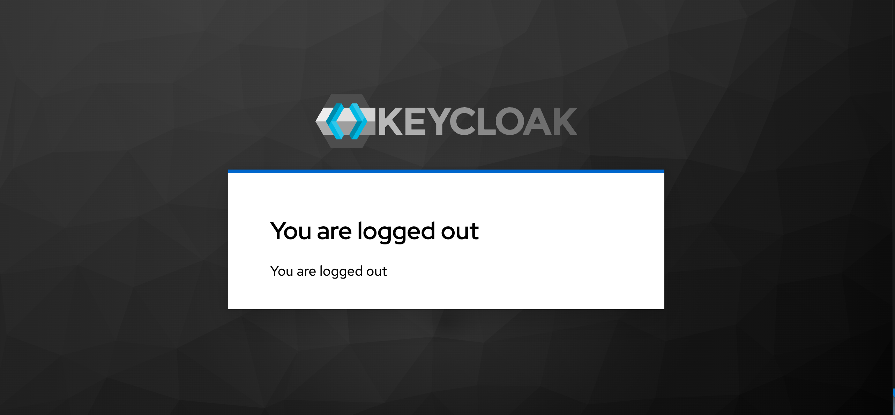
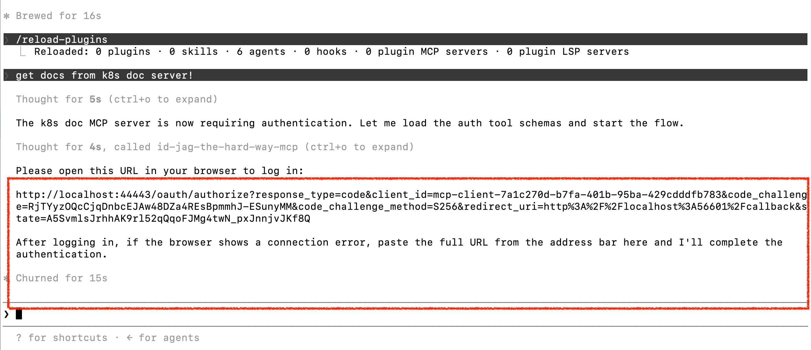
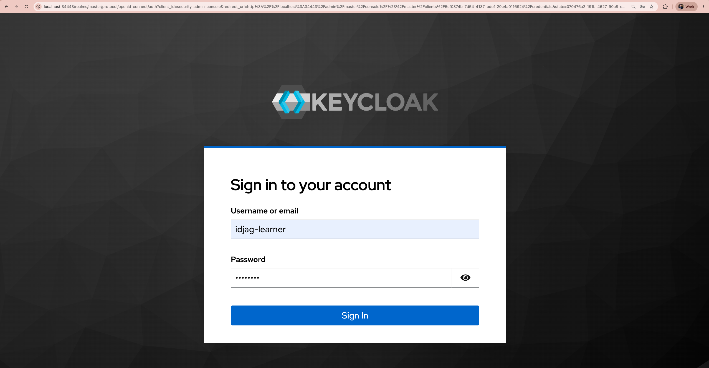
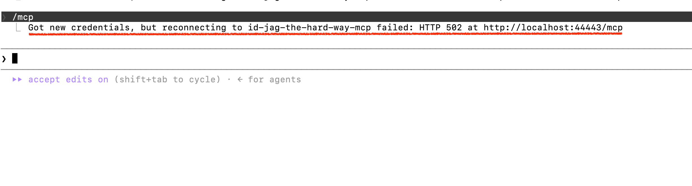

|                            Previous                            |        Current        |           Next           |
|:--------------------------------------------------------------:|:---------------------:|:------------------------:|
| [Trusted Identity Provider](./14-trusted-identity-provider.md) | **AI Client Gateway** | [ID-JAG](./16-id-jag.md) |

# AI Client Gateway

In this tutorial, we will deploy the `AI Client Gateway`. This component sits between Claude Code and the MCP server. It intercepts every request, resolves the human user's Keycloak ID token, and runs the full ID-JAG token exchange chain — so neither Claude Code nor the user ever has to manage Athenz tokens by hand.

<!-- TOC depthFrom:2 depthTo:2 -->

- [Understand What the Gateway Does](#understand-what-the-gateway-does)
- [Deploy AI Client Gateway in K8s](#deploy-ai-client-gateway-in-k8s)
- [Generate the Required Certificates](#generate-the-required-certificates)
- [Mount the Certificates](#mount-the-certificates)
- [Deploy the Human Gateway](#deploy-the-human-gateway)
- [Verification Prerequisite](#verification-prerequisite)
- [Verify](#verify)
- [What's next?](#whats-next)

<!-- /TOC -->

## Understand What the Gateway Does

Claude Code supports OAuth2-protected MCP servers out of the box. The first time it connects to an MCP server that responds with `401 Unauthorized`, it reads the `WWW-Authenticate` header, fetches the gateway's OAuth2 metadata document, and opens your browser to begin a login flow.

The gateway itself acts as a thin OAuth2 Authorization Server that delegates the actual authentication to Keycloak. After you log in, the gateway stores your Keycloak ID token in a server-side session and hands Claude Code a short-lived session token. From that point on, every MCP request from Claude Code carries that session token as a `Bearer` credential. The gateway resolves it back to your ID token and performs the same ID-JAG exchange chain you have seen in earlier tutorials.

```
[human ns]                       [ai ns]          [api ns]
Claude Code
    │ Bearer (session token)
    ▼
human ai-client-gateway
    │ resolves ID token
    │ → ID-JAG exchange (as human.idjag-learner.claude)
    │ → Athenz AT
    ▼
                              MCP Auth Proxy → MCP Server → API Server
```

## Deploy AI Client Gateway in K8s

The gateway belongs in the `human` namespace — it represents the human-controlled, client side of the architecture.

Create the `human` namespace:

```sh
kubectl create ns human
```

Deploy the gateway with name `claude-idjag-learner-ai-client-gateway`:

```sh
kubectl create deploy claude-idjag-learner-ai-client-gateway -n human \
  --image=ghcr.io/mlajkim/ai-client-gateway:latest
```

Check the logs — you will see an error about missing certificates:

```sh
kubectl logs deploy/claude-idjag-learner-ai-client-gateway -n human
```

```sh
# Error: ENOENT: no such file or directory, open '...certs/ai-client-gateway.crt'
```

This is expected. The gateway needs an X.509 certificate to identify itself to Athenz ZTS, and we have not provided one yet. The next two sections take care of that.

## Generate the Required Certificates

The gateway authenticates to Athenz ZTS as the service identity `human.idjag-learner.claude`. To do that, it needs an X.509 certificate issued by Athenz for that identity.

First, create the `human` top-level domain in Athenz:

```sh
./tools/athenz/create-tld.sh "human"
```

Generate an RSA key pair for the service:

```sh
./tools/athenz/create-private-key.sh "./keys/human-idjag-learner-claude"
```

```sh
# Generating RSA key pair for: ./keys/human-idjag-learner-claude...
# Done! Keys generated: ./keys/human-idjag-learner-claude.key, ./keys/human-idjag-learner-claude.public.key
```

Create the `idjag-learner` subdomain under `human`:

```sh
./tools/athenz/create-subdomain.sh "human" "idjag-learner"
```

Register the `claude` service under `human.idjag-learner` and enable the certificate provider so Athenz can issue X.509 certs for it:

```sh
./tools/athenz/create-service.sh "human.idjag-learner" "claude" "./keys/human-idjag-learner-claude.public.key"
./tools/athenz/enable-cert-provider.sh "human.idjag-learner" "claude"
```

## Mount the Certificates

Now that the service is registered, fetch the signed X.509 certificate from Athenz and store it as a Kubernetes Secret:

```sh
./tools/athenz/fetch-cert.sh "human.idjag-learner" "claude" "./keys/human-idjag-learner-claude.key" "v1"

kubectl delete -n human secret human-idjag-learner-claude-cert --ignore-not-found=true
kubectl -n human create secret generic human-idjag-learner-claude-cert \
  --from-file=ai-client-gateway.crt=./keys/human-idjag-learner-claude.crt \
  --from-file=ai-client-gateway.key=./keys/human-idjag-learner-claude.key \
  --from-file=ca.crt=./athenz_dist/certs/ca.cert.pem
```

Mount the secret into the gateway pod so the application can read the certificate files at `/app/certs`:

```sh
kubectl patch deploy claude-idjag-learner-ai-client-gateway -n human --patch "$(cat <<'EOF'
spec:
  template:
    spec:
      containers:
        - name: ai-client-gateway
          volumeMounts:
            - name: certs
              mountPath: /app/certs
              readOnly: true
      volumes:
        - name: certs
          secret:
            secretName: human-idjag-learner-claude-cert
EOF
)"
```

Verify the gateway started without errors:

```sh
kubectl logs deploy/claude-idjag-learner-ai-client-gateway -n human
```

```sh
# 🚀 OpenWebUI OpenAPI Gateway listening on 0.0.0.0:3101
# 🔗 Upstream API: http://mcp.api:8081
# 🌍 Public Base URL: http://localhost:44443
# 🔑 Athenz ZTS Endpoint: https://athenz-zts-server.athenz:4443/zts/v1
```


## Deploy the Human Gateway

Now that the certificate is in place, configure the gateway with the Keycloak credentials it needs to drive the OAuth2 login flow.

Store the Keycloak client credentials (use the client secret you copied in [tutorial 13](./13-identity-provider.md#copy-client-secret)):

```sh
_client_secret="🟡TODO: Put your client secret here"

kubectl delete -n human secret human-idjag-learner-claude-keycloak --ignore-not-found=true
kubectl -n human create secret generic human-idjag-learner-claude-keycloak \
  --from-literal=client-id="human.idjag-learner.claude" \
  --from-literal=client-secret="${_client_secret}"
```

Configure the environment variables for the gateway deployment:

```sh
_gateway_port=$(./tools/port.sh ai-client-gateway)
_keycloak_port=$(./tools/port.sh keycloak)

kubectl patch deploy claude-idjag-learner-ai-client-gateway -n human --patch "$(cat <<EOF
spec:
  template:
    spec:
      containers:
        - name: ai-client-gateway
          imagePullPolicy: Always
          env:
            - name: UPSTREAM_BASE_URL
              value: "http://mcp.api:8081"
            - name: ZTS_URL
              value: "https://athenz-zts-server.athenz:4443/zts/v1"
            - name: KEYCLOAK_URL
              value: "http://keycloak.idp:8080"
            - name: KEYCLOAK_REALM
              value: "master"
            - name: KEYCLOAK_CLIENT_ID
              valueFrom:
                secretKeyRef:
                  name: human-idjag-learner-claude-keycloak
                  key: client-id
            - name: KEYCLOAK_CLIENT_SECRET
              valueFrom:
                secretKeyRef:
                  name: human-idjag-learner-claude-keycloak
                  key: client-secret
            - name: PUBLIC_BASE_URL
              value: "http://localhost:${_gateway_port}"
            - name: KEYCLOAK_PUBLIC_URL
              value: "http://localhost:${_keycloak_port}"
EOF
)"
```

> [!NOTE]
> `KEYCLOAK_URL` uses the in-cluster address `keycloak.idp:8080` because the server-side token exchange happens inside the cluster during the OAuth callback. `KEYCLOAK_PUBLIC_URL` uses the port-forwarded address because the browser's login redirect must be reachable from your local machine.

Expose the deployment as a service and confirm the logs look healthy:

```sh
kubectl delete -n human svc ai-client-gateway --ignore-not-found=true
kubectl expose deploy claude-idjag-learner-ai-client-gateway -n human --port 3101 --name ai-client-gateway
kubectl logs deploy/claude-idjag-learner-ai-client-gateway -n human --tail=5
```

```sh
# 🚀 OpenWebUI OpenAPI Gateway listening on 0.0.0.0:3101
# 🔗 Upstream API: http://mcp.api:8081
# 🌍 Public Base URL: http://localhost:44443
# 🔑 Athenz ZTS Endpoint: https://athenz-zts-server.athenz:4443/zts/v1
```

## Verification Prerequisite

Before verifying, sign out of Keycloak so you start with a clean session. You may still be logged in as `admin` or `idjag-learner` from a previous tutorial.

```sh
_keycloak_port=$(./tools/port.sh keycloak)
./tools/open.sh "http://localhost:${_keycloak_port}/realms/master/protocol/openid-connect/logout"
```



## Verify

Point Claude Code at the gateway by writing an `.mcp.json` configuration file:

```sh
_gateway_port=$(./tools/port.sh ai-client-gateway)

cat > .mcp.json <<EOF
{
  "mcpServers": {
    "id-jag-the-hard-way-mcp": {
      "type": "http",
      "url": "http://localhost:${_gateway_port}/mcp"
    }
  }
}
EOF
```

> [!NOTE]
> Notice that there is no `Authorization` header or pre-fetched access token in this configuration. The gateway handles the entire ID-JAG flow on your behalf — you no longer need `_at=$(cat ./keys/idjag-learner.jwt)` or anything like it.

Then run `/reload-plugins` → `/mcp` → select **1. Authenticate**.

Claude Code will detect that the gateway requires a login and prompt you to authenticate:



Open the link (Claude Code may open it automatically). You will be redirected to Keycloak and asked to sign in. Use username `idjag-learner` and password `password`:



After signing in, you will see the authentication succeed but the MCP connection fail immediately:



This failure is intentional. The gateway now has your ID token and can prove who you are, but the `human.idjag-learner.claude` service does not yet have permission in Athenz to exchange that ID token for an ID-JAG token. Think of it like an enterprise policy: even though `idjag-learner` personally has access to the API, the organization has not yet granted this AI agent the right to act on that person's behalf.

## What's next?

In the next tutorial, we will grant `human.idjag-learner.claude` the Athenz permissions it needs to perform the full ID-JAG token exchange — effectively telling the authorization server that this AI agent is allowed to act on behalf of `idjag-learner`.

Next: [ID-JAG](./16-id-jag.md)
