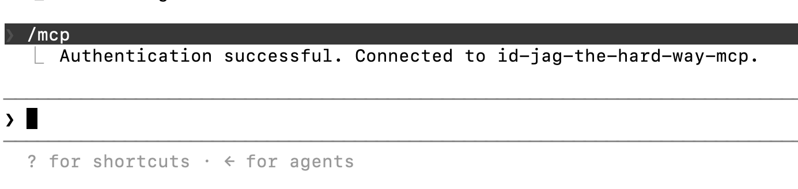

|                            Previous                            |        Current        |           Next           |
|:--------------------------------------------------------------:|:---------------------:|:------------------------:|
| [Trusted Identity Provider](./14-trusted-identity-provider.md) | **AI Client Gateway** | [ID-JAG](./16-id-jag.md) |

# AI Client Gateway

In this tutorial, we will deploy the `AI Client Gateway`. This component sits between Claude Code and the MCP server. It intercepts requests, resolves the user's Keycloak ID token, and performs the ID-JAG token exchange chain so that neither Claude Code nor the user ever has to manage Athenz tokens manually.

<!-- TOC depthFrom:2 depthTo:2 -->

- [Understand What the Gateway Does](#understand-what-the-gateway-does)
- [Deploy AI Client Gateway in K8s](#deploy-ai-client-gateway-in-k8s)
- [Generate the Required Certificates](#generate-the-required-certificates)
- [Mount the Certificates](#mount-the-certificates)
- [Register a Keycloak Client](#register-a-keycloak-client)
- [Deploy the Human Gateway](#deploy-the-human-gateway)
- [Verification Prerequisite](#verification-prerequisite)
- [Verify](#verify)
- [What's happened?](#whats-happened)
- [What's next?](#whats-next)

<!-- /TOC -->

## Understand What the Gateway Does

Claude Code supports OAuth2-protected MCP servers out of the box. When it first connects to an MCP server that returns `401 Unauthorized`, it reads the `WWW-Authenticate` header, discovers the gateway's OAuth2 metadata document, and opens your browser to start a login flow.

The gateway acts as a thin OAuth2 Authorization Server that delegates the actual login to your existing Keycloak deployment. Once you log in, the gateway stores your Keycloak ID token in a server-side session. Every subsequent MCP request carries that session token as a `Bearer` header, and the gateway performs the exact same ID-JAG token exchange chain as before.

```
[human ns]                       [ai ns]          [api ns]
Claude Code
    │ Bearer (session token)
    ▼
human ai-client-gateway
    │ resolves ID token
    │ → ID-JAG exchange (as human.claude-cli)
    │ → Athenz AT
    ▼
                              MCP Auth Proxy → MCP Server → API Server
```

## Deploy AI Client Gateway in K8s

The gateway belongs in the `human` (or `human`'s local) namespace — it is the local, human-controlled client side.

Create the `human` namespace:

```sh
kubectl create ns human
```

Deploy it:

```sh
kubectl create deploy claude-idjag-learner-ai-client-gateway -n human \
  --image=ghcr.io/mlajkim/ai-client-gateway:latest
```

Check the logs — you will see an error about missing certificates:

```sh
kubectl logs deploy/claude-idjag-learner-ai-client-gateway -n human
```

```sh
# Error: ENOENT: no such file or directory, open '/app/certs/open-webui.crt'
```

This is expected — we need to generate and mount the certificates next.

## Generate the Required Certificates

The gateway authenticates to Athenz ZTS using an X.509 certificate for the `human.claude-cli` service identity.

Create the `human` top-level domain:

```sh
./tools/athenz/create-tld.sh "human"
```

Generate the RSA key pair:

```sh
./tools/athenz/create-private-key.sh "./keys/human-idjag-learner-claude"
```

```sh
# Generating RSA key pair for: ./keys/human-idjag-learner-claude...
# Done! Keys generated: ./keys/human-idjag-learner-claude.key, ./keys/human-idjag-learner-claude.public.key
```

Create a sub domain `idjag-learner` under `human`:

```sh
./tools/athenz/create-subdomain.sh "human" "idjag-learner"
```

Register the `claude` service under `human.idjag-learner`:

```sh
./tools/athenz/create-service.sh "human.idjag-learner" "claude" "./keys/human-idjag-learner-claude.public.key"
./tools/athenz/enable-cert-provider.sh "human.idjag-learner" "claude"
```

## Mount the Certificates

Fetch X.509 Cert and create as a Kubernetes Secret:

```sh
./tools/athenz/fetch-cert.sh "human.idjag-learner" "claude" "./keys/human-idjag-learner-claude.key" "v1"

kubectl delete -n human secret human-idjag-learner-claude-cert --ignore-not-found=true
kubectl -n human create secret generic human-idjag-learner-claude-cert \
  --from-file=open-webui.crt=./keys/human-idjag-learner-claude.crt \
  --from-file=open-webui.key=./keys/human-idjag-learner-claude.key \
  --from-file=ca.crt=./athenz_dist/certs/ca.cert.pem
```

Mount the secret into the gateway deployment:

```sh
kubectl patch deploy claude-idjag-learner-ai-client-gateway -n human --patch "$(cat <<'EOF'
spec:
  template:
    spec:
      containers:
        - name: ai-client-gateway
          volumeMounts:
            - name: certs
              mountPath: /app/certs
              readOnly: true
      volumes:
        - name: certs
          secret:
            secretName: human-claude-cli-cert
EOF
)"
```

Verify the gateway started successfully:

```sh
kubectl logs deploy/ai-client-gateway -n human
```

```sh
# 🚀 OpenWebUI OpenAPI Gateway listening on 0.0.0.0:3101
# 🔗 Upstream API: http://mcp.api:8081
# 🌍 Public Base URL: http://localhost:44443
# 🔑 Athenz ZTS Endpoint: https://athenz-zts-server.athenz:4443/zts/v1
```


## Register a Keycloak Client

The gateway needs a Keycloak client to redirect the login and receive the callback.

Open the Keycloak admin UI:

```sh
_keycloak_port=$(./tools/port.sh keycloak)
./tools/open.sh "http://localhost:${_keycloak_port}/admin/master/console/#/master/clients/add-client"
```

Configure the following:

- **Client type**: `OpenID Connect`
- **Client ID**: `human.claude-cli`
- **Client authentication**: `ON`
- **Valid redirect URIs**: `http://localhost:44443/oauth/callback`
- **Web origins**: `http://localhost:44443`

Click **Save**.

> [!NOTE]
> The redirect URI must exactly match `PUBLIC_BASE_URL/oauth/callback` of the human gateway. Port `44443` is the default from `tools/config.yaml`. If you changed it via `config.local.yaml`, update the URI accordingly.

After saving, open the **Credentials** tab and copy the **Client secret** — you will need it in the next step.

## Deploy the Human Gateway

Store the Keycloak client credentials:

```sh
_client_secret="🟡TODO: Put your client secret here"

kubectl delete -n human secret human-idjag-learner-claude-keycloak --ignore-not-found=true
kubectl -n human create secret generic human-idjag-learner-claude-keycloak \
  --from-literal=client-id="human.claude-cli" \
  --from-literal=client-secret="${_client_secret}"
```

Configure environment variables:

```sh
_gateway_port=$(./tools/port.sh ai-client-gateway)
_keycloak_port=$(./tools/port.sh keycloak)

kubectl patch deploy claude-idjag-learner-ai-client-gateway -n human --patch "$(cat <<EOF
spec:
  template:
    spec:
      containers:
        - name: ai-client-gateway
          imagePullPolicy: Always
          env:
            - name: UPSTREAM_BASE_URL
              value: "http://mcp.api:8081"
            - name: ZTS_URL
              value: "https://athenz-zts-server.athenz:4443/zts/v1"
            - name: KEYCLOAK_URL
              value: "http://keycloak.idp:8080"
            - name: KEYCLOAK_REALM
              value: "master"
            - name: KEYCLOAK_CLIENT_ID
              valueFrom:
                secretKeyRef:
                  name: human-idjag-learner-claude-keycloak
                  key: client-id
            - name: KEYCLOAK_CLIENT_SECRET
              valueFrom:
                secretKeyRef:
                  name: human-idjag-learner-claude-keycloak
                  key: client-secret
            - name: PUBLIC_BASE_URL
              value: "http://localhost:${_gateway_port}"
            - name: KEYCLOAK_PUBLIC_URL
              value: "http://localhost:${_keycloak_port}"
EOF
)"
```

> [!NOTE]
> `KEYCLOAK_URL` uses the in-cluster address `keycloak.idp:8080` because the server-side token exchange in the OAuth callback runs inside the cluster. `KEYCLOAK_PUBLIC_URL` uses the port-forwarded address because the browser's login redirect must be reachable from your local machine.

Expose and verify:

```sh
kubectl delete -n human svc ai-client-gateway --ignore-not-found=true
kubectl expose deploy claude-idjag-learner-ai-client-gateway -n human --port 3101 --name ai-client-gateway
kubectl logs deploy/claude-idjag-learner-ai-client-gateway -n human --tail=5
```

```sh
# 🚀 OpenWebUI OpenAPI Gateway listening on 0.0.0.0:3101
# 🔗 Upstream API: http://mcp.api:8081
# 🌍 Public Base URL: http://localhost:44443
# 🔑 Athenz ZTS Endpoint: https://athenz-zts-server.athenz:4443/zts/v1
```

## Verification Prerequisite

Before we verify, let's quickly sign out from our IdP, as you may be logged in as `admin` or `idjag-learner` from previous tutorials.

```sh
_keycloak_port=$(./tools/port.sh keycloak)
tools/open.sh "http://localhost:${_keycloak_port}/realms/master/protocol/openid-connect/logout"
```


## Verify

Run the following command:

```sh
_gateway_port=$(./tools/port.sh ai-client-gateway)

cat > .mcp.json <<EOF
{
  "mcpServers": {
    "id-jag-the-hard-way-mcp": {
      "type": "http",
      "url": "http://localhost:${_gateway_port}/mcp"
    }
  }
}
EOF
```

> [!NOTE]
> Note that you no longer have to get Access Token, because it will follow the ID-JAG Flow to get it
> No more `_at=$(cat ./keys/idjag-learner.jwt)` or `"headeres": { "Authorzation: "Bearer ..." }` needed.

Then, do `reload-plugins` > `/mcp` > `1. Authenticate`

You will be asked to login, because the `AI Client Gateway` we just created requires the `id-token` to proceed.


Then your claude will show:



If you open the link (or automatically opened by the Claude), you will be prompted to sign in. Simply put `idjag-learner` and password `password`:


Once you are logged in, finally request for docs:

```sh
get docs from k8s doc server!
```

The request will fail. This is expected and intentional.

## What's happened?

We created a certificate for `human.claude-cli`, but this service does not yet have the necessary permissions in Athenz to exchange the Keycloak ID Token for an ID-JAG token. Because the gateway cannot assert your identity, the request is denied.


## What's next?

In the next tutorial, we will grant `human.claude-cli` the necessary Athenz permissions to perform the full ID-JAG exchange and complete the end-to-end authorization chain.

Next: [ID-JAG](./16-id-jag.md)
