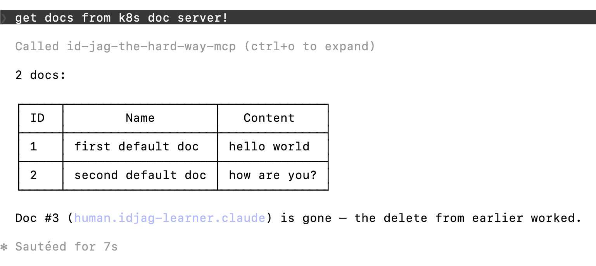

|                    Previous                    |  Current   |                      Next                      |
|:----------------------------------------------:|:----------:|:----------------------------------------------:|
| [AI Client Gateway](./15-ai-client-gateway.md) | **ID-JAG** | *None: You are at the end of the tutorial! 🎉* |

# ID-JAG

In this tutorial, we will resolve the authorization failure from the previous step. We will configure the token exchange policies in Athenz that allow the AI Client Gateway to exchange your Keycloak ID token for an ID-JAG token on your behalf. Once those permissions are in place, you will run the same prompt again and see it succeed end-to-end.

<!-- TOC depthFrom:2 depthTo:2 -->

- [Grant Permissions to `human.idjag-learner.claude`](#grant-permissions-to-humanidjag-learnerclaude)
- [Verify](#verify)
- [What's happened?](#whats-happened)
- [Finally](#finally)

<!-- /TOC -->

## Grant Permissions to `human.idjag-learner.claude`

The `human.idjag-learner.claude` service needs permission to perform JAG exchange into the target roles it will use.

Create one role for each exchange target:

```sh
./tools/athenz/create-role.sh "api" "docs-getter-jag-exchanger"
./tools/athenz/create-role.sh "api" "mcp-accessor-jag-exchanger"
```

```sh
  # ·  Creating Role: api:role.docs-getter-jag-exchanger...
  # ✔  Role created: api:role.docs-getter-jag-exchanger
  # ·  Creating Role: api:role.mcp-accessor-jag-exchanger...
  # ✔  Role created: api:role.mcp-accessor-jag-exchanger
```

In Athenz, the `zts.jag_exchange` action controls whether a principal can exchange an ID token for an ID-JAG token scoped to a given role. Grant it for `api:role.docs-getter` and `api:role.mcp-accessor`:

```sh
./tools/athenz/add-policy.sh "api" "docs-getter-jag-exchanger" "zts.jag_exchange" "role.docs-getter"
./tools/athenz/add-policy.sh "api" "mcp-accessor-jag-exchanger" "zts.jag_exchange" "role.mcp-accessor"
```

```sh
#   ·  Creating Policy: api:policy.docs-getter-jag-exchanger_zts_jag_exchange_role_docs-getter...
#   ✔  Policy created: api:policy.docs-getter-jag-exchanger_zts_jag_exchange_role_docs-getter
#   ·  Creating Policy: api:policy.mcp-accessor-jag-exchanger_zts_jag_exchange_role_mcp-accessor...
#   ✔  Policy created: api:policy.mcp-accessor-jag-exchanger_zts_jag_exchange_role_mcp-accessor
```

Now add `human.idjag-learner.claude` as a member of both roles:

```sh
./tools/athenz/add-role-member.sh "api" "docs-getter-jag-exchanger" "human.idjag-learner.claude"
./tools/athenz/add-role-member.sh "api" "mcp-accessor-jag-exchanger" "human.idjag-learner.claude"
```

```sh
#   ·  Adding Member human.idjag-learner.claude to Role: api:role.docs-getter-jag-exchanger...
#   ✔  human.idjag-learner.claude  →  api:role.docs-getter-jag-exchanger
#   ·  Adding Member human.idjag-learner.claude to Role: api:role.mcp-accessor-jag-exchanger...
#   ✔  human.idjag-learner.claude  →  api:role.mcp-accessor-jag-exchanger
```

## Verify

Do:

```sh
/reload-plugins
```

Then:

```sh
/mcp
```

Select **1. Re-Authenticate** to reconnect. This time, with the token exchange permission in place, you will see the connection succeed.

Then send the same prompt that failed in the previous tutorial:

```
get docs from k8s doc server!
```



🎉 ID-JAG worked! You got the docs!

## What's happened?

The logs show each authorization boundary in the chain.

1. The AI Client Gateway resolved the signed-in user's Keycloak ID token, exchanged it for an ID-JAG token, and then fetched an Athenz Access Token.

```sh
kubectl logs -n human deployment/claude-idjag-learner-ai-client-gateway --tail=30
```

```sh
# [Athenz ID-JAG] 🔑 Resolved ID token from bearer session (Claude Code path)
# [Athenz ID-JAG] 🔄 Attempting to exchange new ID-JAG with id-token for scope [api:role.docs-getter api:role.mcp-accessor] ...
# [Athenz ID-JAG] 🎯 Target ZTS for ID-JAG: https://athenz-zts-server.athenz:4443/zts/v1/oauth2/token
# [Athenz ID-JAG] 🎫 Granted scope in ID-JAG: ["api:role.docs-getter","api:role.mcp-accessor"]
# [Athenz AT] Fetching Athenz Access Token using ID-JAG ...
# [Athenz AT] 🎯 Target ZTS for AT: https://athenz-zts-server.athenz:4443/zts/v1/oauth2/token
# [Athenz AT] 🔑 Successfully fetched Athenz Access Token. Granted scope: ["docs-getter","mcp-accessor"]
```

2. The MCP Authorization Proxy checked that the gateway's Access Token had `access` on `mcp`.

```sh
kubectl logs -n api deployment/mcp -c auth-proxy --tail=20
```

```sh
# [2026-07-06 21:30:34] [INFO] [MCP-Auth-Proxy] ✅ AUTHORIZED: 'access' on 'mcp' (Token: eyJraWQiOi...)
# [2026-07-06 21:30:34] [INFO] [MCP-Auth-Proxy] ➡️ Forwarding to downstream MCP Server for API Server
```

3. The MCP server exchanged the incoming Access Token for an API-specific `docs-getter` Access Token.

```sh
kubectl logs -n api deployment/mcp -c mcp --tail=20
```

```sh
# [INFO] [Token Exchange] Initiating for scope: "api:role.docs-getter" using /app/certs/api-mcp.crt cert, token: eyJraWQiOiJhdGhl...
# [INFO] [Token Exchange] ✅ Success! scope: ["api:role.docs-getter"] gotScope: ["docs-getter"] token: eyJraWQiOiJhdGhl...
# 2026-07-07T06:30:34+09:00 [INFO] IP: 127.0.0.1 | POST /mcp HTTP/1.1 | Status: 200 | Time: 268.199 ms
# Headers: -
# Body: {
#   method: 'tools/call',
#   params: {
#     name: 'get_k8s_docs',
#     arguments: {},
#     _meta: {
#       'claudecode/toolUseId': 'toolu_bdrk_01KR8XRgaGWFKkSmNs9yqseh',
#       progressToken: 2
#     }
#   },
#   jsonrpc: '2.0',
#   id: 2
# }
```

4. The API server authorized the final token and returned the docs.

```sh
kubectl logs -n api deployment/api-server --tail=20
```

```sh
# [DEBUG] Access Granted: Action 'get' allowed on Resource 'docs' (Token: eyJraWQi...)
```

At every hop, the Principle of Least Privilege was enforced — each component only held the minimum permissions it needed.

## Finally

Thank you for following along. Hope it was helpful.

You have seen the full ID-JAG flow end-to-end: a human signs in, an AI agent acts on their behalf with a scoped identity, enterprise policy governs exactly what the agent can do, and the organization can tighten or expand those boundaries at any time — without touching application code.

If you found this tutorial useful, please consider giving the repository a ⭐ on GitHub!

[](https://github.com/mlajkim/id-jag-the-hard-way)

If you run into any issues or have questions, feel free to [open an issue](https://github.com/mlajkim/id-jag-the-hard-way/issues).
