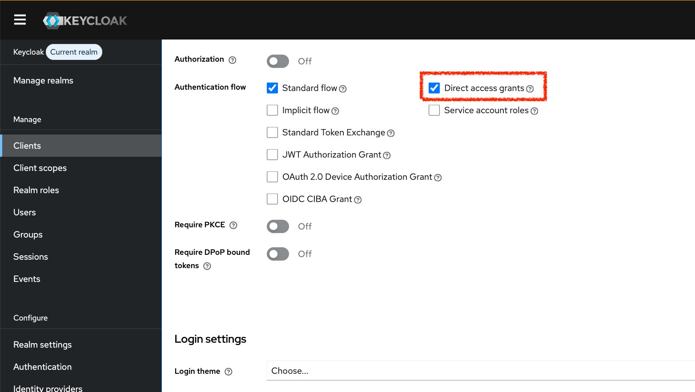

|                          Previous                           |             Current             |                                  Next                                   |
|:-----------------------------------------------------------:|:-------------------------------:|:-----------------------------------------------------------------------:|
| [Challenge: Successfully post documents](./01-post-docs.md) | **Challenge: ID-JAG with Curl** | [List all errors in ID_JAG exchange](./03-list-all-errors-in-id-jag.md) |

# Challenge: ID-JAG with Curl

We have depended on components preinstalled for you that does:

- id_token => ID_JAG
- ID_JAG => Access Token

Can you do the same using only `curl`?

- `sub`: `idjag-learner`
- `client_id`: `ai.open-webui`

## Solution

> [!NOTE]
> The solution has been tested and proven solvable.

<details>
<summary>Click to expand the solution</summary>
<br>

You need to have the `direct access grants` enabled. Go to `Keycloak` > `Clients` > `ai.open-webui` > then, search `Direct access grants`, then `Save` it.



> [!NOTE]
> You will get the following error without the setting above: `{"error":"unauthorized_client","error_description":"Client not allowed for direct access grants"}`

Then, get `id-token`:

```sh
_id_token=$(curl -s -X POST "http://localhost:9090/realms/master/protocol/openid-connect/token" \
  -d "client_id=ai.open-webui" \
  -d "client_secret=wdoKE9MBkgjLayZLg9Q6xU2oP2IOZKXv" \
  -d "username=idjag-learner" \
  -d "password=password" \
  -d "scope=openid email profile" \
  -d "grant_type=password" | jq -r '.id_token')

echo $_id_token | jq -R 'split(".") | .[0] | @base64d | fromjson'
echo $_id_token | jq -R 'split(".") | .[1] | @base64d | fromjson'
```

```sh
# {
#   "alg": "RS256",
#   "typ": "JWT",
#   "kid": "yYjouvP9rTOU1K0rpjMhhYoPa_xIlgdLi7vQZDdzj4w"
# }
# {
#   "exp": 1780347641,
#   "iat": 1780347581,
#   "jti": "e0a363bb-b624-4fc2-14a6-454e04f79b59",
#   "iss": "http://localhost:9090/realms/master",
#   "aud": "ai.open-webui",
#   "sub": "aaa9c26b-9609-47b1-a298-2ded44f28f21",
#   "typ": "ID",
#   "azp": "ai.open-webui",
#   "sid": "VTxpxTQcGGBhP0Mr_KeVXEjM",
#   "at_hash": "AbpW9Vlc6Frl4oJtP4GpFQ",
#   "acr": "1",
#   "email_verified": false,
#   "name": "ID-JAG Learner",
#   "preferred_username": "idjag-learner",
#   "given_name": "ID-JAG",
#   "family_name": "Learner",
#   "email": "idjag-learner@athenz.io"
# }
```

Then, get `ID_JAG` based on the `id_token`:

```sh
local _cert_path="./ai_client_gateway/certs/open-webui.crt"
local _key_path="./ai_client_gateway/certs/open-webui.key"
local _ca_cert="./athenz_dist/certs/ca.cert.pem"
local _zts_url="https://localhost:8443/zts/v1/oauth2/token"
local _role_scope="api:role.mcp-accessor api:role.docs-getter"
local _id_jag_aud="https://athenz-zts-server.athenz:4443/zts/v1"

_id_jag=$(curl -sS -X POST "$_zts_url" \
  --cert "$_cert_path" \
  --key "$_key_path" \
  --cacert "$_ca_cert" \
  -H "Content-Type: application/x-www-form-urlencoded" \
  --data-urlencode "grant_type=urn:ietf:params:oauth:grant-type:token-exchange" \
  --data-urlencode "requested_token_type=urn:ietf:params:oauth:token-type:id-jag" \
  --data-urlencode "subject_token_type=urn:ietf:params:oauth:token-type:id_token" \
  --data-urlencode "subject_token=$_id_token" \
  --data-urlencode "scope=$_role_scope" \
  --data-urlencode "audience=$_id_jag_aud" | jq -r .access_token)

echo $_id_jag | jq -R 'split(".") | .[0] | @base64d | fromjson'
echo $_id_jag | jq -R 'split(".") | .[1] | @base64d | fromjson'
```

```sh
# {
#   "kid": "athenz-zts-server-69c9bb4774-rmjn2",
#   "typ": "oauth-id-jag+jwt",
#   "alg": "RS256"
# }
# {
#   "sub": "human.idjag-learner",
#   "aud": "https://athenz-zts-server.athenz:4443/zts/v1",
#   "scp": [
#     "api:role.docs-getter",
#     "api:role.mcp-accessor"
#   ],
#   "ver": 1,
#   "auth_time": 1780348699,
#   "scope": "api:role.docs-getter api:role.mcp-accessor",
#   "iss": "https://athenz-zts-server.athenz:4443/zts/v1",
#   "exp": 1780355899,
#   "iat": 1780348699,
#   "jti": "c9a5d03e-b311-4ceb-a444-ae7099290ac3",
#   "client_id": "ai.open-webui"
# }
```

**✅ We have successfully fetched `ID_TOKEN` with `curl` only.**

</details>

## Next Challenge

Next: [List all errors in ID_JAG exchange](./03-list-all-errors-in-id-jag.md)