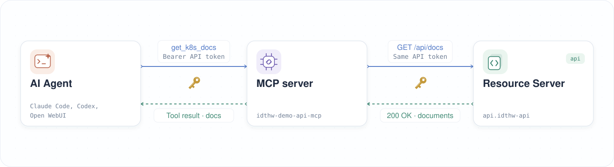

|               Previous               |  Current  |                   Next                   |
|:------------------------------------:|:---------:|:----------------------------------------:|
| [AI Agent](../09-ai-agent.md) | **Codex** | [Protect MCP Server](./10-protect-mcp-server.md) |

# Codex


> [!NOTE]
> Codex CLI runs on your machine. With OpenAI-hosted models, model inference runs remotely, so this path does not require a local model runtime such as Ollama.

Install Codex CLI, connect it to the MCP server, and verify that it discovers the document tools.

<!-- TOC depthFrom:2 depthTo:2 -->

- [Install Codex CLI](#install-codex-cli)
- [Sign In to Codex](#sign-in-to-codex)
- [Add the MCP Server to Codex](#add-the-mcp-server-to-codex)
- [Connect to the MCP Server](#connect-to-the-mcp-server)
- [Verify](#verify)
- [Understand the Result](#understand-the-result)
- [Next Steps](#next-steps)

<!-- /TOC -->

## Install Codex CLI

Check if Codex is already installed:

```sh
codex --version
```

```sh
# codex-cli X.XXX.X
```

If Codex is not installed, install [Node.js and npm](https://nodejs.org/en/download), then run:

```sh
npm install -g @openai/codex
```

> [!NOTE]
> For other installation methods, see the [official Codex CLI documentation](https://developers.openai.com/codex/cli/).

<a id="login-to-codex"></a>

## Sign In to Codex

Start Codex and follow the sign-in prompts:

```sh
codex
```

Choose **Sign in with ChatGPT** or another available authentication method. See the [authentication guide](https://learn.chatgpt.com/docs/auth) for the supported options. Exit Codex after signing in to configure the MCP connection in your shell.

## Add the MCP Server to Codex

Create a local Codex config file and append the provided settings:

```sh
_mcp_port=$(./tools/port.sh mcp)

cat > .codex/config.toml <<EOF
[mcp_servers.id-jag-the-hard-way-mcp]
url = "http://localhost:${_mcp_port}/mcp"
EOF

cat .codex/settings.toml >> .codex/config.toml
```

Check the created config file:

```sh
cat .codex/config.toml
```

```toml
[mcp_servers.id-jag-the-hard-way-mcp]
url = "http://localhost:<your_port>/mcp"

[mcp_servers.id-jag-the-hard-way-mcp.tools.get_k8s_docs]
approval_mode = "approve"

[mcp_servers.id-jag-the-hard-way-mcp.tools.delete_k8s_doc]
approval_mode = "approve"

[mcp_servers.id-jag-the-hard-way-mcp.tools.post_k8s_doc]
approval_mode = "approve"
```

<a id="connect-to-mcp-server"></a>

## Connect to the MCP Server

Start Codex in this project directory:

```sh
codex
```

Codex should connect and discover the three document tools.

## Verify

Confirm that Codex connects to `id-jag-the-hard-way-mcp` and discovers these tools:

- `get_k8s_docs`
- `post_k8s_doc`
- `delete_k8s_doc`

## Understand the Result

Codex CLI can connect to `idthw-demo-api-mcp` and discover its document tools without an access token. Discovery reads tool definitions; it does not retrieve documents from the protected API.



## Next Steps

The AI client can now discover the MCP tools. In the next chapter, we will add Runtime Proxy to validate access tokens before allowing tool execution.

Next: [Protect MCP Server](./10-protect-mcp-server.md)
