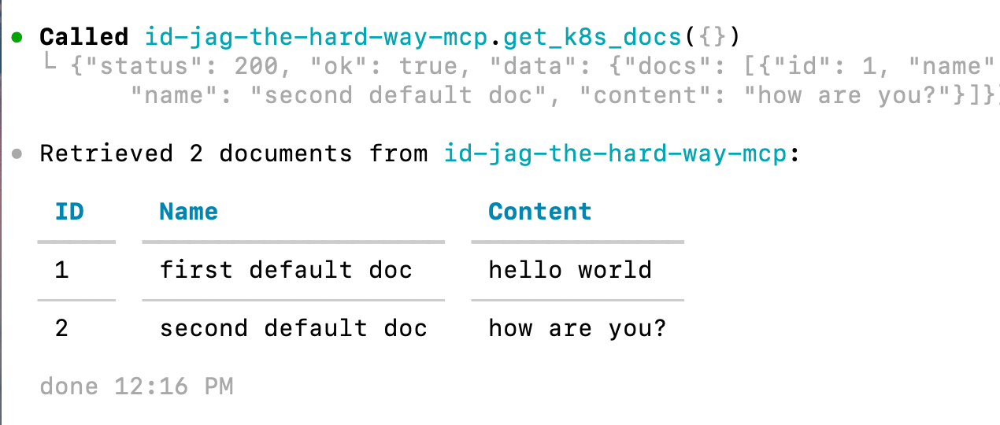

|               Previous               |  Current  |                   Next                   |
|:------------------------------------:|:---------:|:----------------------------------------:|
| [AI Agent](../09-ai-agent.md) | **Codex** | [Protect MCP Server](./10-protect-mcp-server.md) |

# Codex


> [!NOTE]
> Codex CLI runs on your machine. With OpenAI-hosted models, model inference runs remotely, so this path does not require a local model runtime such as Ollama.

Install Codex CLI, connect it to the MCP server, and retrieve documents using the learner's API access token.

<!-- TOC depthFrom:2 depthTo:2 -->

- [Install Codex CLI](#install-codex-cli)
- [Sign In to Codex](#sign-in-to-codex)
- [Add the MCP Server to Codex](#add-the-mcp-server-to-codex)
- [Connect to the MCP Server](#connect-to-the-mcp-server)
- [Verify](#verify)
- [Verify Working](#verify-working)
- [Understand the Result](#understand-the-result)
- [Next Steps](#next-steps)

<!-- /TOC -->

## Install Codex CLI

Check if Codex is already installed:

```sh
codex --version
```

```sh
# codex-cli X.XXX.X
```

If Codex is not installed, install [Node.js and npm](https://nodejs.org/en/download), then run:

```sh
npm install -g @openai/codex
```

> [!NOTE]
> For other installation methods, see the [official Codex CLI documentation](https://developers.openai.com/codex/cli/).

<a id="login-to-codex"></a>

## Sign In to Codex

Start Codex and follow the sign-in prompts:

```sh
codex
```

Choose **Sign in with ChatGPT** or another available authentication method. See the [authentication guide](https://learn.chatgpt.com/docs/auth) for the supported options. Exit Codex after signing in to configure the MCP connection in your shell.

## Add the MCP Server to Codex

Fetch a fresh API access token, create the local Codex config, and append the provided settings in the same block. The MCP server forwards this bearer token from each request to the API:

```sh
_mcp_port=$(./tools/port.sh mcp)
_scope="api:role.docs-getter"
_my_access_token=$(./tools/athenz/fetch-access-token.sh \
  "./keys/idjag-learner.crt" \
  "./keys/idjag-learner.key" \
  "${_scope}" \
  "./keys/idjag-learner.jwt")

cat > .codex/config.toml <<EOF
[mcp_servers.id-jag-the-hard-way-mcp]
url = "http://localhost:${_mcp_port}/mcp"
http_headers = { Authorization = "Bearer ${_my_access_token}" }
EOF

cat .codex/settings.toml >> .codex/config.toml
```

Check the created config file:

```sh
cat .codex/config.toml
```

```sh
# [mcp_servers.id-jag-the-hard-way-mcp]
# url = "http://localhost:<your_port>/mcp"
# http_headers = { Authorization = "Bearer <your_access_token>" }

# [mcp_servers.id-jag-the-hard-way-mcp.tools.get_k8s_docs]
# approval_mode = "approve"

# [mcp_servers.id-jag-the-hard-way-mcp.tools.delete_k8s_doc]
# approval_mode = "approve"

# [mcp_servers.id-jag-the-hard-way-mcp.tools.post_k8s_doc]
# approval_mode = "approve"
```

<a id="connect-to-mcp-server"></a>

## Connect to the MCP Server

Start Codex in this project directory:

```sh
codex
```

Codex should connect and discover the three document tools.

## Verify

Confirm that the MCP status shows `id-jag-the-hard-way-mcp` connected with all three document tools:

```sh
/mcp verbose
```

```sh
# 🔌  MCP Tools

#   • id-jag-the-hard-way-mcp: connected (3 tools)
#     • Auth: Bearer token
#     • Tools: delete_k8s_doc, get_k8s_docs, post_k8s_doc
#     • Resources: (none)
#     • Resource templates: (none)
```

## Verify Working


Ask Codex to call the document tool:

```sh
Get docs with id-jag-the-hard-way-mcp
```



The tool should return status `200` and the document list. If the API rejects an expired token, repeat the token and configuration steps above, then restart Codex.

## Understand the Result

Discovery reads tool definitions without calling the API. When Codex calls `get_k8s_docs`, the MCP server forwards the API token from that request's Authorization header. The API validates the token and its document-read permission.


## Next Steps

The AI client can now retrieve documents through MCP. In the next chapter, we will add Runtime Proxy to validate access tokens before allowing tool execution.

Next: [Protect MCP Server](./10-protect-mcp-server.md)
