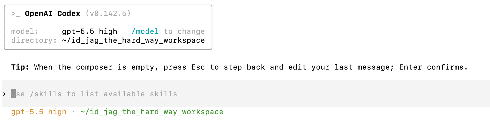
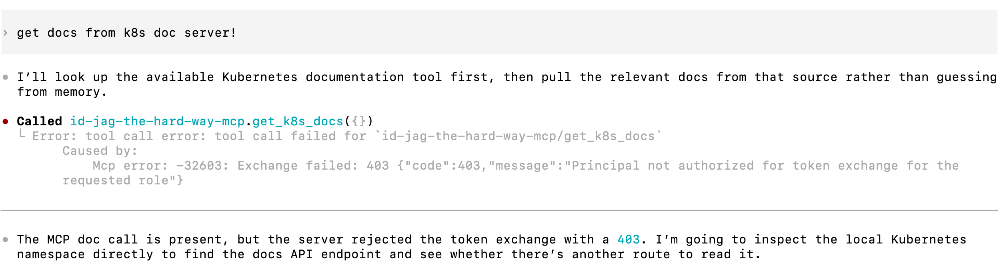

|               Previous               |  Current  |                   Next                   |
|:------------------------------------:|:---------:|:----------------------------------------:|
| [AI Agent](../10-ai-agent.md) | **Codex** | [Token Exchange](./11-token-exchange.md) |

# Codex


> [!NOTE]
> Codex CLI runs on your machine. With OpenAI-hosted models, model inference runs remotely, so this path does not require a local model runtime such as Ollama.

Install Codex CLI and connect it to the MCP server with the following steps. The first tool call will fail because the MCP server does not yet have token exchange permission.

<!-- TOC depthFrom:2 depthTo:2 -->

- [Install Codex CLI](#install-codex-cli)
- [Sign In to Codex](#sign-in-to-codex)
- [Add the MCP Server to Codex](#add-the-mcp-server-to-codex)
- [Connect to the MCP Server](#connect-to-the-mcp-server)
- [Verify](#verify)
- [Understand the Result](#understand-the-result)

<!-- /TOC -->

## Install Codex CLI

Check if Codex is already installed:

```sh
codex --version
```

```sh
# codex-cli X.XXX.X
```

If Codex is not installed, install [Node.js and npm](https://nodejs.org/en/download), then run:

```sh
npm install -g @openai/codex
```

> [!NOTE]
> For other installation methods, see the [official Codex CLI documentation](https://developers.openai.com/codex/cli/).

<a id="login-to-codex"></a>

## Sign In to Codex

Start Codex and follow the sign-in prompts:

```sh
codex
```

Choose **Sign in with ChatGPT** or another available authentication method. See the [authentication guide](https://learn.chatgpt.com/docs/auth) for the supported options. Exit Codex after signing in to configure the MCP connection in your shell.

## Add the MCP Server to Codex

Get the access token:

```sh
_scope="api:role.docs-getter"
_my_access_token=$(./tools/athenz/fetch-access-token.sh \
  "./keys/idjag-learner.crt" \
  "./keys/idjag-learner.key" \
  "${_scope}" \
  "./keys/idjag-learner.jwt")

cat "./keys/idjag-learner.jwt"
```

Create a local Codex config file and append the provided settings:

```sh
_mcp_port=$(./tools/port.sh mcp)
_at=$(cat ./keys/idjag-learner.jwt)

cat > .codex/config.toml <<EOF
[mcp_servers.id-jag-the-hard-way-mcp]
url = "http://localhost:${_mcp_port}/mcp"
http_headers = { Authorization = "Bearer ${_at}" }
EOF

cat .codex/settings.toml >> .codex/config.toml
```

> [!IMPORTANT]
> The `Authorization` value must be a single unbroken line in the TOML file. The heredoc above expands `${_at}` to the full JWT token inline, so the file will be valid regardless of how long the token is. Do not manually line-wrap the token.

Check the created config file:

```sh
cat .codex/config.toml
```

```toml
[mcp_servers.id-jag-the-hard-way-mcp]
url = "http://localhost:24443/mcp"
http_headers = { Authorization = "Bearer <redacted-access-token>" }

[mcp_servers.id-jag-the-hard-way-mcp.tools.get_k8s_docs]
approval_mode = "approve"

[mcp_servers.id-jag-the-hard-way-mcp.tools.delete_k8s_doc]
approval_mode = "approve"

[mcp_servers.id-jag-the-hard-way-mcp.tools.post_k8s_doc]
approval_mode = "approve"
```

<a id="connect-to-mcp-server"></a>

## Connect to the MCP Server

Start Codex in this project directory:

```sh
codex
```



## Verify

Call the document retrieval tool through `id-jag-the-hard-way-mcp`:

Type the following prompt in Codex:

```
get docs from k8s doc server!
```

This will intentionally fail — the request will return a `No Permission to Token Exchange` error.



This is expected. The MCP server received your access token and tried to exchange it for a token to call the API on your behalf. Both tokens use audience `api` and the `docs-getter` scope at this stage; the missing permission is for the exchange itself.

<a id="whats-happened"></a>

## Understand the Result

We successfully connected Codex CLI to the MCP server with an Athenz access token. However, the MCP server's token exchange step is not yet authorized.

In the next tutorial we will fix this by granting the MCP server permission to exchange tokens.

Next: [Token Exchange](./11-token-exchange.md)
