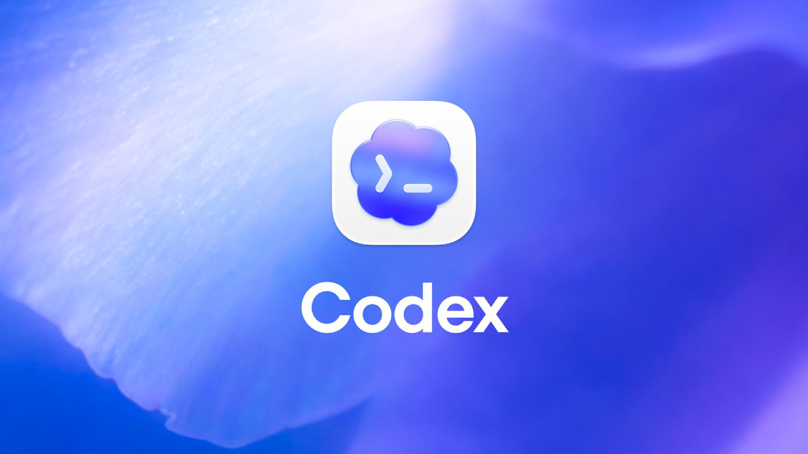

|               Previous               |  Current  |                   Next                   |
|:------------------------------------:|:---------:|:----------------------------------------:|
| [AI Client Agent](../10-ai-agent.md) | **Codex** | [Token Exchange](./11-token-exchange.md) |

# Codex



> [!NOTE]
> OpenAI Codex CLI runs in the cloud and has no local hardware requirements. This path uses the Codex CLI as the AI client instead of Claude Code or Open WebUI.

> [!NOTE]
> Codex is currently BETA

In this tutorial, we will install Codex CLI as the AI client and connect it to the MCP server for the first time.

<!-- TOC depthFrom:2 depthTo:2 -->

- [Install Codex CLI](#install-codex-cli)
- [Login to Codex](#login-to-codex)
- [Add the MCP Server to Codex](#add-the-mcp-server-to-codex)
- [Connect to MCP Server](#connect-to-mcp-server)
- [Verify](#verify)
- [What's happened?](#whats-happened)

<!-- /TOC -->

## Install Codex CLI

Check if Codex is already installed:

```sh
codex --version
```

```sh
# codex-cli X.XXX.X
```

If you don't see a version, install it:

```sh
npm install -g @openai/codex
```

> [!NOTE]
> For the official Codex CLI installation guide, visit: https://github.com/openai/codex

## Login to Codex

Set your OpenAI API key:

```sh
export OPENAI_API_KEY=<your-openai-api-key>
```

> [!TIP]
> You can add this to your shell profile (e.g. `~/.zshrc` or `~/.bashrc`) so you do not have to set it every time.

## Add the MCP Server to Codex

Get the Access Token:

```sh
_scope="api:role.docs-getter"
_my_access_token=$(./tools/athenz/fetch-access-token.sh \
  "./keys/idjag-learner.crt" \
  "./keys/idjag-learner.key" \
  "${_scope}" \
  "./keys/idjag-learner.jwt")

cat "./keys/idjag-learner.jwt"
```

Create a project-local `.codex/config.toml` at the root of this repository.

> [!NOTE]
> Codex merges config from two locations: the global `~/.codex/config.toml` and the project-local `.codex/config.toml` in the current directory. Settings in the project-local file are appended to the global config, so you only need to add the MCP server entry here — any existing global settings remain active.

```sh
_mcp_port=$(./tools/port.sh mcp)
_at=$(cat ./keys/idjag-learner.jwt)

mkdir -p .codex
cat > .codex/config.toml <<EOF
[mcp_servers.id-jag-the-hard-way-mcp]
type = "http"
url = "http://localhost:${_mcp_port}/mcp"
http_headers = { Authorization = "Bearer ${_at}" }
EOF
```

> [!IMPORTANT]
> The `Authorization` value must be a single unbroken line in the TOML file. The heredoc above expands `${_at}` to the full JWT token inline, so the file will be valid regardless of how long the token is. Do not manually line-wrap the token.

Check the created config file:

```sh
cat .codex/config.toml
```

## Connect to MCP Server

Start Codex in this project directory:

```sh
codex
```

> [!NOTE]
> 🟡 TODO: Add a screenshot of Codex CLI running with the MCP server connected successfully.

## Verify

Let's see if we can talk through the `id-jag-the-hard-way-mcp` MCP.

Type the following prompt in Codex:

```
get docs from k8s doc server!
```

> [!NOTE]
> 🟡 TODO: Add a screenshot of Codex asking for permission to proceed.

This will intentionally fail — the request will return a `No Permission to Token Exchange` error.

> [!NOTE]
> 🟡 TODO: Add a screenshot of the token exchange permission error in Codex.

This is expected. The MCP server received your Access Token and tried to exchange it for a narrower-scoped token to call the API server — but it does not yet have permission to do that.

## What's happened?

We successfully connected Codex CLI to the MCP server with an Athenz Access Token. However, the MCP server's token exchange step is not yet authorized.

In the next tutorial we will fix this by granting the MCP server permission to exchange tokens.

Next: [Token Exchange](./11-token-exchange.md)
