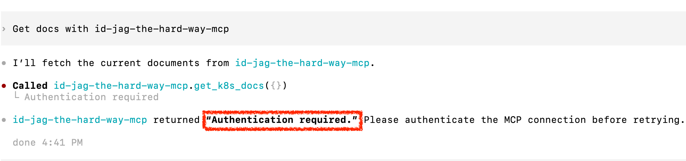

| Previous | Current | Next |
|:---:|:---:|:---:|
| [Codex](./09-ai-agent.md) | **Protect MCP Server — Codex** | [Token Exchange](./11-token-exchange.md) |

# Protect MCP Server — Codex

In the previous chapter, the AI client retrieved documents with an Athenz access token (AT). Just as we protected the API server with an AT, we also want to protect the MCP server.

The [MCP authorization specification](https://modelcontextprotocol.io/specification/2025-11-25/basic/authorization#access-token-privilege-restriction) states:

> If the MCP server makes requests to upstream APIs, it may act as an OAuth client to them. The access token used at the upstream API is a separate token, issued by the upstream authorization server. The MCP server **MUST NOT** pass through the token it received from the MCP client.

In this chapter, we will deploy `MCP Runtime Proxy` to require an AT with audience `mcp` and scope `mcp:role.mcp-accessor` before allowing tool calls. After MCP access passes, we will see why the proxy needs token exchange to obtain a separate API AT.

<!-- TOC depthFrom:2 depthTo:2 -->

- [Deploy MCP Runtime Proxy](#deploy-mcp-runtime-proxy)
- [Verify MCP Access Is Rejected](#verify-mcp-access-is-rejected)
- [Grant the Learner MCP Access](#grant-the-learner-mcp-access)
- [Update Codex with the MCP Token](#update-codex-with-the-mcp-token)
- [Verify Token Exchange Is Required](#verify-token-exchange-is-required)
- [Next Steps](#next-steps)

<!-- /TOC -->

## Deploy MCP Runtime Proxy

The Runtime Proxy image must support declaring `MCP_TOOL_SCOPES` before token exchange is enabled. Earlier images reject this combination at startup; use an image built with the updated proxy behavior.

### Attach the Proxy

Add Runtime Proxy as a second container in the MCP pod. It will require audience `mcp` and scope `mcp:role.mcp-accessor` for tool calls. `MCP_TOOL_SCOPES` declares the API scope each tool needs. Token exchange remains disabled until chapter 11. The Athenz domain and learner role will be created below.

```sh
kubectl patch deploy mcp -n mcp --patch "$(cat <<'EOF'
spec:
  template:
    spec:
      containers:
        - name: auth-proxy
          image: ghcr.io/mlajkim/mcp-runtime-proxy:latest
          imagePullPolicy: Always
          env:
            - name: ATHENZ_EXPECTED_AUDIENCE
              value: "mcp"
            - name: ATHENZ_REQUIRED_SCOPE
              value: "mcp:role.mcp-accessor"
            - name: MCP_PUBLIC_OPENAPI_ENABLED
              value: "true"
            - name: MCP_TOOL_SCOPES
              value: '{"get_k8s_docs":"api:role.docs-getter","post_k8s_doc":"api:role.docs-poster","delete_k8s_doc":"api:role.docs-deleter"}'
          ports:
            - containerPort: 8082
          readinessProbe:
            httpGet:
              path: /readyz
              port: 8082
          livenessProbe:
            httpGet:
              path: /healthz
              port: 8082
EOF
)"
```

```sh
# deployment.apps/mcp patched
```

Both containers share the pod's network. Runtime Proxy listens on `8082` and reaches the MCP app at its default loopback address, `http://127.0.0.1:8080`.

The proxy reads `/var/run/athenz/ca.crt` at startup. Until you mount the CA in the next step, its container will exit and restart; wait for readiness after that step.

### Create and Attach the CA Secret

Create a Secret containing the existing Athenz CA certificate. Runtime Proxy uses it to trust ZTS when loading signing keys and exchanging tokens:

```sh
kubectl -n mcp create secret generic mcp-runtime-proxy-athenz-ca \
  --from-file=ca.crt=./athenz_dist/certs/ca.cert.pem \
  --dry-run=client -o yaml | kubectl apply -f -
```

```sh
# secret/mcp-runtime-proxy-athenz-ca created
```

Mount the CA Secret in Runtime Proxy:

```sh
kubectl patch deploy mcp -n mcp --patch "$(cat <<'EOF'
spec:
  template:
    spec:
      containers:
        - name: auth-proxy
          volumeMounts:
            - name: athenz-ca-secret
              mountPath: /var/run/athenz
              readOnly: true
      volumes:
        - name: athenz-ca-secret
          secret:
            secretName: mcp-runtime-proxy-athenz-ca
EOF
)"
```

```sh
# deployment.apps/mcp patched
```

The proxy can now start. Its readiness probe checks MCP initialization. Tool discovery and OpenAPI discovery stay public.

### Route Requests Through the Proxy

Wait for both containers to be ready:

```sh
kubectl rollout status deploy/mcp -n mcp
```

```sh
# deployment "mcp" successfully rolled out
```

Point the Service at Runtime Proxy on `8082`, keeping its public port `8081`:

```sh
kubectl patch svc mcp -n mcp --patch '{"spec":{"ports":[{"port":8081,"targetPort":8082}]}}'
```

```sh
# service/mcp patched
```

## Verify MCP Access Is Rejected

Before creating the MCP domain or service identity in Athenz, ask Codex to retrieve documents again using the same configuration as in the previous chapter:

```sh
Get docs with id-jag-the-hard-way-mcp
```

Codex should report **Authentication required**:



Codex can still connect and discover tools, but Runtime Proxy rejects this tool call. The token configured in the previous chapter has audience `api`; the proxy now requires audience `mcp`. Even an unexpired API token fails this check. The next steps issue an MCP-audience token.

Check the proxy log for the reason behind Codex's authentication message:

```sh
kubectl logs deploy/mcp -n mcp -c auth-proxy --tail=2
```

Example output from the updated proxy for an unexpired API-audience token:

```sh
# 2026-XX-XXT03:20:11.552Z → INFO  [mcp-runtime-proxy] [request] request received | requestId=434926ee-eba7-4770-aca3-6a292410b19c method=POST path=/mcp accessTokenPresent=true
# 2026-XX-XXT03:20:11.583Z ! WARN  [mcp-runtime-proxy] [auth] access denied | requestId=434926ee-eba7-4770-aca3-6a292410b19c method=POST path=/mcp accessTokenPresent=true code=invalid_access_token durationMs=31 message="The Athenz access token is invalid or expired." status=401 expectedAudience=mcp requiredScope=mcp:role.mcp-accessor keyId=athenz-zts-server-example signatureVerified=true expiresAt=2026-XX-XXT04:20:11.000Z expiresInSeconds=3600 audiences=["api"] reason=audience_mismatch
```

`reason=audience_mismatch`, `expectedAudience=mcp`, and `audiences=["api"]` identify the failed check. `signatureVerified=true` and the positive `expiresInSeconds` show that the signature and expiration checks passed.

`invalid_access_token` is the client-facing error code. An expired token instead logs `reason=token_expired`, its `expiresAt`, and a nonpositive `expiresInSeconds`; expiration is checked before audience. If Codex sends no bearer token, the log shows `accessTokenPresent=false`, `code=missing_access_token`, and `reason=missing_authorization`, also with `status=401`. These failures stop the request at MCP access validation, before any downstream exchange or API call.


## Grant the Learner MCP Access

Create the `mcp` domain:

```sh
./tools/athenz/create-tld.sh "mcp"
```

Create the MCP accessor role:

```sh
./tools/athenz/create-role.sh "mcp" "mcp-accessor"
```

Add the learner to that role:

```sh
./tools/athenz/add-role-member.sh "mcp" "mcp-accessor" "human.idjag-learner"
```

Request both MCP and API scopes, explicitly selecting the MCP audience:

```sh
_scope="mcp:role.mcp-accessor api:role.docs-getter"
_my_access_token=$(./tools/athenz/fetch-access-token.sh \
  "./keys/idjag-learner.crt" \
  "./keys/idjag-learner.key" \
  "${_scope}" \
  "./keys/idjag-learner.jwt" \
  --audience mcp)
```

Example output:

```text
  ·  Fetching Access Token for scope: mcp:role.mcp-accessor api:role.docs-getter...
  ✔  Access token issued for scope: mcp:role.mcp-accessor api:role.docs-getter
{
  "kid": "athenz-zts-server-5fcdbc67f4-lwctf",
  "typ": "at+jwt",
  "alg": "RS256"
}
{
  "sub": "human.idjag-learner",
  "scp": [
    "api:role.docs-getter",
    "mcp-accessor"
  ],
  "ver": 1,
  "iss": "athenz-zts-server-5fcdbc67f4-lwctf",
  "client_id": "human.idjag-learner",
  "aud": "mcp",
  "uid": "human.idjag-learner",
  "auth_time": 1790138556,
  "scope": "api:role.docs-getter mcp-accessor",
  "cnf": {
    "x5t#S256": "X-pSh5Xo4sMnl9vvbPkUtcJCgOPHdfsBG1PGzecYoIg"
  },
  "exp": 1790142156,
  "iat": 1790138556,
  "jti": "0e87ef54-6233-4540-9452-77608bd02556"
}
```

The MCP role permits tool execution. The API role permits the later exchange into document access; the API still rejects this MCP-audience token directly.

## Update Codex with the MCP Token

Update `.codex/config.toml` with the MCP-audience token from the preceding step. Run this block in the same shell where you issued `_my_access_token`. If the token has expired, rerun the token command first.

For the tutorial configuration from chapter 09, use the following block. If you have added unrelated settings, update just this server's `http_headers` entry instead of replacing the file:

```sh
_mcp_port=$(./tools/port.sh mcp)

cat > .codex/config.toml <<EOF
[mcp_servers.id-jag-the-hard-way-mcp]
url = "http://localhost:${_mcp_port}/mcp"
http_headers = { Authorization = "Bearer ${_my_access_token}" }
EOF
cat .codex/settings.toml >> .codex/config.toml
```

Exit the current Codex session:

```text
/quit
```

From the project directory, restart Codex and resume the conversation so it loads the updated token:

```sh
codex resume --last
```

## Verify Token Exchange Is Required

Ask Codex to retrieve the documents again:

```sh
Get docs with id-jag-the-hard-way-mcp
```

The MCP token now passes validation, but the proxy cannot obtain the API token yet. The tool request should fail with HTTP `502` and:

```json
{
  "error": "downstream_token_exchange_unavailable",
  "message": "Downstream access-token publication is not enabled for this MCP server."
}
```

Check the proxy log:

```sh
kubectl logs deploy/mcp -n mcp -c auth-proxy --tail=3
```

```sh
# 2026-09-23T07:05:21.309Z → INFO  [mcp-runtime-proxy] [request] request received | requestId=eb1c16b4-6ec0-445f-905d-7baa32cb4952 method=POST path=/mcp accessTokenPresent=true
# 2026-09-23T07:05:21.312Z ✓ INFO  [mcp-runtime-proxy] [auth] access token verified | requestId=eb1c16b4-6ec0-445f-905d-7baa32cb4952 method=POST path=/mcp audiences=["mcp"] clientId=human.idjag-learner expiresAt=2026-09-23T08:04:16.000Z expiresInSeconds=3535 keyId=athenz-zts-server-5fcdbc67f4-lwctf scopes=["api:role.docs-getter","mcp-accessor"] subject=human.idjag-learner userId=human.idjag-learner
# 2026-09-23T07:05:21.312Z × ERROR [mcp-runtime-proxy] [exchange] downstream token exchange failed | requestId=eb1c16b4-6ec0-445f-905d-7baa32cb4952 method=POST path=/mcp code=downstream_token_exchange_unavailable durationMs=3 message="Downstream access-token publication is not enabled for this MCP server." status=502
```

For the same `requestId`, "access token verified" is followed by "downstream token exchange failed" with `code=downstream_token_exchange_unavailable` and `status=502`.

The MCP token passed validation, but the tool needs a separate API token. Token exchange is not yet configured, so the proxy stops the request before contacting Athenz for exchange or calling the MCP tool or API.

## Next Steps

In the next chapter, you will prepare Runtime Proxy's service identity and shared token directory, configure and authorize token exchange, and retry the request through Codex.

Next: [Token Exchange — Codex](./11-token-exchange.md)
