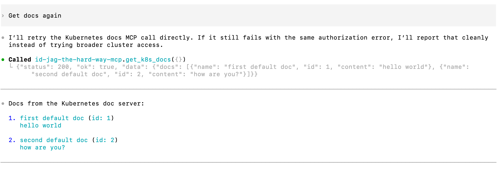

|              Previous               |          Current           |                       Next                       |
|:-----------------------------------:|:--------------------------:|:------------------------------------------------:|
| [AI Client Agent](./10-ai-agent.md) | **Token Exchange - Codex** | [Protect MCP Server](./12-protect-mcp-server.md) |

# Token Exchange - Codex

In this tutorial, we will fix the "Principal not authorized for token exchange" error from the previous step. The MCP server received your Access Token but did not have permission to exchange it for a new one on your behalf.

By implementing [OAuth 2.0 Token Exchange (RFC 8693)](https://www.rfc-editor.org/rfc/rfc8693.html), we will grant the MCP server permission to exchange the user's Access Token and act on their behalf to call the API server.

<!-- TOC depthFrom:2 depthTo:2 -->

- [Allow MCP Server to Exchange the Given Access Token](#allow-mcp-server-to-exchange-the-given-access-token)
- [Refresh the MCP Token](#refresh-the-mcp-token)
- [Verify](#verify)
- [What's happened?](#whats-happened)

<!-- /TOC -->

## Allow MCP Server to Exchange the Given Access Token

Even if the original requester has `get` access to the `api:docs` resource, that does not automatically mean anyone can exchange the Access Token on their behalf. We need to create dedicated roles that explicitly allow token exchange.

Create the exchange roles:

```sh
./tools/athenz/create-role.sh "api" "to-api-exchanger"
./tools/athenz/create-role.sh "api" "docs-getter-exchanger"
```

```sh
#   ·  Creating Role: api:role.to-api-exchanger...
#   ✔  Role created: api:role.to-api-exchanger
#   ·  Creating Role: api:role.docs-getter-exchanger...
#   ✔  Role created: api:role.docs-getter-exchanger
```

In Athenz, you must explicitly define both the source and the target of the exchange. Add both policies:

```sh
./tools/athenz/add-policy.sh "api" "to-api-exchanger" "zts.token_source_exchange" "api"
./tools/athenz/add-policy.sh "api" "docs-getter-exchanger" "zts.token_target_exchange" "api:role.docs-getter"
```

```sh
#   ·  Creating Policy: api:policy.to-api-exchanger_zts_token_source_exchange_api...
#   ✔  Policy created: api:policy.to-api-exchanger_zts_token_source_exchange_api
#   ·  Creating Policy: api:policy.docs-getter-exchanger_zts_token_target_exchange_api_role_docs-getter...
#   ✔  Policy created: api:policy.docs-getter-exchanger_zts_token_target_exchange_api_role_docs-getter
```

> [!NOTE]
> The MCP server does not need direct access to the target resource. It only needs permission to perform the exchange itself.

Add the `api.api-mcp` service principal as a member of both roles:

```sh
./tools/athenz/add-role-member.sh "api" "to-api-exchanger" "api.api-mcp"
./tools/athenz/add-role-member.sh "api" "docs-getter-exchanger" "api.api-mcp"
```

```sh
#   ·  Adding Member api.api-mcp to Role: api:role.to-api-exchanger...
#   ✔  api.api-mcp  →  api:role.to-api-exchanger
#   ·  Adding Member api.api-mcp to Role: api:role.docs-getter-exchanger...
#   ✔  api.api-mcp  →  api:role.docs-getter-exchanger
```

## Refresh the MCP Token

The role and policy changed, so fetch a fresh Access Token scoped to the real API docs permission:

```sh
_scope="api:role.docs-getter"
./tools/athenz/fetch-access-token.sh \
  "./keys/idjag-learner.crt" \
  "./keys/idjag-learner.key" \
  "${_scope}" \
  "./keys/idjag-learner.jwt"
```

```sh
#   ·  Fetching Access Token for scope: api:role.docs-getter...
#   ✔  Access token issued for scope: api:role.docs-getter
#   ✔  Token saved to: ./keys/idjag-learner.jwt
```

Overwrite `.codex/config.toml` with the fresh token and append the provided settings:

```sh
_mcp_port=$(./tools/port.sh mcp)
_at=$(cat ./keys/idjag-learner.jwt)

cat > .codex/config.toml <<EOF
[mcp_servers.id-jag-the-hard-way-mcp]
type = "http"
url = "http://localhost:${_mcp_port}/mcp"
http_headers = { Authorization = "Bearer ${_at}" }
EOF

cat .codex/settings.toml >> .codex/config.toml
```

## Verify

Start a new Codex chat so the updated MCP config is used:

```sh
/new
```

Then ask the exact same prompt that failed before:

```sh
get docs from k8s doc server!
```

You just got the docs list through Codex.



## What's happened?

By creating the `to-api-exchanger` and `docs-getter-exchanger` roles, the MCP server (`api.api-mcp`) can now exchange the incoming `api` Access Token for a narrower-scoped token before calling the API server.

Our API server is so far fully protected by Athenz Access Tokens. However, the MCP server itself has no authentication layer - anyone who can reach it can use it. In the next tutorial, we will deploy an Authorization Proxy in front of the MCP server.

Next: [Protect MCP Server](./12-protect-mcp-server.md)
