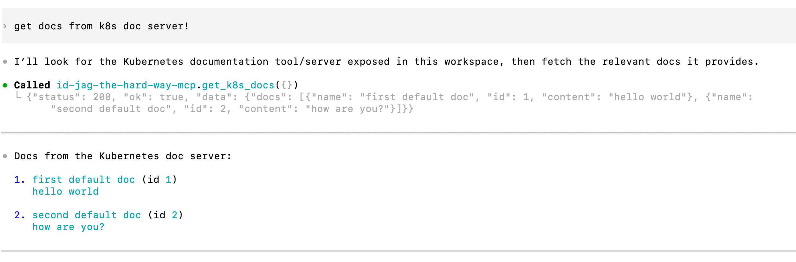

|                 Previous                 |            Current             |                      Next                      |
|:----------------------------------------:|:------------------------------:|:----------------------------------------------:|
| [Token Exchange](./11-token-exchange.md) | **Protect MCP Server - Codex** | [Identity Provider](./13-identity-provider.md) |

# Protect MCP Server - Codex

In this tutorial, we will secure MCP tool execution using an Authorization Proxy - exactly as we protected the API server with Athenz in earlier tutorials. MCP protocol bootstrap and `tools/list` remain public so clients can discover the server and its available tools before requesting access.

<!-- TOC depthFrom:2 depthTo:2 -->

- [Run Authorization Proxy for API MCP](#run-authorization-proxy-for-api-mcp)
- [Update the MCP Service to Point to the Proxy](#update-the-mcp-service-to-point-to-the-proxy)
- [Verify (Expected Failure)](#verify-expected-failure)
- [Fix Insufficient Permission](#fix-insufficient-permission)
- [Fetch a New Access Token for the New Role](#fetch-a-new-access-token-for-the-new-role)
- [Update Codex Config with the New Token](#update-codex-config-with-the-new-token)
- [Verify](#verify)
- [Review Summary of Changes](#review-summary-of-changes)
- [What's next?](#whats-next)

<!-- /TOC -->

## Run Authorization Proxy for API MCP

Deploy MCP Runtime Proxy as the `auth-proxy` sidecar. It validates the Access Token's signature, expiry, audience `api`, and `api:role.mcp-accessor` scope. The existing MCP adapter continues to exchange tokens before calling the API.

Enable OpenAPI discovery for the current AI Client Gateway and Open WebUI. MCP bootstrap and tool discovery remain public; protected requests require the accessor scope.

```sh
kubectl patch deploy mcp -n api --patch "$(cat <<'EOF'
spec:
  template:
    spec:
      containers:
        - name: auth-proxy
          image: ghcr.io/mlajkim/mcp-runtime-proxy:latest
          imagePullPolicy: Always
          env:
            - name: PORT
              value: "8082"
            - name: MCP_TARGET_URL
              value: "http://localhost:8081"
            - name: ATHENZ_EXPECTED_AUDIENCE
              value: "api"
            - name: ATHENZ_REQUIRED_SCOPE
              value: "api:role.mcp-accessor"
            - name: ATHENZ_JWKS_CA_PATH
              value: "/var/run/athenz/ca.crt"
            - name: MCP_PUBLIC_OPENAPI_ENABLED
              value: "true"
          ports:
            - containerPort: 8082
          volumeMounts:
            - name: zts-ca
              mountPath: /var/run/athenz
              readOnly: true
      volumes:
        - name: zts-ca
          configMap:
            name: api-zts-ca
EOF
)"
kubectl rollout status deploy/mcp -n api
```

The `api-zts-ca` ConfigMap was created in chapter 07. The proxy needs only the CA and ZTS's public signing keys. No ZPU sidecar, policy volume, or proxy service certificate is required; Runtime Proxy's downstream token-file exchange stays disabled.

## Update the MCP Service to Point to the Proxy

Keep the Service on port `8081`, and route its traffic through the proxy on port `8082`:

```sh
kubectl patch svc mcp -n api --patch '{"spec":{"ports":[{"port":8081,"targetPort":8082}]}}'
```

```sh
# service/mcp patched
```

## Verify (Expected Failure)

Ask Codex:

```sh
get docs from k8s doc server!
```

Codex can still initialize and list the available tools. The tool call fails because protected requests require `api:role.mcp-accessor`, while the current token only grants `docs-getter`.

```sh
kubectl logs deploy/mcp -n api -c auth-proxy
```

## Fix Insufficient Permission

Create the `mcp-accessor` role. The proxy maps this scope to MCP access directly:

```sh
./tools/athenz/create-role.sh "api" "mcp-accessor"
./tools/athenz/add-role-member.sh "api" "mcp-accessor" "human.idjag-learner"
```

```sh
#   ·  Creating Role: api:role.mcp-accessor...
#   ✔  Role created: api:role.mcp-accessor
#   ·  Adding Member human.idjag-learner to Role: api:role.mcp-accessor...
#   ✔  human.idjag-learner  →  api:role.mcp-accessor
```

## Fetch a New Access Token for the New Role

The Access Token must now include both scopes - one to pass through the MCP proxy, and one to call the API server:

```sh
_scope="api:role.mcp-accessor api:role.docs-getter"
./tools/athenz/fetch-access-token.sh \
  "./keys/idjag-learner.crt" \
  "./keys/idjag-learner.key" \
  "${_scope}" \
  "./keys/idjag-learner.jwt"
```

```sh
#   ·  Fetching Access Token for scope: api:role.mcp-accessor api:role.docs-getter...
#   ✔  Access token issued for scope: api:role.mcp-accessor api:role.docs-getter
#   ✔  Token saved to: ./keys/idjag-learner.jwt
```

## Update Codex Config with the New Token

```sh
_mcp_port=$(./tools/port.sh mcp)
_at=$(cat ./keys/idjag-learner.jwt)

cat > .codex/config.toml <<EOF
[mcp_servers.id-jag-the-hard-way-mcp]
url = "http://localhost:${_mcp_port}/mcp"
http_headers = { Authorization = "Bearer ${_at}" }
EOF

cat .codex/settings.toml >> .codex/config.toml
```

## Verify

Start a new Codex chat so the updated MCP config is used:

```sh
/new
```

Then ask Codex again:

```sh
get docs from k8s doc server!
```



## Review Summary of Changes

We deployed MCP Runtime Proxy in front of the existing MCP adapter, using signed token scopes instead of downloaded policies. Any client can initialize and list tools without an Athenz access role. Protected methods such as `tools/call` reach the MCP server only when the caller's Access Token carries the `api:role.mcp-accessor` scope.

## What's next?

Next: [Identity Provider](./13-identity-provider.md)
