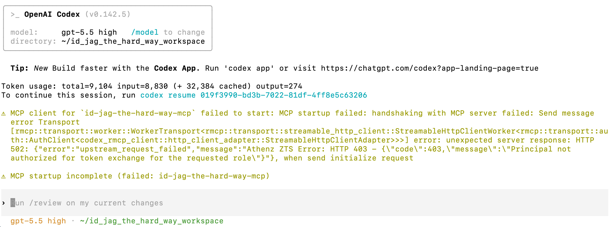

|                            Previous                            |            Current            |           Next           |
|:--------------------------------------------------------------:|:-----------------------------:|:------------------------:|
| [Trusted Identity Provider](./13-trusted-identity-provider.md) | **AI Client Gateway — Codex** | [ID-JAG](./15-id-jag.md) |

# AI Client Gateway — Codex

Deploy AI Client Gateway between Codex CLI and the MCP service with the following steps. The gateway uses the signed-in user's Keycloak ID token to obtain an Athenz access token. The MCP server performs the later exchange for API access.

<!-- TOC depthFrom:2 depthTo:2 -->

- [Deploy AI Client Gateway in K8s](#deploy-ai-client-gateway-in-k8s)
- [Generate the Required Certificates](#generate-the-required-certificates)
- [Mount the Certificates](#mount-the-certificates)
- [Create the Keycloak Client Secret](#create-the-keycloak-client-secret)
- [Configure the Gateway](#configure-the-gateway)
- [Sign Out of Keycloak](#sign-out-of-keycloak)
- [Update Codex MCP Config](#update-codex-mcp-config)
- [Verify](#verify)
- [Next Steps](#next-steps)

<!-- /TOC -->

## Deploy AI Client Gateway in K8s

The gateway belongs in the `human` namespace — it represents the human-controlled, client side of the architecture.

Create the `human` namespace (skip if already created in a previous tutorial):

```sh
kubectl create ns human
```

Deploy the gateway with name `codex-idjag-learner-ai-client-gateway`:

```sh
kubectl create deploy codex-idjag-learner-ai-client-gateway -n human \
  --image=ghcr.io/mlajkim/ai-client-gateway:latest
```

```sh
# deployment.apps/codex-idjag-learner-ai-client-gateway created
```

Check the logs — you will see an error about missing certificates (this is expected):

```sh
kubectl logs deploy/codex-idjag-learner-ai-client-gateway -n human
```

```sh
# ...
# Error: ENOENT: no such file or directory, open '...certs/ai-client-gateway.crt'
# ...
```

This is expected. The gateway needs an X.509 certificate to identify itself to Athenz ZTS, and we have not provided one yet.

## Generate the Required Certificates

Create the service identity and fetch its X.509 certificate:

```sh
./tools/athenz/create-private-key.sh "./keys/human-idjag-learner-codex"
./tools/athenz/create-subdomain.sh "human" "idjag-learner"
./tools/athenz/create-service.sh "human.idjag-learner" "codex" "./keys/human-idjag-learner-codex.public.key"
./tools/athenz/enable-cert-provider.sh "human.idjag-learner" "codex"
./tools/athenz/fetch-cert.sh "human.idjag-learner" "codex" "./keys/human-idjag-learner-codex.key" "v1"
```

```sh
#   ·  Generating RSA key pair for: ./keys/human-idjag-learner-codex...
#   ✔  Keys generated: ./keys/human-idjag-learner-codex.key, ./keys/human-idjag-learner-codex.public.key
#   ·  Creating Subdomain: human.idjag-learner...
#   ✔  Subdomain created: human.idjag-learner
#   ·  Registering Service: human.idjag-learner.codex...
#   ✔  Service registered: human.idjag-learner.codex
#   ·  Enabling ZTS Certificate Provider for human.idjag-learner.codex...
# [Template(s) successfully applied to domain]
#   ✔  ZTS Certificate Provider enabled for human.idjag-learner.codex
#   ·  Fetching X.509 Certificate for human.idjag-learner.codex...
#   ✔  Certificate saved to: ./keys/human-idjag-learner-codex.crt
```

## Mount the Certificates

Store the certificate, private key, and CA certificate in a Kubernetes Secret:

```sh
test -f ./keys/human-idjag-learner-codex.crt

kubectl delete -n human secret human-idjag-learner-codex-cert --ignore-not-found=true
kubectl -n human create secret generic human-idjag-learner-codex-cert \
  --from-file=ai-client-gateway.crt=./keys/human-idjag-learner-codex.crt \
  --from-file=ai-client-gateway.key=./keys/human-idjag-learner-codex.key \
  --from-file=ca.crt=./athenz_dist/certs/ca.cert.pem
```

Mount the secret into the gateway pod:

```sh
kubectl patch deploy codex-idjag-learner-ai-client-gateway -n human --patch "$(cat <<'EOF'
spec:
  template:
    spec:
      containers:
        - name: ai-client-gateway
          volumeMounts:
            - name: certs
              mountPath: /app/certs
              readOnly: true
      volumes:
        - name: certs
          secret:
            secretName: human-idjag-learner-codex-cert
EOF
)"
```

```sh
# deployment.apps/codex-idjag-learner-ai-client-gateway patched
```

Verify the gateway started without errors:

```sh
kubectl logs deploy/codex-idjag-learner-ai-client-gateway -n human
```

```sh
# 🚀 OpenWebUI OpenAPI Gateway listening on 0.0.0.0:3101
# 🔗 Upstream API: http://mcp.api:8081
# 🌍 Public Base URL: http://localhost:44444
# 🔑 Athenz ZTS Endpoint: https://athenz-zts-server.athenz:4443/zts/v1
```

<a id="deploy-the-human-gateway"></a>

## Create the Keycloak Client Secret

Configure the gateway with the Keycloak credentials it needs to drive the OAuth2 login flow.

Create the Kubernetes Secret from the Keycloak client credentials:

```sh
./tools/keycloak/create-client-k8s-secret.sh \
  "human.idjag-learner.codex" \
  "human" \
  "human-idjag-learner-codex-keycloak"
```

```sh
#   ·  Fetching Keycloak admin token...
#   ·  Looking up UUID for client human.idjag-learner.codex...
#   ·  Fetching client secret...
#   ·  Creating K8s secret human/human-idjag-learner-codex-keycloak...
# secret/human-idjag-learner-codex-keycloak created
#   ✔  Secret created: human/human-idjag-learner-codex-keycloak
```

<a id="set-env-vars-for-the-gateway"></a>

## Configure the Gateway

Configure the environment variables for the gateway deployment:

<details>
<summary>What each variable does</summary>

- `UPSTREAM_BASE_URL` — the in-cluster MCP server the gateway proxies requests to.
- `ZTS_URL` — the Athenz ZTS endpoint used to exchange ID-JAG tokens for scoped access tokens.
- `ATHENZ_ACCESS_TOKEN_AUDIENCE` — `mcp`, the recipient of the gateway's access token. The token can carry both MCP and API scopes; the ID-JAG audience remains the ZTS URL.
- `KEYCLOAK_URL` / `KEYCLOAK_REALM` — in-cluster Keycloak address used for server-side authorization-code exchange during the OAuth callback.
- `KEYCLOAK_CLIENT_ID` / `KEYCLOAK_CLIENT_SECRET` — pulled from the Kubernetes Secret you just created; used to authenticate this gateway as a registered OAuth2 client.
- `PUBLIC_BASE_URL` — the port-forwarded gateway address the browser is redirected back to after login.
- `KEYCLOAK_PUBLIC_URL` — the port-forwarded Keycloak address used in the browser-facing login redirect URL.

</details>

```sh
_gateway_port=$(./tools/port.sh ai-client-gateway-codex)
_keycloak_port=$(./tools/port.sh keycloak)

kubectl patch deploy codex-idjag-learner-ai-client-gateway -n human --patch "$(cat <<EOF
spec:
  template:
    spec:
      containers:
        - name: ai-client-gateway
          imagePullPolicy: Always
          env:
            - name: UPSTREAM_BASE_URL
              value: "http://mcp.api:8081"
            - name: ATHENZ_ACCESS_TOKEN_AUDIENCE
              value: "mcp"
            - name: ZTS_URL
              value: "https://athenz-zts-server.athenz:4443/zts/v1"
            - name: KEYCLOAK_URL
              value: "http://keycloak.idp:8080"
            - name: KEYCLOAK_REALM
              value: "master"
            - name: KEYCLOAK_CLIENT_ID
              valueFrom:
                secretKeyRef:
                  name: human-idjag-learner-codex-keycloak
                  key: client-id
            - name: KEYCLOAK_CLIENT_SECRET
              valueFrom:
                secretKeyRef:
                  name: human-idjag-learner-codex-keycloak
                  key: client-secret
            - name: PUBLIC_BASE_URL
              value: "http://localhost:${_gateway_port}"
            - name: KEYCLOAK_PUBLIC_URL
              value: "http://localhost:${_keycloak_port}"
EOF
)"
```

```sh
# deployment.apps/codex-idjag-learner-ai-client-gateway patched
```

Expose the deployment as a service and confirm the logs look healthy:

```sh
kubectl delete -n human svc ai-client-gateway-codex --ignore-not-found=true
kubectl expose deploy codex-idjag-learner-ai-client-gateway -n human --port 3101 --name ai-client-gateway-codex
kubectl logs deploy/codex-idjag-learner-ai-client-gateway -n human --tail=5
```

<a id="verification-prerequisite"></a>

## Sign Out of Keycloak

Before verifying, sign out of Keycloak so you start with a clean session:

```sh
_keycloak_port=$(./tools/port.sh keycloak)
./tools/open.sh "http://localhost:${_keycloak_port}/realms/master/protocol/openid-connect/logout"
```

If Keycloak asks **"Do you want to log out?"**, click **Logout** to confirm.

## Update Codex MCP Config

Point Codex at the gateway by overwriting `.codex/config.toml` and appending the provided settings. This time with no `Authorization` header — the gateway handles the entire ID-JAG flow:

```sh
_gateway_port=$(./tools/port.sh ai-client-gateway-codex)

cat > .codex/config.toml <<EOF
[mcp_servers.id-jag-the-hard-way-mcp]
enabled = true
url = "http://localhost:${_gateway_port}/mcp"
auth = "oauth"
EOF

cat .codex/settings.toml >> .codex/config.toml
```

> [!NOTE]
> Notice that there is no `Authorization` header or pre-fetched access token. The gateway handles the entire ID-JAG flow on your behalf.

## Verify

Log in to the MCP server. Unlike Claude Code (which prompts you inside the chat), Codex uses a dedicated login command:

```sh
codex mcp login id-jag-the-hard-way-mcp
```

```sh
# Authorize `id-jag-the-hard-way-mcp` by opening this URL in your browser:
# http://localhost:44444/oauth/authorize?...
```

Open that URL in your browser and sign in with:

- username: `idjag-learner`
- password: `password`

Once you complete the login, the terminal will confirm:

```sh
# Successfully logged in to MCP server 'id-jag-the-hard-way-mcp'.
```

Start a new Codex chat:

```sh
/new
```

Codex will try to initialize the MCP server and fail:



This is expected. Codex reached the AI Client Gateway, and the gateway tried to exchange the logged-in user's Keycloak ID token through Athenz ZTS. Athenz rejected that exchange because `human.idjag-learner.codex` does not yet have `zts.jag_exchange` permission for the requested MCP and API roles.

<a id="whats-next"></a>

## Next Steps

In the next tutorial, we will grant `human.idjag-learner.codex` the Athenz permissions it needs to perform the full ID-JAG token exchange.

Next: [ID-JAG](./15-id-jag.md)
