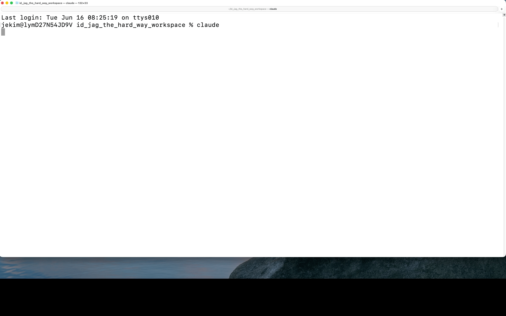
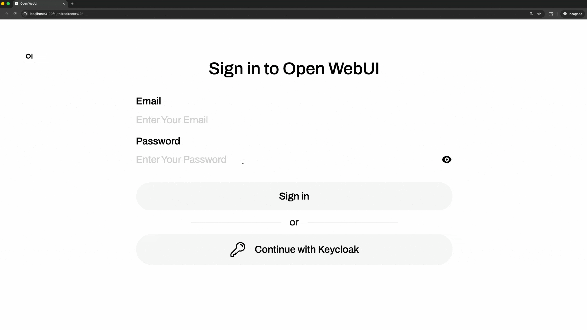
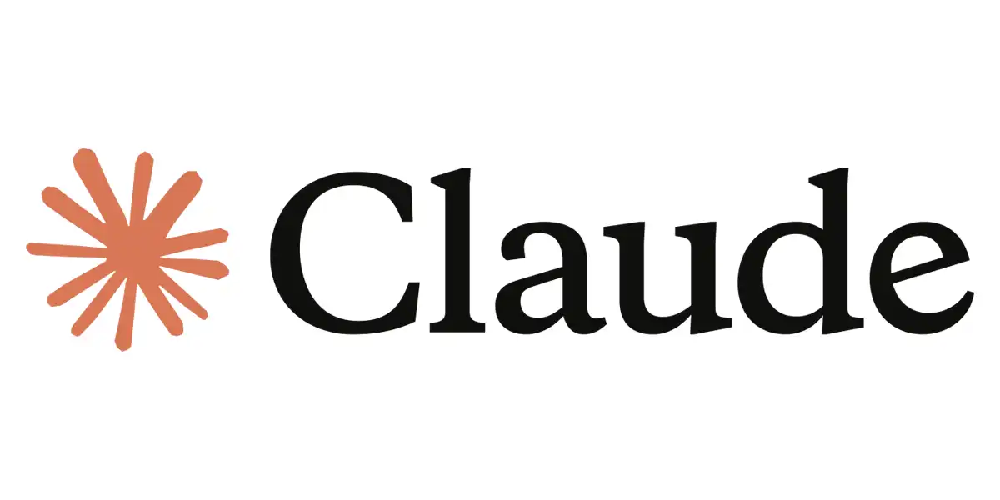
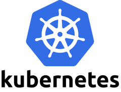
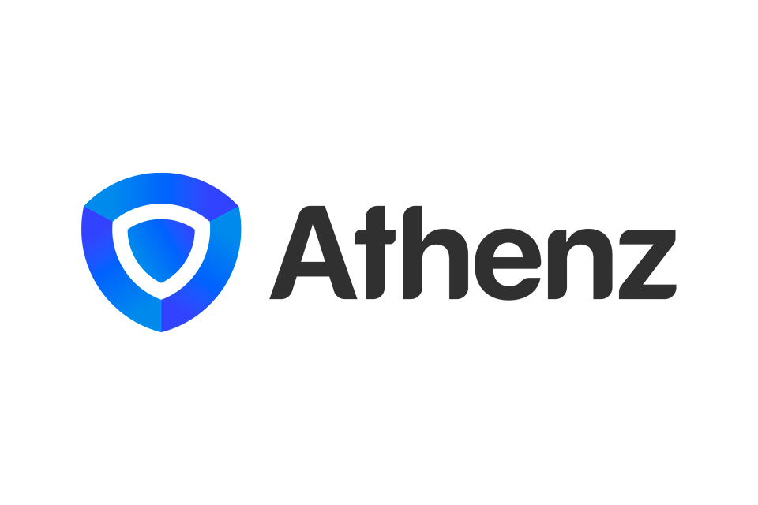
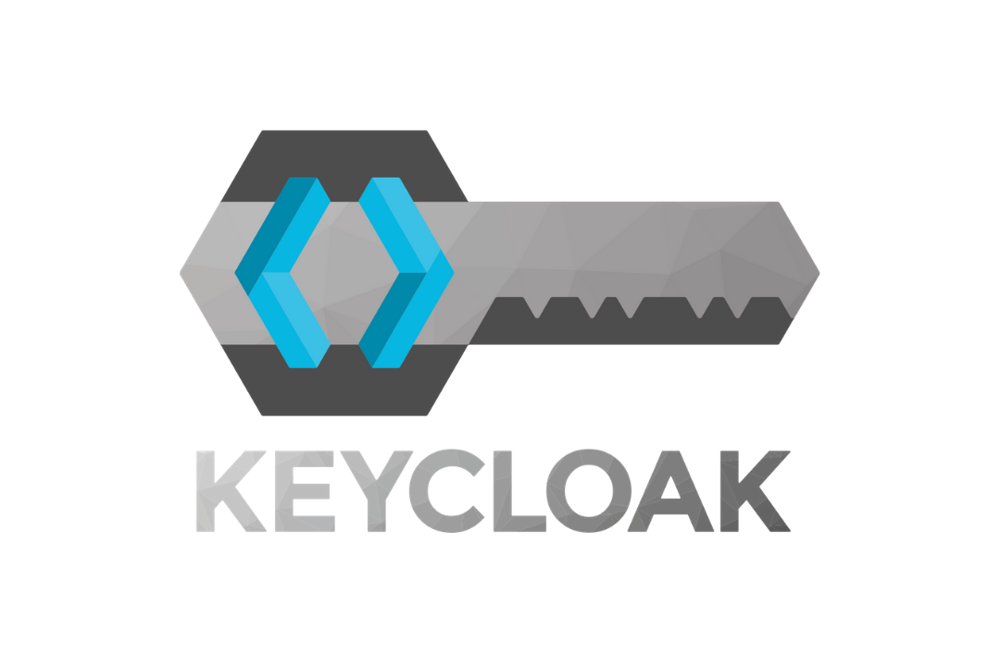
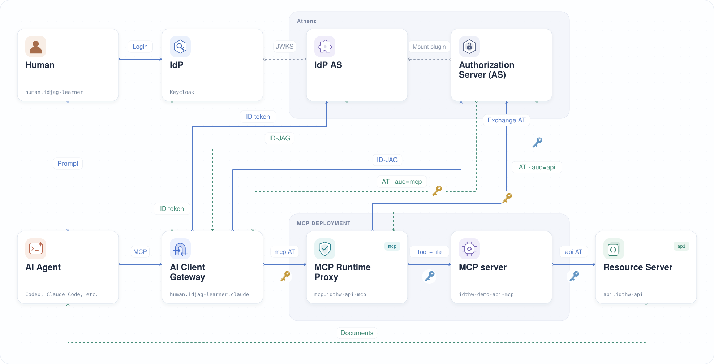
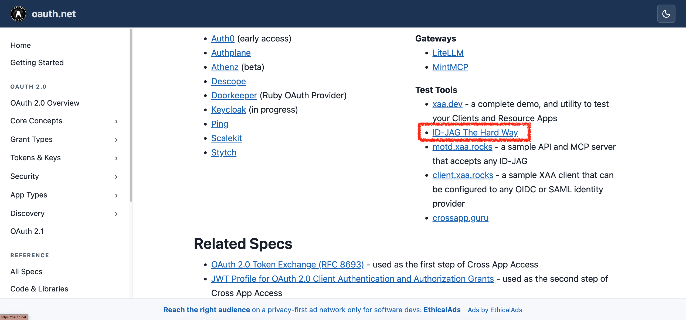
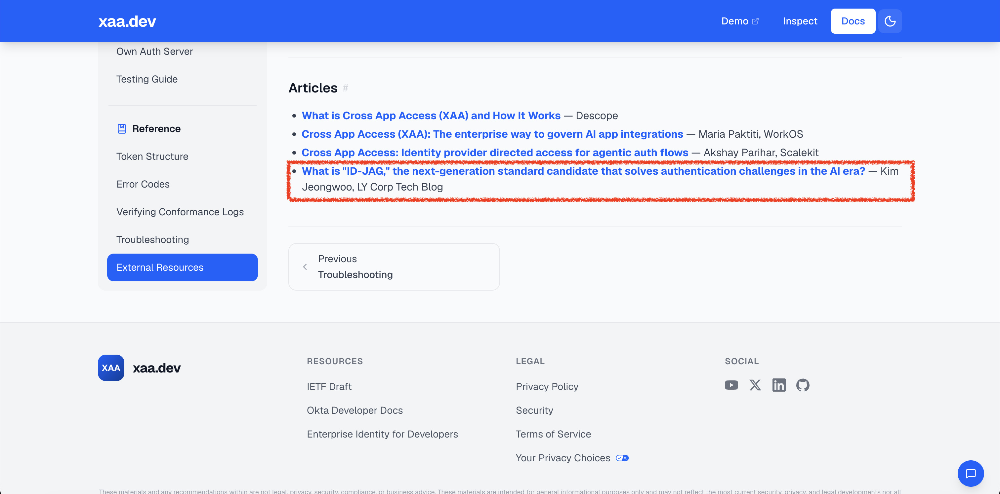

# ID-JAG The Hard Way

*Build Cross-App Access for AI agents with ID-JAG, the hard way.* 
*ID-JAG を使った AI エージェントの Cross-App Access を、一つずつ自分で構築します。*

ログインしたユーザーに代わって保護された API にアクセスする AI エージェントを作ります。ユーザーとサービスの ID、ポリシー、トークン交換（Token Exchange）を順に設定します。リクエストを意図的に失敗させながら、各コンポーネントがどこで権限を確認するかを学びます。

このチュートリアルでは、Cross-App Access（XAA）で使われる Identity Assertion JWT Authorization Grant（ID-JAG）という [IETF のドラフト仕様](https://datatracker.ietf.org/doc/draft-ietf-oauth-identity-assertion-authz-grant/)を扱います。概要は [LY Tech Blog の ID-JAG 解説（英語）](https://techblog.lycorp.co.jp/en/20260417a)を参照してください。

## このチュートリアルで作るもの

チュートリアルを終えると、Keycloak でログインし、AI エージェントにローカル Kubernetes クラスター上の API から文書を取得するよう依頼できます：

Open WebUI でも同じ認可（Authorization）の流れを使えます：

どちらも次の手順で動きます：

1. **ユーザー**がログインし、AI エージェントに文書の取得を依頼する
2. **AI Client Gateway** がユーザーに代わってスコープ（Scope）を指定したアクセストークン（Access Token）を取得し、MCP サービスにツールの呼び出しを渡す
3. **MCP Runtime Proxy** が受け取ったトークンを検証して API アクセストークンに交換し、**MCP サーバー**がリクエストごとのファイルからトークンを読んで API を呼び出す
4. **リソースサーバー（Resource Server）**が交換されたトークンを検証し、操作に必要なスコープを確認する

## コンポーネント

このチュートリアルでは次のコンポーネントを使います：

<table>
  <tr>
    <td align="center" width="25%">
       
       
      
    </td>
    <td align="center" width="25%"></td>
    <td align="center" width="25%"></td>
    <td align="center" width="25%"></td>
  </tr>
  <tr>
    <td><strong>AI クライアント</strong> Claude、Codex、Open WebUI が MCP ツールを呼び出します。</td>
    <td><strong>実行環境</strong> Kubernetes 上で API、MCP、ゲートウェイ、認可コンポーネントを動かします。</td>
    <td><strong>認可</strong> Athenz ZMS/ZTS がポリシーを評価し、ID-JAG とスコープを指定したアクセストークンを発行します。</td>
    <td><strong>ID プロバイダー（Identity Provider, IdP）</strong> Keycloak が OIDC を通じてログインしたユーザーの ID を提供します。</td>
  </tr>
</table>

## 全体アーキテクチャ

次の図に各コンポーネントの役割を示します。このチュートリアルでは Keycloak を IdP として使います。Athenz は IdP AS として ID-JAG を発行し、認可サーバー（Authorization Server, AS）としてアクセストークンを発行・交換します。必要なプロトコルとポリシーをサポートしていれば、ほかの製品でもこれらの役割を実装できます。

1. ユーザーが Keycloak にログインし、AI クライアントにプロンプトを送る
2. AI Client Gateway がログインセッションからユーザーの ID トークン（ID Token）を取得する
3. ゲートウェイが Athenz ZTS に認証し、必要な MCP と API のスコープを含む ID-JAG を要求する
4. ZTS が ID トークンを検証し、ユーザーとゲートウェイにそのスコープの権限があるか確認する
5. ゲートウェイが ID-JAG を audience が `mcp` のアクセストークンに交換し、ツールの呼び出しを渡す
6. MCP Runtime Proxy がトークンを検証して `mcp:role.mcp-accessor` を確認し、MCP サービス ID（Service Identity）で API トークンに交換する
7. プロキシが `idthw-demo-api-mcp` にリクエストごとのトークンファイルを渡し、MCP が audience `api` とスコープ `api:role.docs-getter` で API を呼び出す
8. リソースサーバーが交換されたトークンと必要なスコープを確認し、文書を返す

図は既定の Claude Code の経路です。Codex と Open WebUI はそれぞれ別の AI Client Gateway サービス ID を使います。

## 学び方

意図的な失敗から学ぶこのチュートリアルの進め方は、次の記事で紹介しています：

[ID-JAG The Hard Way：失敗から学ぶ AI エージェントの認可 — LY Tech Blog（英語）](https://techblog.lycorp.co.jp/en/20260526a)

## 謝辞

このチュートリアルの名前と学習方法は [kelseyhightower/kubernetes-the-hard-way](https://github.com/kelseyhightower/kubernetes-the-hard-way) から着想を得ました。

## 外部での紹介

ID-JAG The Hard Way は [OAuth.net の Cross-App Access（XAA）ページ](https://oauth.net/cross-app-access/)で、ID-JAG を学ぶためのテストツールとして紹介されています。

ID-JAG The Hard Way の基礎となった ID-JAG の記事は [Okta の xaa.dev にある External Resources](https://xaa.dev/docs/resources#external-resources)にも掲載されています。

すべてのコンポーネントを自分で構築する前に XAA を試したい場合は、<https://xaa.dev/> の **XAA.dev** にアクセスするか、[ライブデモ](https://app.xaa.dev?auto_connect=todo0)を起動してください。アカウントやローカル環境の設定なしで、設定済みの ID-JAG の流れを試せます。

## コミュニティでの紹介

> [!NOTE]
> このチュートリアルを紹介したら、イシューまたはプルリクエストでお知らせください。届いた順にここへ追加します。

| # |     日付     | コミュニティ                                                                                                 |
|:-:|:------------:|:----------------------------------------------------------------------------------------------------------|
| 3 | 2026-08-29 | [dorsha/awesome-cross-app-access][260829-community] - Github                                              |
| 2 | 2026-07-28 | [Authorization Challenges in the AI Agent Era: What Is ID-JAG and Why?][260728-community] — DEV Community |
| 1 | 2026-07-23 | [[學習心得][Golang] AI Agent 時代的授權難題：ID-JAG 是什麼？為什麼我用 Go 重新實作了一次][260723-community] |

[260829-community]: https://github.com/dorsha/awesome-cross-app-access
[260723-community]: https://www.evanlin.com/id-jag-mcp-go/
[260728-community]: https://dev.to/gde/learning-notesgolang-authorization-challenges-in-the-ai-agent-era-what-is-id-jag-and-why-i-jfb

## ⭐ コミュニティの広がり

ID-JAG The Hard Way は元のリポジトリと Athenz コミュニティのフォークで成長しています。次のスター数とフォーク数は GitHub のデータをもとに更新されます。

| リポジトリ                                                                       | スター                                                                                                                                                                                                   | フォーク                                                                                                                                                                                              |
|----------------------------------------------------------------------------------|---------------------------------------------------------------------------------------------------------------------------------------------------------------------------------------------------------|----------------------------------------------------------------------------------------------------------------------------------------------------------------------------------------------------|
| [元のリポジトリ](https://github.com/mlajkim/id-jag-the-hard-way)                |                     |                     |
| [Athenz コミュニティフォーク](https://github.com/athenz-community/id-jag-the-hard-way) |  |  |

このチュートリアルが役に立ったら、どちらかのリポジトリに ⭐ を付けていただけるとうれしいです。ほかの方が見つける助けにもなります。

質問や問題があれば、[イシューを作成してください](https://github.com/mlajkim/id-jag-the-hard-way/issues)。

作業ディレクトリの準備から始めます：

