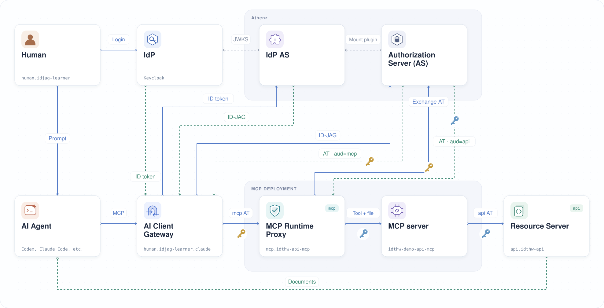
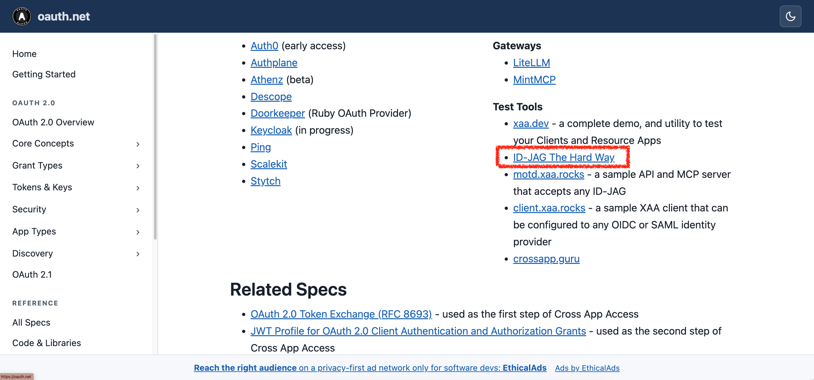
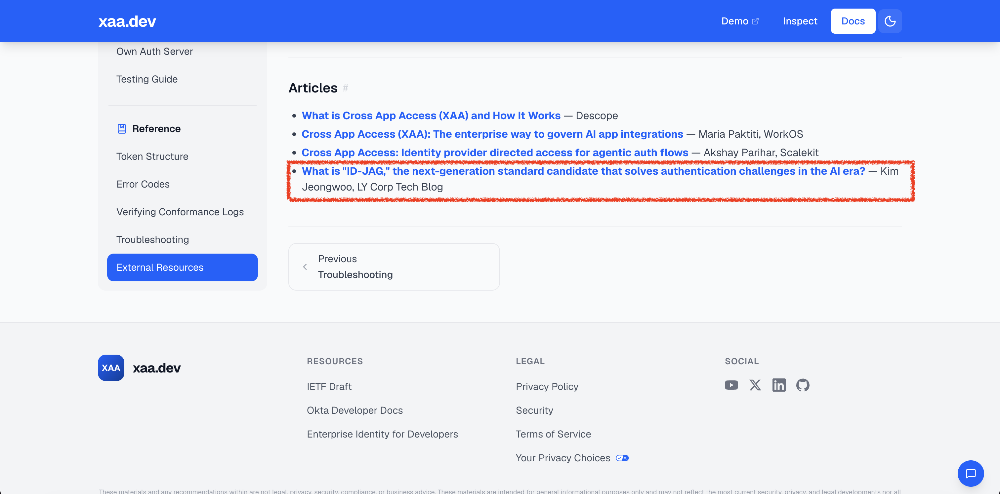

# ID-JAG The Hard Way

*ID-JAG로 AI 에이전트의 Cross-App Access를 하나씩 직접 구성해 봅니다.*

로그인한 사용자를 대신해 보호된 API에 접근하는 AI 에이전트를 만듭니다. 사용자와 서비스의 ID, 정책, 토큰 교환 (Token Exchange)을 차례로 설정합니다. 일부 요청을 의도적으로 실패시키면서 각 구성 요소가 어디에서 권한을 확인하는지 살펴봅니다.

이 튜토리얼은 Cross-App Access(XAA)에 사용되는 [IETF 초안 명세](https://datatracker.ietf.org/doc/draft-ietf-oauth-identity-assertion-authz-grant/)인 Identity Assertion JWT Authorization Grant(ID-JAG)를 다룹니다. 개념 소개는 LY 기술블로그의 [AI 시대에 인증 과제를 해결할 차세대 표준 후보, ID-JAG](https://techblog.lycorp.co.jp/ko/id-jag-next-generation-authentication-ai-era)를 참고해 주세요.

## 실습 목표

튜토리얼을 마치면 Keycloak으로 로그인한 뒤 AI 에이전트에게 로컬 Kubernetes 클러스터의 API에서 문서를 조회하도록 요청할 수 있습니다:

Open WebUI에서도 같은 인가 (Authorization) 흐름을 사용할 수 있습니다:

두 흐름 모두 다음 과정을 거칩니다:

1. **사용자**가 로그인하고 AI 에이전트에게 문서 조회를 요청
2. **AI Client Gateway**가 사용자를 대신해 스코프 (Scope)가 지정된 액세스 토큰 (Access Token)을 발급받고 MCP 서비스에 도구 호출 전달
3. **MCP Runtime Proxy**가 받은 토큰을 검증하고 API 액세스 토큰으로 교환한 뒤, **MCP 서버**가 요청별 파일에서 토큰을 읽어 API 호출
4. **리소스 서버 (Resource Server)**가 교환된 토큰을 검증하고 해당 작업에 필요한 스코프 확인

## 구성 요소

이 튜토리얼은 다음 구성 요소를 사용합니다:

<table>
  <tr>
    <td align="center" width="25%">
       
       
      
    </td>
    <td align="center" width="25%"></td>
    <td align="center" width="25%"></td>
    <td align="center" width="25%"></td>
  </tr>
  <tr>
    <td><strong>AI 클라이언트</strong> Claude, Codex, Open WebUI가 MCP 도구를 호출합니다.</td>
    <td><strong>실행 환경</strong> Kubernetes에서 API, MCP, 게이트웨이, 인가 구성 요소를 실행합니다.</td>
    <td><strong>인가</strong> Athenz ZMS/ZTS가 정책을 평가하고 ID-JAG와 스코프가 지정된 액세스 토큰을 발급합니다.</td>
    <td><strong>ID 제공자 (Identity Provider, IdP)</strong> Keycloak이 OIDC를 통해 로그인한 사용자의 신원을 제공합니다.</td>
  </tr>
</table>

## 전체 아키텍처

다음 그림은 각 구성 요소가 맡은 역할을 보여 줍니다. 이 튜토리얼에서는 Keycloak을 IdP로 사용합니다. Athenz는 IdP AS로서 ID-JAG를 발급하고, 인가 서버 (Authorization Server, AS)로서 액세스 토큰을 발급하고 교환합니다. 필요한 프로토콜과 정책을 지원한다면 다른 제품으로도 이 역할을 구현할 수 있습니다.

1. 사용자가 Keycloak으로 로그인하고 AI 클라이언트에 프롬프트 전송
2. AI Client Gateway가 로그인 세션에서 사용자의 ID 토큰 (ID Token) 확인
3. 게이트웨이가 Athenz ZTS에 인증하고 필요한 MCP 및 API 스코프의 ID-JAG 요청
4. ZTS가 ID 토큰을 검증하고 사용자와 게이트웨이가 해당 스코프를 사용할 권한이 있는지 확인
5. 게이트웨이가 ID-JAG를 audience가 `mcp`인 액세스 토큰으로 교환한 뒤 도구 호출 전달
6. MCP Runtime Proxy가 토큰을 검증하고 `mcp:role.mcp-accessor`를 확인한 뒤, MCP 서비스 ID (Service Identity)로 API 토큰 교환
7. 프록시가 `idthw-demo-api-mcp`에 요청별 토큰 파일을 제공하면, MCP가 audience `api`와 스코프 `api:role.docs-getter`로 API 호출
8. 리소스 서버가 교환된 토큰과 필요한 스코프를 확인한 뒤 문서 반환

그림은 기본 Claude Code 경로를 보여 줍니다. Codex와 Open WebUI는 각각 별도의 AI Client Gateway 서비스 ID를 사용합니다.

## 학습 방식

의도된 실패를 통해 배우는 이 튜토리얼의 접근 방식은 다음 글에서 소개합니다:

[ID-JAG The Hard Way: 실패를 통해 배우는 AI 에이전트 인가 — LY Tech Blog(영문)](https://techblog.lycorp.co.jp/en/20260526a)

## 감사의 말

이 튜토리얼의 이름과 학습 방식은 [kelseyhightower/kubernetes-the-hard-way](https://github.com/kelseyhightower/kubernetes-the-hard-way)에서 영감을 받았습니다.

## 외부 소개

ID-JAG The Hard Way는 [OAuth.net의 Cross-App Access(XAA) 페이지](https://oauth.net/cross-app-access/)에 ID-JAG 학습용 테스트 도구로 소개되어 있습니다.

ID-JAG The Hard Way의 바탕이 된 ID-JAG 소개 글은 [Okta xaa.dev의 External Resources](https://xaa.dev/docs/resources#external-resources)에도 소개되어 있습니다.

모든 구성 요소를 직접 만들기 전에 XAA를 체험하고 싶다면 <https://xaa.dev/>의 **XAA.dev**를 방문하거나 [라이브 데모](https://app.xaa.dev?auto_connect=todo0)를 실행해 보세요. 계정이나 로컬 환경 설정 없이 미리 구성된 ID-JAG 흐름을 바로 실행할 수 있습니다.

## 커뮤니티 소개 글

> [!NOTE]
> 이 튜토리얼을 소개하셨다면 이슈나 풀 리퀘스트로 알려 주세요. 접수된 순서대로 여기에 추가하겠습니다.

| # |     날짜     | 커뮤니티                                                                                                 |
|:-:|:------------:|:----------------------------------------------------------------------------------------------------------|
| 3 | 2026-08-29 | [dorsha/awesome-cross-app-access][260829-community] - Github                                              |
| 2 | 2026-07-28 | [Authorization Challenges in the AI Agent Era: What Is ID-JAG and Why?][260728-community] — DEV Community |
| 1 | 2026-07-23 | [[學習心得][Golang] AI Agent 時代的授權難題：ID-JAG 是什麼？為什麼我用 Go 重新實作了一次][260723-community] |

[260829-community]: https://github.com/dorsha/awesome-cross-app-access
[260723-community]: https://www.evanlin.com/id-jag-mcp-go/
[260728-community]: https://dev.to/gde/learning-notesgolang-authorization-challenges-in-the-ai-agent-era-what-is-id-jag-and-why-i-jfb

## ⭐ 커뮤니티 성장

ID-JAG The Hard Way는 원본 저장소와 Athenz 커뮤니티 포크에서 함께 성장하고 있습니다. 아래 스타와 포크 수는 GitHub 데이터를 기준으로 갱신됩니다.

| 저장소                                                                       | 스타                                                                                                                                                                                                   | 포크                                                                                                                                                                                              |
|----------------------------------------------------------------------------------|---------------------------------------------------------------------------------------------------------------------------------------------------------------------------------------------------------|----------------------------------------------------------------------------------------------------------------------------------------------------------------------------------------------------|
| [원본 저장소](https://github.com/mlajkim/id-jag-the-hard-way)                |                     |                     |
| [Athenz 커뮤니티 포크](https://github.com/athenz-community/id-jag-the-hard-way) |  |  |

이 튜토리얼이 도움이 되었다면 두 저장소 중 한 곳에 ⭐를 남겨 주세요. 다른 분들이 튜토리얼을 찾는 데도 도움이 됩니다!

궁금한 점이나 문제가 있으면 [이슈를 남겨 주세요](https://github.com/mlajkim/id-jag-the-hard-way/issues).

작업 디렉터리 설정부터 시작합니다:

