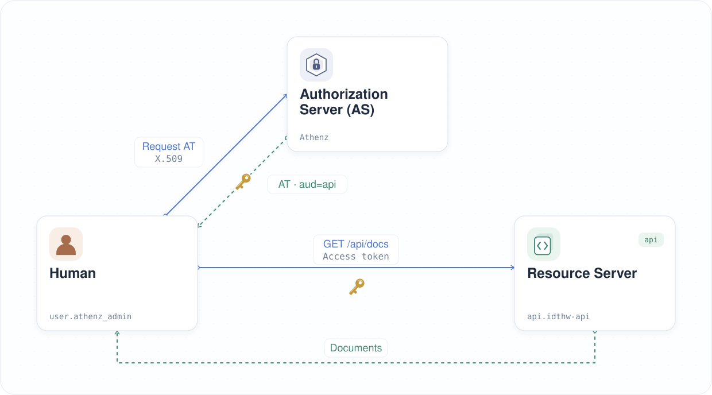

| 이전 | 현재 | 다음 |
|:---:|:---:|:---:|
| [인가 서버 (Authorization Server)](./05-authorization-server.md) | **액세스 토큰 (Access Token)** | [권한 세분화](./07-granular-permission.md) |

<a id="access-token"></a>

# 액세스 토큰 (Access Token)

지금까지 리소스 서버에 액세스 토큰 검증을 켜고 인증 정보가 없는 요청이 실패하는 것을 확인했습니다. 이제 API가 Athenz를 신뢰하도록 설정하고, 액세스 토큰을 발급받아 문서를 조회합니다.

<!-- TOC depthFrom:2 depthTo:2 -->

- [API 도메인 생성](#create-the-api-domain)
- [ZTS 서명 키 엔드포인트 신뢰 설정](#trust-the-zts-signing-key-endpoint)
- [문서 조회 역할 생성](#create-the-document-reading-role)
- [API에 필요한 스코프 이해](#understand-the-required-api-scopes)
- [역할에 관리자 추가](#add-the-administrator-to-the-role)
- [관리자로 토큰 요청](#request-a-token-as-the-administrator)
- [보호된 API 호출](#call-the-protected-api)
- [결과 확인](#review-the-result)
- [다음 단계](#next-steps)

<!-- /TOC -->

<a id="create-the-api-domain"></a>

## API 도메인 생성

API를 나타내는 Athenz 도메인을 만듭니다:

```sh
./tools/athenz/create-tld.sh "api"
```

```sh
#   ·  Creating TLD: api...
#   ✔  TLD created: api
```

이 도메인은 리소스 서버를 배포할 때 만든 Kubernetes 네임스페이스 `api`와 별개입니다.

<a id="trust-the-zts-signing-key-endpoint"></a>

## ZTS 서명 키 엔드포인트 신뢰 설정

API는 ZTS의 공개 서명 키로 액세스 토큰을 검증합니다. Node.js가 ZTS와의 HTTPS 연결을 검증할 수 있도록 튜토리얼의 CA를 마운트합니다:

```sh
kubectl -n api create configmap api-zts-ca \
  --from-file=ca.crt=./athenz_dist/certs/ca.cert.pem

kubectl patch deploy api-server -n api --patch "$(cat <<'EOF'
spec:
  template:
    spec:
      containers:
        - name: idthw-demo-api
          env:
            - name: NODE_EXTRA_CA_CERTS
              value: /var/run/athenz/ca.crt
          volumeMounts:
            - name: zts-ca
              mountPath: /var/run/athenz
              readOnly: true
      volumes:
        - name: zts-ca
          configMap:
            name: api-zts-ca
EOF
)"
kubectl rollout status deploy/api-server -n api
```

컨테이너 이름은 리소스 서버를 배포할 때 사용한 이미지와 같은 `idthw-demo-api`입니다. Deployment와 Service 이름은 `api-server`입니다.

API가 ZTS의 HTTPS 인증서를 신뢰할 수 없으면 액세스 토큰을 포함한 요청에 `503 Service Unavailable`을 반환합니다:

```json
{
  "error": "zts_ca_untrusted",
  "message": "Cannot verify the ZTS HTTPS certificate. Mount the CA certificate that signed it, set NODE_EXTRA_CA_CERTS to its path, and restart the API."
}
```

이 경우에도 API Pod는 계속 실행되며 `/healthz`는 `200 OK`를 반환합니다. 위의 CA 설정을 적용하면 토큰을 검증할 수 있습니다.

<a id="create-athenz-role-under-the-api-domain"></a>

<a id="create-the-document-reading-role"></a>

## 문서 조회 역할 생성

Athenz는 **역할 기반 접근 제어 (Role-Based Access Control, RBAC)**를 사용합니다. ZTS는 요청자가 해당 역할 (Role)에 속해 있는지 확인한 뒤 스코프 (Scope)를 토큰에 담아 발급합니다. API는 이 스코프에 요청한 작업의 권한이 있는지 확인합니다.

문서를 조회하려면 `api:role.docs-getter` 스코프가 필요합니다. 먼저 해당 역할을 만듭니다.

> [!NOTE]
> `create-role.sh`는 빈 역할 정의를 ZMS API에 PUT하여 지정한 도메인 아래에 역할을 만듭니다. `cat ./tools/athenz/create-role.sh`로 내용을 확인할 수 있습니다.

스크립트를 실행해 `api` 도메인에 `docs-getter` 역할을 만듭니다:

```sh
UI_OPEN=true ./tools/athenz/create-role.sh "api" "docs-getter"
```

```sh
#   ·  Creating Role: api:role.docs-getter...
#   ✔  Role created: api:role.docs-getter
#   ✔  Opened: http://localhost:3000/domain/api/role
```

역할을 생성한 뒤 Athenz UI에서 해당 역할 페이지를 엽니다.


<a id="understand-the-required-api-scopes"></a>

## API에 필요한 스코프 이해

API는 신뢰하는 ZTS 서명 키로 토큰의 서명을 검증합니다. 이어서 만료 시각과 수신 대상 (audience)이 `api`인지 확인합니다. 각 작업에는 다음 스코프가 필요합니다:

| 작업 | 필요한 스코프 |
|---|---|
| `GET /api/docs` | `api:role.docs-getter` |
| `POST /api/docs` | `api:role.docs-poster` |
| `DELETE /api/docs/{doc_id}` | `api:role.docs-deleter` |

API는 `scope` 또는 `scp` 클레임을 읽습니다. audience가 `api` 하나뿐이면 `docs-getter`처럼 도메인을 생략한 역할 이름도 허용합니다. 조회용 토큰으로는 문서를 생성하거나 삭제할 수 없습니다.

작업과 스코프의 대응 관계는 API에 정의되어 있습니다. API가 Athenz의 action/resource 정책을 내려받거나 평가하는 것은 아닙니다. 토큰 발급은 ZTS가 제어합니다. 역할에서 멤버를 제거하면 ZTS가 변경을 반영한 뒤부터 새 토큰 발급이 중단되지만, 이미 발급된 토큰은 만료될 때까지 사용할 수 있습니다.

<a id="add-root-user-as-a-member"></a>

<a id="add-the-administrator-to-the-role"></a>

## 역할에 관리자 추가

Athenz 배포에는 관리자 인증 주체 (Principal)인 `user.athenz_admin`의 인증서가 포함되어 있습니다. 첫 토큰 요청에는 이 인증서를 사용합니다. ZTS는 요청자가 요청한 스코프의 역할에 속해 있어야 토큰을 발급합니다.

> [!NOTE]
> `add-role-member.sh`는 ZMS API를 통해 역할에 멤버 항목을 PUT하여 해당 주체에 역할의 권한을 부여합니다. `cat ./tools/athenz/add-role-member.sh`로 내용을 확인할 수 있습니다.

`user.athenz_admin`을 `api` 도메인의 `docs-getter` 역할에 추가합니다:

```sh
./tools/athenz/add-role-member.sh "api" "docs-getter" "user.athenz_admin"
```

`user.athenz_admin`이 `api` 도메인의 `docs-getter` 역할에 추가되었는지 확인합니다:

```sh
_athenz_ui_port=$(./tools/port.sh athenz-ui)
./tools/open.sh "http://localhost:${_athenz_ui_port}/domain/api/role/docs-getter/members"
```


<a id="get-access-token-as-root-user"></a>

<a id="request-a-token-as-the-administrator"></a>

## 관리자로 토큰 요청

> [!NOTE]
> `fetch-access-token.sh`는 ZTS 토큰 엔드포인트에 `client_credentials` grant를 POST하고, 요청한 역할의 스코프가 담긴 서명된 Athenz 액세스 토큰을 반환합니다. `cat ./tools/athenz/fetch-access-token.sh`로 내용을 확인할 수 있습니다.

Athenz 배포에서 생성한 관리자 인증서와 키로 스크립트를 실행하고, 출력을 `_root_user_at` 변수에 저장합니다.

```sh
_scope="api:role.docs-getter"
_root_user_at=$(./tools/athenz/fetch-access-token.sh \
  "./athenz_dist/certs/athenz_admin.cert.pem" \
  "./athenz_dist/keys/athenz_admin.private.pem" \
  "${_scope}" \
  "./keys/api_docs-getter.jwt")
```

```sh
#   ·  Fetching Access Token for scope: api:role.docs-getter...
#   ✔  Access token issued for scope: api:role.docs-getter
# {
#   "kid": "athenz-zts-server-6966ff7f66-4j67d",
#   "typ": "at+jwt",
#   "alg": "RS256"
# }
# {
#   "sub": "user.athenz_admin",
#   "scp": [
#     "docs-getter"
#   ],
#   "ver": 1,
#   "iss": "athenz-zts-server-6966ff7f66-4j67d",
#   "client_id": "user.athenz_admin",
#   "aud": "api",
#   "uid": "user.athenz_admin",
#   "auth_time": 1778407550,
#   "scope": "docs-getter",
#   "cnf": {
#     "x5t#S256": "ify-xpF2OH2YWreL9ollKhZZt6xM35BPhli-dNnt19Y"
#   },
#   "exp": 1778411150,
#   "iat": 1778407550,
#   "jti": "b5836abf-3033-439d-82cd-0c02a662862d"
# }
```

<a id="send-request-to-the-protected-server"></a>

<a id="call-the-protected-api"></a>

## 보호된 API 호출

앞서 액세스 토큰 없이 요청했을 때는 API가 요청을 거부했습니다. 이제 이전 단계에서 발급받은 토큰을 `Authorization: Bearer <token>`으로 전달합니다:

> [!NOTE]
> `curl: (52) Empty reply from server`가 표시되면 몇 초 기다린 뒤 다시 시도해 주세요.

```sh
curl -sS -k -H "Authorization: Bearer $_root_user_at" http://localhost:14443/api/docs | jq .
```

```sh
# {
#   "docs": [
#     {
#       "name": "first default doc",
#       "id": 1,
#       "content": "hello world"
#     },
#     {
#       "name": "second default doc",
#       "id": 2,
#       "content": "how are you?"
#     }
#   ]
# }
```

<a id="whats-done"></a>

<a id="review-the-result"></a>

## 결과 확인

`user.athenz_admin`으로 Athenz 액세스 토큰을 발급받고, 이 토큰으로 보호된 API에 접근했습니다.



<a id="whats-next"></a>

<a id="next-steps"></a>

## 다음 단계

관리자는 Athenz 도메인과 정책도 관리할 수 있습니다. 일반적인 API 호출에는 이런 권한까지 필요하지 않습니다. 다음 장에서는 실습용 ID를 별도로 만들고 문서 조회 역할을 부여합니다.

다음: [권한 세분화](./07-granular-permission.md)
