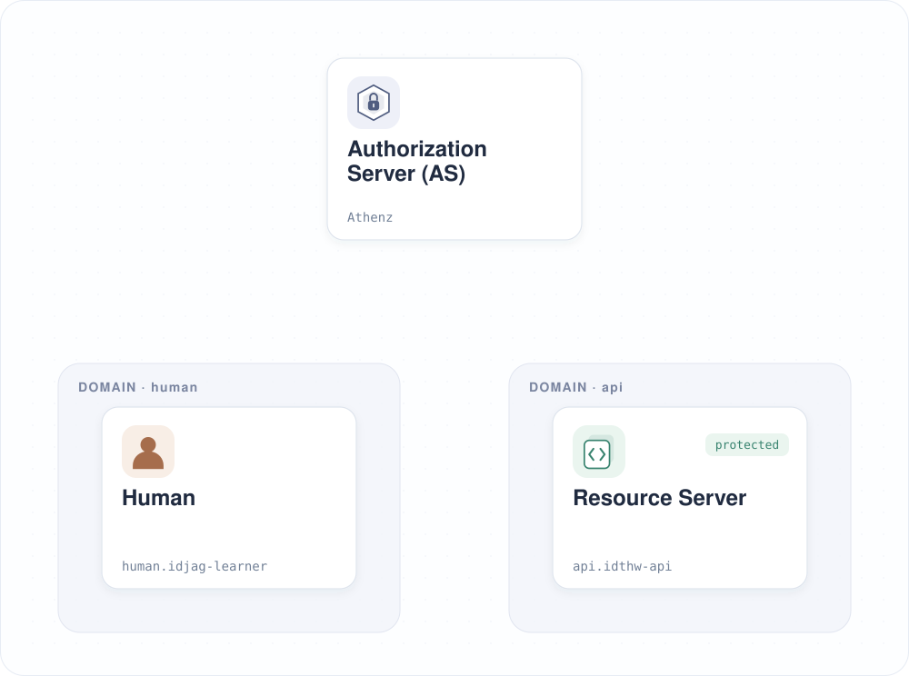
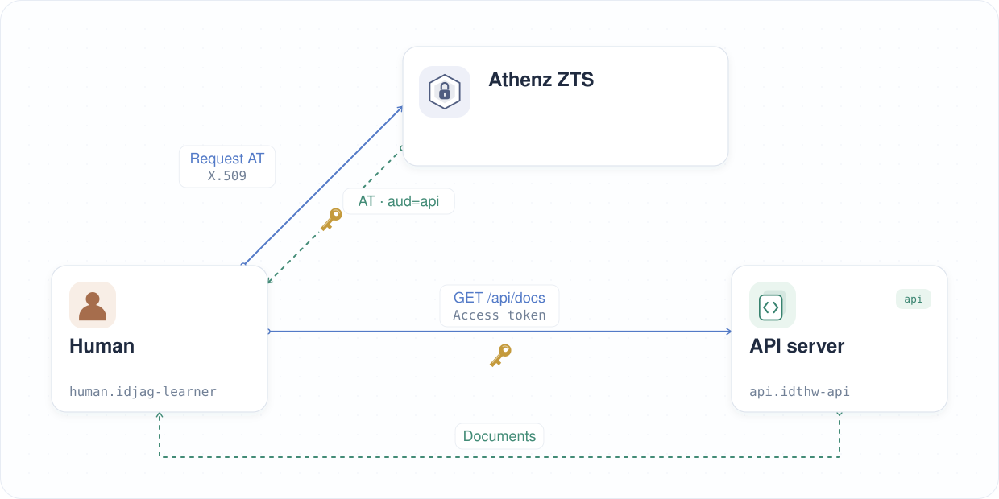

| 이전 | 현재 | 다음 |
|:---:|:---:|:---:|
| [액세스 토큰 (Access Token)](./06-access-token.md) | **권한 세분화** | [리소스 서버 (Resource Server)를 위한 MCP 서버](./08-mcp-server-for-resource-server.md) |

<a id="granular-permission"></a>

# 권한 세분화

저번 장에서는 관리자 인증서로 액세스 토큰 (Access Token)을 발급받았습니다. 이번 장에서는 관리자 인증 정보 대신 별도의 실습용 ID를 사용하고, `api:role.docs-getter` 스코프 (Scope)로 접근할 수 있는지 확인합니다:

<!-- TOC depthFrom:2 depthTo:2 -->

- [실습용 ID 생성](#create-a-learner-identity)
- [실습용 ID로 액세스 토큰 요청](#fetch-an-access-token-as-the-learner)
- [역할 등록 여부 확인](#troubleshoot-missing-role-membership)
- [실습용 ID에 `docs-getter` 권한 부여](#grant-the-learner-access-to-docs-getter)
- [액세스 토큰 다시 요청](#fetch-the-access-token-again)
- [보호된 API 호출](#call-the-protected-api)
- [아키텍처 확인](#review-architecture)

<!-- /TOC -->

<details>
<summary>별도의 ID가 필요한 이유는 무엇인가요?</summary>
<br>

관리자 인증 정보로는 도메인을 만들고, 서비스를 등록하고, 정책을 변경할 수 있습니다. 일반적인 API 호출에 이를 사용하면 요청에 필요한 것보다 훨씬 큰 권한을 부여하게 됩니다.

실습에 사용할 서비스 ID (Service Identity)인 `human.idjag-learner`를 별도로 만듭니다. ZTS는 토큰을 요청한 인증 주체 (Principal)가 해당 역할 (Role)에 속해 있는지 확인합니다. API는 발급된 토큰의 스코프로 각 작업의 권한을 확인합니다.

토큰의 audience는 `api`, 스코프는 `api:role.docs-getter`입니다. API는 이 토큰으로 문서를 조회하는 것은 허용하지만 생성하거나 삭제하는 것은 거부합니다. 토큰을 가진 사람은 토큰이 만료될 때까지 이 조회 권한을 사용할 수 있습니다.

> [!NOTE]
> Athenz는 실제 사용자를 위한 UserCert도 지원합니다. 이 튜토리얼에서는 사용자 인증서 등록보다 인가 흐름에 집중할 수 있도록 서비스 ID를 사용합니다.
</details>

<a id="create-a-learner-identity"></a>

## 실습용 ID 생성

실습용 ID 및 인증서 생성 스크립트로 `human.idjag-learner`를 만듭니다:

```sh
./tools/athenz/create-tld.sh "human"
./tools/athenz/create-private-key.sh "./keys/idjag-learner"
./tools/athenz/create-service.sh "human" "idjag-learner" "./keys/idjag-learner.public.key"
./tools/athenz/enable-cert-provider.sh "human" "idjag-learner"
./tools/athenz/fetch-cert.sh "human" "idjag-learner" "./keys/idjag-learner.key" "v1"
```

```sh
#   ·  Creating TLD: human...
#   ✔  TLD created: human
#   ·  Generating RSA key pair for: ./keys/idjag-learner...
#   ✔  Keys generated: ./keys/idjag-learner.key, ./keys/idjag-learner.public.key
#   ·  Registering Service: human.idjag-learner...
#   ✔  Service registered: human.idjag-learner
#   ·  Enabling ZTS Certificate Provider for human.idjag-learner...
# [Template(s) successfully applied to domain]
#   ✔  ZTS Certificate Provider enabled for human.idjag-learner
#   ·  Fetching X.509 Certificate for human.idjag-learner..
#   ·  Fetching X.509 Certificate for human.idjag-learner...
#   ✔  Certificate saved to: ./keys/idjag-learner.crt
```

다음 그림은 새로 만든 `human` 도메인과 `human.idjag-learner` 서비스 ID, 그리고 `api` 도메인의 보호된 API를 보여 줍니다:



서비스 페이지를 열어 실습용 ID를 확인합니다:

```sh
./tools/open.sh "http://localhost:$(./tools/port.sh athenz-ui)/domain/human/service"
```


<a id="fetch-an-access-token-as-the-learner"></a>

## 실습용 ID로 액세스 토큰 요청

같은 `api:role.docs-getter` 스코프를 요청하되, 관리자 대신 `human.idjag-learner`로 인증합니다.

> [!WARNING]
> 이 명령은 실패합니다. 의도된 결과입니다.

```sh
_scope="api:role.docs-getter"
_my_access_token=$(./tools/athenz/fetch-access-token.sh \
  "./keys/idjag-learner.crt" \
  "./keys/idjag-learner.key" \
  "${_scope}" \
  "./keys/idjag-learner.jwt")
```

```sh
#   ·  Fetching Access Token for scope: api:role.docs-getter...
#   ✘  Failed to issue an access token. ZTS Response:
# {
#   "code": 403,
#   "message": "postaccesstokenrequest: principal human.idjag-learner is not included in the requested role(s) in domain api"
# }
#
# ✘ Token issuance failed for scope: api:role.docs-getter
```

<a id="troubleshoot-missing-role-membership"></a>

## 역할 등록 여부 확인

실습용 ID는 존재하지만 아직 `api:role.docs-getter`의 멤버가 아닙니다. Athenz는 기본적으로 접근을 거부하므로 ZTS가 해당 역할의 토큰 발급을 거절합니다.

역할 멤버 페이지를 열어 확인합니다:

```sh
./tools/open.sh "http://localhost:$(./tools/port.sh athenz-ui)/domain/api/role/docs-getter/members"
```


<a id="grant-the-learner-access-to-docs-getter"></a>

## 실습용 ID에 `docs-getter` 권한 부여

`human.idjag-learner`를 `api:role.docs-getter`에 추가합니다:

```sh
./tools/athenz/add-role-member.sh "api" "docs-getter" "human.idjag-learner"
```

```sh
#   ·  Adding Member human.idjag-learner to Role: api:role.docs-getter...
#   ✔  human.idjag-learner  →  api:role.docs-getter
```

역할 멤버 페이지를 다시 엽니다:

```sh
./tools/open.sh "http://localhost:$(./tools/port.sh athenz-ui)/domain/api/role/docs-getter/members"
```


<a id="fetch-the-access-token-again"></a>

## 액세스 토큰 다시 요청

이제 실습용 ID가 역할의 멤버가 되었으므로 토큰을 다시 요청합니다:

```sh
_scope="api:role.docs-getter"
_my_access_token=$(./tools/athenz/fetch-access-token.sh \
  "./keys/idjag-learner.crt" \
  "./keys/idjag-learner.key" \
  "${_scope}" \
  "./keys/idjag-learner.jwt")
```

```sh
#   ·  Fetching Access Token for scope: api:role.docs-getter...
#   ✔  Access token issued for scope: api:role.docs-getter
# {
#   "kid": "athenz-zts-server-6966ff7f66-4j67d",
#   "typ": "at+jwt",
#   "alg": "RS256"
# }
# {
#   "sub": "human.idjag-learner",
#   "scp": [
#     "docs-getter"
#   ],
#   "ver": 1,
#   "iss": "athenz-zts-server-6966ff7f66-4j67d",
#   "client_id": "human.idjag-learner",
#   "aud": "api",
#   "uid": "human.idjag-learner",
#   "auth_time": 1778451929,
#   "scope": "docs-getter",
#   "cnf": {
#     "x5t#S256": "QUXJN5ALSWRR_fK5iHMwo0hnmlp01mcnyiNcd141o1E"
#   },
#   "exp": 1778455529,
#   "iat": 1778451929,
#   "jti": "cca1a64e-f309-47bd-94b9-3cef584663ef"
# }
```

<a id="send-request-to-the-protected-server"></a>

<a id="call-the-protected-api"></a>

## 보호된 API 호출

이전 단계에서 발급받은 실습용 토큰으로 보호된 API 서버에 요청을 보냅니다:

```sh
curl -sS -k -H "Authorization: Bearer $_my_access_token" http://localhost:14443/api/docs | jq .
```

```sh
# {
#   "docs": [
#     {
#       "name": "first default doc",
#       "id": 1,
#       "content": "hello world"
#     },
#     {
#       "name": "second default doc",
#       "id": 2,
#       "content": "how are you?"
#     }
#   ]
# }
```

> [!TIP]
> 역할의 멤버를 변경한 직후 토큰 발급이 실패하면, ZTS가 변경을 반영할 수 있도록 몇 초 기다린 뒤 새 토큰을 요청해 주세요. API는 발급된 토큰의 스코프를 확인하며 정책을 동기화하지는 않습니다.

<a id="review-architecture"></a>

## 아키텍처 확인

관리자가 아닌 서비스 ID(`human.idjag-learner`)의 X.509 인증서를 발급받고, 이 인증서로 인증하여 `api:role.docs-getter` 스코프의 Athenz 액세스 토큰을 요청했습니다:



이제 실습자는 스코프가 지정된 액세스 토큰으로 문서를 조회할 수 있습니다. 다음 장에서는 MCP 서버를 통해 API를 사용할 수 있도록 구성합니다.

다음: [리소스 서버 (Resource Server)를 위한 MCP 서버](./08-mcp-server-for-resource-server.md)
