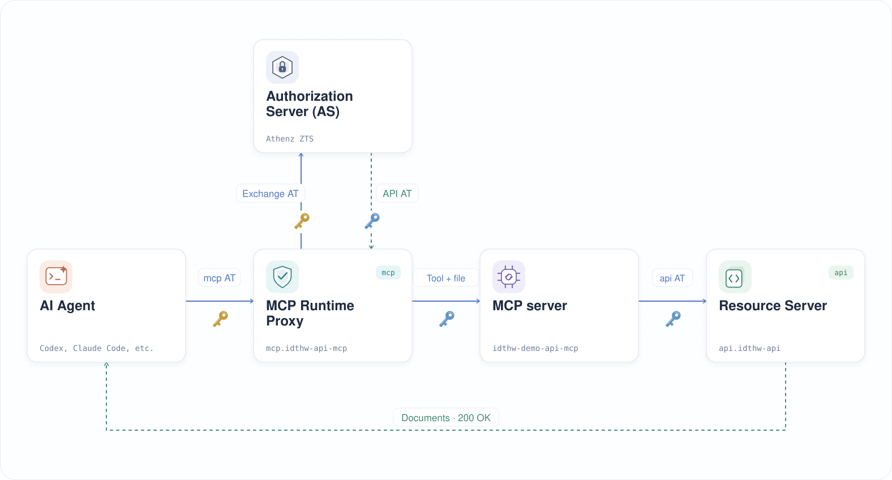
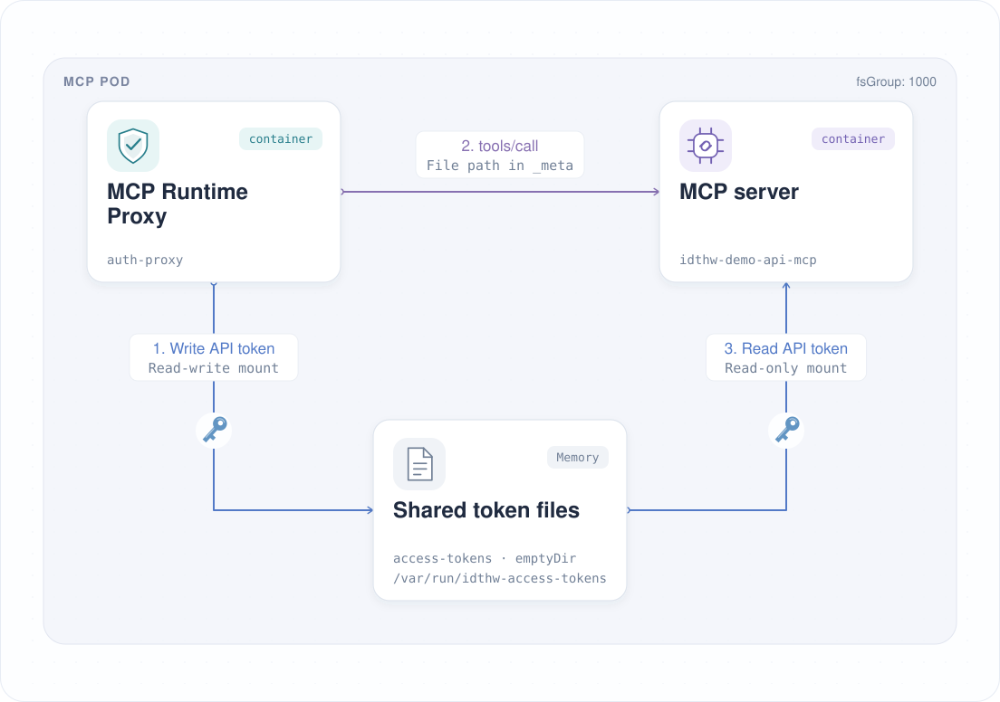
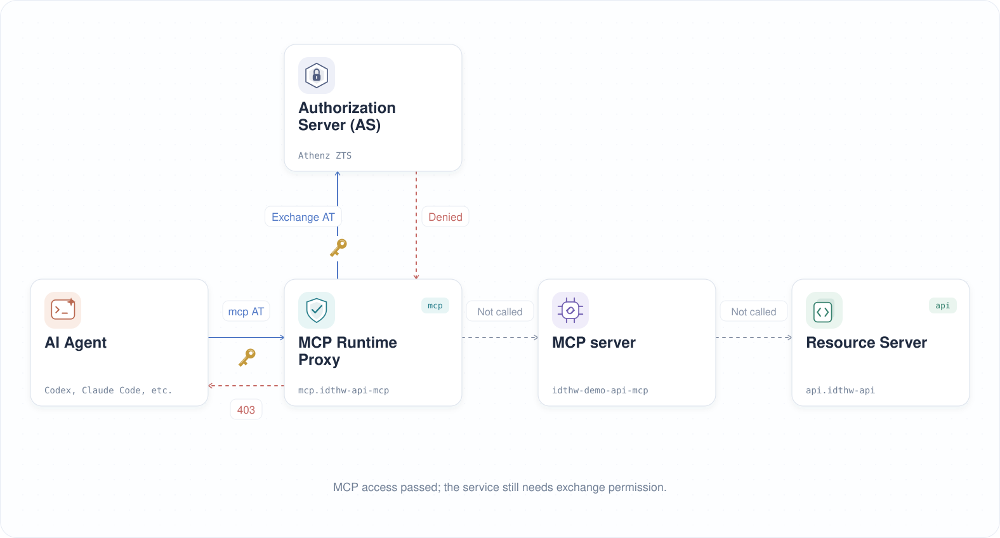

| 이전 | 현재 | 다음 |
|:---:|:---:|:---:|
| [MCP 서버 보호](./10-protect-mcp-server.md) | **토큰 교환** | [ID 제공자](./12-identity-provider.md) |

<a id="token-exchange--codex"></a>

# 토큰 교환 (Token Exchange) — Codex

이전 장에서는 Runtime Proxy가 실습자의 MCP 토큰을 받아들였지만, 문서 조회는 여전히 `502 downstream_token_exchange_unavailable`로 실패했습니다.

이번 장에서는 Runtime Proxy의 서비스 ID (Service Identity)를 만들고, 토큰 교환과 토큰 파일 공유를 설정한 뒤, 필요한 Athenz 권한을 부여해 Codex로 문서를 조회합니다.

<!-- TOC depthFrom:2 depthTo:2 -->

- [오류 원인 확인](#understand-the-remaining-error)
- [토큰 교환 흐름](#how-token-exchange-works)
- [MCP 서비스 ID 생성](#create-the-mcp-service-identity)
- [Kubernetes Secret 생성](#create-a-kubernetes-secret)
- [다운스트림 토큰 교환 설정](#configure-downstream-token-exchange)
- [실습자 토큰 갱신](#refresh-the-learner-token)
- [Codex에 MCP 토큰 적용](#update-codex-with-the-mcp-token)
- [토큰 교환 거부 확인](#verify-token-exchange-is-denied)
- [다운스트림 교환 권한 부여](#authorize-the-downstream-exchange)
- [문서 조회 확인](#verify-document-retrieval)
- [다음 단계](#next-steps)

<!-- /TOC -->

<a id="understand-the-remaining-error"></a>

## 오류 원인 확인

실습자의 MCP 토큰과 API 스코프 (Scope)는 검증을 통과하지만, Runtime Proxy가 Athenz에 토큰 교환을 요청하려면 자신의 서비스 ID로 인증해야 합니다. 아직 서비스 인증서를 마운트하지 않았으므로 도구 요청은 HTTP `502`를 반환합니다:

```json
{
  "error": "downstream_token_exchange_unavailable",
  "message": "Token exchange failed: the required MCP service certificate could not be read. Check ATHENZ_TOKEN_EXCHANGE_CERT_PATH."
}
```

프록시 로그를 확인합니다:

```sh
kubectl logs deploy/mcp -n mcp -c auth-proxy --tail=3
```

다음과 같은 항목을 찾습니다:

```sh
# 2026-XX-XXT07:05:21.312Z × ERROR [mcp-runtime-proxy] [exchange] downstream token exchange failed | requestId=eb1c16b4-6ec0-445f-905d-7baa32cb4952 method=POST path=/mcp code=downstream_token_exchange_unavailable durationMs=3 message="Token exchange failed: the required MCP service certificate could not be read. Check ATHENZ_TOKEN_EXCHANGE_CERT_PATH." status=502 reason=service_certificate_unavailable credentialPath=/var/run/athenz/service.cert.pem fileErrorCode=ENOENT athenzRequestSent=false
```

`reason=service_certificate_unavailable`이 실패 원인을 나타냅니다. `credentialPath`는 필요한 파일 경로이고, `fileErrorCode=ENOENT`는 해당 파일이 없다는 뜻입니다. 프록시는 서비스 인증 정보를 읽기 전에 실습자의 스코프를 확인합니다.

`athenzRequestSent=false`는 교환 요청이 Athenz에 도달하지 않았다는 뜻입니다. 따라서 Athenz는 아직 프록시의 교환 권한을 검사하지 않았으며, MCP 도구와 API도 호출되지 않았습니다.

<a id="how-token-exchange-works"></a>

## 토큰 교환 흐름

Codex는 수신 대상 (audience)이 `mcp`인 실습자의 액세스 토큰 (Access Token)을 보냅니다. Runtime Proxy는 먼저 토큰을 검증하고 MCP 접근 권한과 도구에 필요한 API 스코프를 확인합니다. 이후 서비스 인증서와 개인 키를 읽어 Athenz ZTS에 `mcp.idthw-api-mcp`로 인증합니다. 실습자의 토큰을 제출하고 audience가 `api`, 스코프가 `api:role.docs-getter`인 새 토큰을 요청합니다. 도구에 설정된 스코프에 따라 이 교환이 자동으로 실행됩니다.

Athenz는 해당 서비스가 `mcp` audience의 토큰을 API의 `docs-getter` 역할로 교환할 수 있는지 확인합니다. 교환에 성공하면 Runtime Proxy가 API 토큰을 요청별 파일에 쓰고 파일 경로를 MCP 서버에 전달합니다. MCP 서버는 이 토큰으로 API를 호출합니다. 요청이 끝나면 프록시가 파일을 제거합니다.



<a id="create-the-mcp-service-identity"></a>

## MCP 서비스 ID 생성

Runtime Proxy가 Athenz ZTS에 토큰 교환을 요청할 때 사용할 서비스 ID를 만듭니다. 10장에서 만든 `mcp` 도메인에 `idthw-api-mcp`를 생성합니다. 인증 주체 (Principal)는 `mcp.idthw-api-mcp`이며, 개인 키는 Runtime Proxy에만 마운트합니다.

실습용 ID 및 인증서 생성 스크립트로 MCP 서비스 ID인 `mcp.idthw-api-mcp`를 만듭니다:

```sh
./tools/athenz/create-private-key.sh "./keys/api-mcp"
./tools/athenz/create-service.sh "mcp" "idthw-api-mcp" "./keys/api-mcp.public.key"
./tools/athenz/enable-cert-provider.sh "mcp" "idthw-api-mcp"
./tools/athenz/fetch-cert.sh "mcp" "idthw-api-mcp" "./keys/api-mcp.key" "v1"
```

```sh
#   ·  Generating RSA key pair for: ./keys/api-mcp...
#   ✔  Keys generated: ./keys/api-mcp.key, ./keys/api-mcp.public.key
#   ·  Registering Service: mcp.idthw-api-mcp...
#   ✔  Service registered: mcp.idthw-api-mcp
#   ·  Enabling ZTS Certificate Provider for mcp.idthw-api-mcp...
# [Template(s) successfully applied to domain]
#   ✔  ZTS Certificate Provider enabled for mcp.idthw-api-mcp
#   ·  Fetching X.509 Certificate for mcp.idthw-api-mcp...
#   ✔  Certificate saved to: ./keys/api-mcp.crt
```

<a id="create-k8s-secret"></a>

<a id="create-a-kubernetes-secret"></a>

## Kubernetes Secret 생성

서비스 인증서와 개인 키를 `mcp` 네임스페이스에 저장합니다. 이 Secret은 Runtime Proxy에만 마운트합니다. CA는 10장에서 마운트한 별도의 CA Secret에 그대로 둡니다:

```sh
kubectl -n mcp create secret generic api-mcp-cert \
  --from-file=api-mcp.crt=./keys/api-mcp.crt \
  --from-file=api-mcp.key=./keys/api-mcp.key \
  --dry-run=client -o yaml | kubectl apply -f -
```

```sh
# secret/api-mcp-cert created
```

<a id="configure-downstream-token-exchange"></a>

## 다운스트림 토큰 교환 설정

<a id="mount-the-service-identity"></a>

### 서비스 ID 마운트

CA 인증서와 별도로 서비스 ID를 Runtime Proxy에 마운트합니다:

```sh
kubectl patch deploy mcp -n mcp --patch "$(cat <<'EOF'
spec:
  template:
    spec:
      containers:
        - name: auth-proxy
          volumeMounts:
            - name: mcp-identity
              mountPath: /var/run/athenz-identity
              readOnly: true
      volumes:
        - name: mcp-identity
          secret:
            secretName: api-mcp-cert
EOF
)"
```

```sh
# deployment.apps/mcp patched
```

<a id="share-the-api-token-directory"></a>

### API 토큰 디렉터리 공유

프록시에 교환한 API 토큰을 저장할 메모리 기반 디렉터리를 제공합니다. MCP 컨테이너에는 같은 디렉터리를 읽기 전용으로 마운트해 토큰을 사용할 수 있도록 합니다. `fsGroup: 1000`은 MCP 프로세스가 공유 파일을 읽을 수 있게 합니다.

다음 그림은 토큰 교환에 성공한 뒤 두 컨테이너가 같은 파일을 사용하는 방식을 보여 줍니다:



```sh
kubectl patch deploy mcp -n mcp --patch "$(cat <<'EOF'
spec:
  template:
    spec:
      securityContext:
        fsGroup: 1000
      containers:
        - name: auth-proxy
          volumeMounts:
            - name: access-tokens
              mountPath: /var/run/idthw-access-tokens
        - name: idthw-demo-api-mcp
          volumeMounts:
            - name: access-tokens
              mountPath: /var/run/idthw-access-tokens
              readOnly: true
      volumes:
        - name: access-tokens
          emptyDir:
            medium: Memory
EOF
)"
```

```sh
# deployment.apps/mcp patched
```

<a id="configure-the-service-credential-paths"></a>

### 서비스 인증 정보 경로 설정

Runtime Proxy가 마운트된 서비스 인증서와 개인 키를 사용하도록 경로를 설정합니다. 10장에서 지정한 `MCP_TOOL_SCOPES` 매핑에 따라 실습자의 스코프 검증이 통과하면 교환이 실행됩니다.

```sh
kubectl set env deploy/mcp -n mcp --containers=auth-proxy \
  ATHENZ_TOKEN_EXCHANGE_CERT_PATH=/var/run/athenz-identity/api-mcp.crt \
  ATHENZ_TOKEN_EXCHANGE_KEY_PATH=/var/run/athenz-identity/api-mcp.key
```

```sh
# deployment.apps/mcp env updated
```

도구를 호출할 때마다 프록시가 교환한 토큰을 요청별 파일에 쓰고 경로를 MCP에 전달합니다. MCP 서버는 이 토큰으로 API를 호출하며, 응답이 끝나면 프록시가 파일을 제거합니다. 아직 Athenz가 교환을 허용하지 않았으므로 아래에서 거부되는 것을 확인합니다.

변경된 Pod가 준비될 때까지 기다립니다:

```sh
kubectl rollout status deploy/mcp -n mcp
```

```sh
# deployment "mcp" successfully rolled out
```

`./tools/keep-k8s-port-forward.sh`를 다시 시작해 로컬 연결이 변경된 Pod를 향하도록 합니다.

<a id="refresh-the-learner-token"></a>

## 실습자 토큰 갱신

10장에서 사용한 audience와 두 스코프로 새 실습자 토큰을 발급받습니다:

```sh
_scope="mcp:role.mcp-accessor api:role.docs-getter"
_my_access_token=$(./tools/athenz/fetch-access-token.sh \
  "./keys/idjag-learner.crt" \
  "./keys/idjag-learner.key" \
  "${_scope}" \
  "./keys/idjag-learner.jwt" \
  --audience mcp)
```

디코딩한 출력에는 `aud=mcp`가 표시되고, `scp`에 `mcp-accessor`와 `api:role.docs-getter`가 모두 포함되어야 합니다. Runtime Proxy는 도구 호출 중 별도의 API용 액세스 토큰을 발급받습니다.

<a id="update-the-client"></a>

<a id="update-codex-with-the-mcp-token"></a>

## Codex에 MCP 토큰 적용

`_my_access_token`을 발급받은 셸에서 튜토리얼의 `.codex/config.toml`을 업데이트합니다. 다른 설정을 추가했다면 파일 전체를 바꾸지 말고 해당 서버의 `http_headers` 항목만 수정해 주세요:

```sh
_mcp_port=$(./tools/port.sh mcp)

cat > .codex/config.toml <<EOF
[mcp_servers.id-jag-the-hard-way-mcp]
url = "http://localhost:${_mcp_port}/mcp"
http_headers = { Authorization = "Bearer ${_my_access_token}" }
EOF
cat .codex/settings.toml >> .codex/config.toml
```

현재 Codex 세션을 종료합니다:

```text
/quit
```

프로젝트 디렉터리에서 Codex를 다시 실행하고 대화를 이어가 새 토큰을 불러오도록 합니다:

```sh
codex resume --last
```

<a id="verify-token-exchange-is-denied"></a>

## 토큰 교환 거부 확인

Codex에 문서 조회를 다시 요청합니다:

```sh
Get docs with id-jag-the-hard-way-mcp
```

Runtime Proxy가 교환 실패에 대해 `insufficient_scope` 인증 챌린지를 반환하므로 Codex에 **Insufficient scope**가 표시될 수 있습니다. 프록시 로그에서도 실패 원인을 확인할 수 있습니다:

```sh
kubectl logs deploy/mcp -n mcp -c auth-proxy --tail=3
```

출력 예시:

```sh
# 2026-09-23T04:44:42.137Z → INFO  [mcp-runtime-proxy] [request] request received | requestId=7dd7e8b3-f274-4708-90a0-3dd28c48e2a3 method=POST path=/mcp accessTokenPresent=true
# 2026-09-23T04:44:42.158Z ✓ INFO  [mcp-runtime-proxy] [auth] access token verified | requestId=7dd7e8b3-f274-4708-90a0-3dd28c48e2a3 method=POST path=/mcp audiences=["mcp"] clientId=human.idjag-learner expiresAt=2026-09-23T05:42:36.000Z expiresInSeconds=3474 keyId=athenz-zts-server-5fcdbc67f4-lwctf scopes=["api:role.docs-getter","mcp-accessor"] subject=human.idjag-learner userId=human.idjag-learner
# 2026-09-23T04:44:42.190Z ! WARN  [mcp-runtime-proxy] [exchange] downstream token exchange failed | requestId=7dd7e8b3-f274-4708-90a0-3dd28c48e2a3 method=POST path=/mcp code=downstream_token_exchange_denied durationMs=53 message="Athenz denied the downstream token exchange." status=403
```

같은 `requestId`에서 "access token verified" 다음에 `code=downstream_token_exchange_denied`, `status=403`인 "downstream token exchange failed"가 나타나는지 확인합니다. 변경된 프록시는 `reason=athenz_error_response`, `athenzRequestSent=true`, Athenz 응답 상태인 `athenzStatus`도 기록합니다. 이제 프록시는 서비스 인증 정보를 읽고 Athenz에 접근할 수 있지만, 서비스 ID에 교환 권한이 아직 없습니다.

대신 `reason=service_certificate_unavailable` 또는 `reason=service_private_key_unavailable`이 보이면 위의 Secret 마운트와 인증 정보 경로를 확인해 주세요. `athenzRequestSent=false`는 Athenz가 교환 권한을 검사하기 전에 요청이 중단되었다는 뜻입니다.



<a id="authorize-the-downstream-exchange"></a>

## 다운스트림 교환 권한 부여

실습자는 이미 `mcp:role.mcp-accessor`와 `api:role.docs-getter`를 모두 가지고 있습니다. 이제 프록시의 서비스 ID에 교환 권한을 부여합니다. Athenz는 원본 도메인인 `mcp`와 대상 도메인인 `api` 양쪽에서 권한을 요구합니다.

<a id="allow-exchange-from-mcp-to-api"></a>

### MCP에서 API로의 교환 허용

`mcp`에 교환 역할을 만들고, `api`를 대상으로 `zts.token_source_exchange`를 허용한 뒤 `mcp.idthw-api-mcp`를 역할에 추가합니다:

```sh
./tools/athenz/create-role.sh "mcp" "to-api-exchanger"
./tools/athenz/add-policy.sh "mcp" "to-api-exchanger" "zts.token_source_exchange" "api"
./tools/athenz/add-role-member.sh "mcp" "to-api-exchanger" "mcp.idthw-api-mcp"
```

처음 실행했을 때의 출력 예시:

```sh
#   ·  Creating Role: mcp:role.to-api-exchanger...
#   ✔  Role created: mcp:role.to-api-exchanger
#   ·  Creating Policy: mcp:policy.to-api-exchanger_zts_token_source_exchange_api...
#   ✔  Policy created: mcp:policy.to-api-exchanger_zts_token_source_exchange_api
#   ·  Adding Member mcp.idthw-api-mcp to Role: mcp:role.to-api-exchanger...
#   ✔  mcp.idthw-api-mcp  →  mcp:role.to-api-exchanger
```

정책 리소스는 `mcp:api`입니다. `mcp` 도메인이 해당 서비스에 MCP용 액세스 토큰을 `api` 도메인으로 교환할 권한을 부여합니다.

<a id="allow-exchange-into-the-api-role"></a>

### API 역할로의 교환 허용

`api`에 교환 역할을 만들고, `mcp`에서 `docs-getter`로의 `zts.token_target_exchange`를 허용한 뒤 같은 서비스 ID를 추가합니다:

```sh
./tools/athenz/create-role.sh "api" "docs-getter-exchanger"
./tools/athenz/add-policy.sh "api" "docs-getter-exchanger" "zts.token_target_exchange" "mcp:role.docs-getter"
./tools/athenz/add-role-member.sh "api" "docs-getter-exchanger" "mcp.idthw-api-mcp"
```

처음 실행했을 때의 출력 예시:

```sh
#   ·  Creating Role: api:role.docs-getter-exchanger...
#   ✔  Role created: api:role.docs-getter-exchanger
#   ·  Creating Policy: api:policy.docs-getter-exchanger_zts_token_target_exchange_mcp_role_docs-getter...
#   ✔  Policy created: api:policy.docs-getter-exchanger_zts_token_target_exchange_mcp_role_docs-getter
#   ·  Adding Member mcp.idthw-api-mcp to Role: api:role.docs-getter-exchanger...
#   ✔  mcp.idthw-api-mcp  →  api:role.docs-getter-exchanger
```

정책 리소스는 `api:mcp:role.docs-getter`입니다. `api` 도메인이 해당 서비스에 `mcp`의 토큰을 자신의 `docs-getter` 역할로 교환할 권한을 부여합니다. 문서 접근 권한은 실습자의 스코프에서 오며, 서비스에 추가한 역할은 교환 자체를 허용합니다.

<a id="verify-document-retrieval"></a>

## 문서 조회 확인

**Insufficient scope**가 발생했던 요청을 Codex에 다시 보냅니다:

```sh
Get docs with id-jag-the-hard-way-mcp
```

이제 Codex가 문서를 조회할 수 있어야 합니다. 튜토리얼의 기본 문서를 사용한다면 도구의 구조화된 응답에는 다음 내용이 포함됩니다:

```json
{
  "status": 200,
  "ok": true,
  "data": {
    "docs": [
      { "id": 1, "name": "first default doc", "content": "hello world" },
      { "id": 2, "name": "second default doc", "content": "how are you?" }
    ]
  }
}
```

프록시 로그를 확인합니다:

```sh
kubectl logs deploy/mcp -n mcp -c auth-proxy --tail=5
```

같은 `requestId`에서 다음 이벤트를 찾습니다:

- `access token verified` — 실습자의 MCP 토큰이 검증을 통과함
- `downstream access token published` — 교환에 성공해 API 토큰 파일이 준비됨
- `upstreamStatus=200`인 `request completed` — MCP 서버가 응답을 반환함
- `downstream access token removed` — 프록시가 해당 요청의 토큰 파일을 정리함

정책을 변경한 직후에도 `downstream_token_exchange_denied`가 기록되면 Athenz의 정책 캐시가 갱신될 때까지 기다린 뒤 Codex에서 같은 요청을 다시 시도해 주세요.

<a id="next-steps"></a>

## 다음 단계

이제 Codex가 보호된 MCP 서비스를 통해 문서를 조회할 수 있습니다. Runtime Proxy는 실습자의 MCP 토큰을 각 요청에 필요한 API 토큰으로 교환합니다.

다음 장에서는 사용자가 로그인하고 ID 토큰을 받을 수 있도록 Keycloak을 배포합니다.

다음: [ID 제공자](./12-identity-provider.md)
