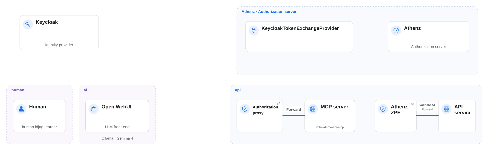

| 이전 | 현재 | 다음 |
|:---:|:---:|:---:|
| [ID 제공자](./12-identity-provider.md) | **신뢰할 수 있는 ID 제공자** | [AI Client Gateway](./14-ai-client-gateway.md) |

<a id="trusted-identity-provider--codex"></a>

# 신뢰할 수 있는 ID 제공자 (Identity Provider, IdP) — Codex

Athenz가 Keycloak의 ID 토큰 (ID Token)을 신뢰하고 검증하도록 설정합니다. 이 신뢰 관계가 있어야 ID 토큰을 ID-JAG로 교환할 수 있습니다.

<!-- TOC depthFrom:2 depthTo:2 -->

- [신뢰 설정 이해](#understand-the-trust-configuration)
- [ZTS 서버에 플러그인 설치](#install-plugin-into-the-zts-server)
- [플러그인에 Keycloak 연결](#connect-keycloak-with-the-plugin)
- [ZTS가 플러그인을 불러오도록 설정](#configure-zts-to-load-the-plugin)
- [결과 확인](#review-the-result)
- [다음 단계](#next-steps)

<!-- /TOC -->

<a id="understand-what-we-need-to-do"></a>

<a id="understand-the-trust-configuration"></a>

## 신뢰 설정 이해

현재 배포에는 Keycloak을 신뢰하는 설정이 없습니다. Keycloak ID 토큰을 ID-JAG로 교환하려면 다음 작업이 필요합니다:

1. Athenz가 Keycloak 토큰을 검증할 수 있도록 플러그인 설치
2. 토큰 서명을 검증할 수 있도록 플러그인에 Keycloak의 `jwks_uri` 제공
3. ZTS 서버에 플러그인 설정 파일의 위치 지정


<a id="install-plugin-into-the-zts-server"></a>

## ZTS 서버에 플러그인 설치

Keycloak 토큰 교환 제공자 JAR를 ZTS 서버에 마운트하는 패치를 적용합니다:

```sh
kubectl patch deployment athenz-zts-server \
  -n athenz \
  --patch-file components/keycloak_token_exchange_provider/hack/static/zts-plugin-jar-mount-patch.yaml
```

롤아웃이 끝날 때까지 기다립니다:

```sh
kubectl rollout status deployment/athenz-zts-server -n athenz
```

```sh
# Waiting for deployment "athenz-zts-server" rollout to finish: 0 of 1 updated replicas are available...
# deployment "athenz-zts-server" successfully rolled out
```

JAR가 마운트되었는지 확인합니다:

```sh
kubectl -n athenz exec deployment/athenz-zts-server \
  -c athenz-zts-server \
  -- sh -c "ls -al /opt/athenz/zts/lib/jars | grep keycloak"
```

```sh
# -rw-r--r-- 1 root root 3237 May 1 14:26 keycloak-token-provider.jar
```



<a id="connect-keycloak-with-the-plugin"></a>

## 플러그인에 Keycloak 연결

플러그인이 Keycloak 인스턴스를 참조하도록 `providers.json` ConfigMap을 만듭니다:

```sh
cat <<EOF | kubectl apply -f -
apiVersion: v1
kind: ConfigMap
metadata:
  name: zts-providers-config
  namespace: athenz
data:
  providers.json: |
    [
      {
        "issuerUri": "http://localhost:$(./tools/port.sh keycloak)/realms/master",
        "jwksUri": "http://keycloak.idp:8080/realms/master/protocol/openid-connect/certs",
        "providerClassName": "com.mlajkim.athenz.KeycloakTokenExchangeProvider"
      }
    ]
EOF
```

ZTS 서버에서 Keycloak의 JWKS 엔드포인트에 접근할 수 있는지 확인합니다:

```sh
kubectl -n athenz exec deployment/athenz-zts-server -c athenz-zts-server -- \
  sh -c "curl -k http://keycloak.idp:8080/realms/master/protocol/openid-connect/certs | jq ."
```

ConfigMap을 ZTS 서버에 마운트합니다:

```sh
kubectl patch deployment athenz-zts-server \
  -n athenz \
  --patch-file components/keycloak_token_exchange_provider/hack/static/zts-providers-config-patch.yaml
```

```sh
# deployment.apps/athenz-zts-server patched
```

컨테이너 안에 파일이 있는지 확인합니다:

```sh
kubectl -n athenz exec deployment/athenz-zts-server \
  -c athenz-zts-server \
  -- sh -c "cat /opt/athenz/zts/conf/providers.json"
```

```sh
# [
#   {
#     "issuerUri": "http://localhost:34443/realms/master",
#     "jwksUri": "http://keycloak.idp:8080/realms/master/protocol/openid-connect/certs",
#     "providerClassName": "com.mlajkim.athenz.KeycloakTokenExchangeProvider"
#   }
# ]
```

<a id="configure-zts-to-load-the-plugin"></a>

## ZTS가 플러그인을 불러오도록 설정

파일을 마운트하는 것만으로는 충분하지 않습니다. ZTS 서버에 파일 위치를 알려 줘야 합니다. `kubectl edit`로 ZTS ConfigMap을 수정합니다:

```sh
KUBE_EDITOR=vim kubectl edit configmap athenz-zts-conf -n athenz
```

`vim`에서 다음 순서로 진행합니다:

1. `/zts.prop`을 입력하고 **Enter**를 눌러 properties 섹션으로 이동
2. `o`를 눌러 아래에 새 줄을 만들고 입력 모드로 전환
3. `zts.properties: |` 아래의 다른 속성과 들여쓰기 맞추기(공백 네 칸)
4. 다음 줄 붙여 넣기

```
athenz.zts.oauth_provider_config_file=/opt/athenz/zts/conf/providers.json
```


5. **Esc**를 누르고 `:wq!`를 입력한 뒤 **Enter**를 눌러 저장

다음과 같이 표시되어야 합니다:

```sh
# configmap/athenz-zts-conf edited
```

새 설정을 읽도록 ZTS 서버를 다시 시작합니다:

```sh
kubectl -n athenz rollout restart deployment athenz-zts-server
kubectl rollout status deployment/athenz-zts-server -n athenz
```

설정이 적용되었는지 확인합니다:

```sh
kubectl logs -n athenz deployment/athenz-zts-server -c athenz-zts-server | grep "oauth_provider_config_file"
```

```sh
# 12:34:56.233 [main] INFO  c.y.a.c.s.util.config.ConfigManager - configuration "athenz.zts.oauth_provider_config_file" created
```

> [!NOTE]
> 플러그인은 Keycloak 토큰의 `preferred_username` 클레임을 Athenz 인증 주체 (Principal)인 `human.[preferred_username]`에 매핑합니다. 따라서 Keycloak의 `idjag-learner`는 Athenz에서 `human.idjag-learner`가 됩니다.

<a id="review-summary-of-changes"></a>

<a id="review-the-result"></a>

## 결과 확인

`KeycloakTokenExchangeProvider` 플러그인을 설치했습니다. 이 플러그인은 Keycloak ID 토큰을 받아 Keycloak의 공개 키로 서명을 검증하고 토큰의 클레임을 확인한 뒤, 인증된 Athenz 주체를 반환합니다:


<a id="whats-next"></a>

<a id="next-steps"></a>

## 다음 단계

이제 Athenz는 Keycloak ID 토큰을 신뢰합니다. 다음 장에서는 Codex CLI에서 Keycloak 로그인을 사용할 수 있도록 AI Client Gateway를 배포합니다.

다음: [AI Client Gateway](./14-ai-client-gateway.md)
