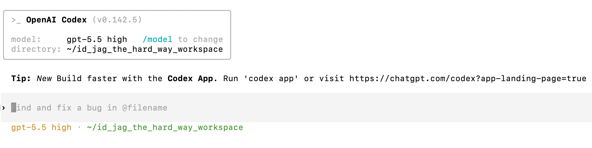
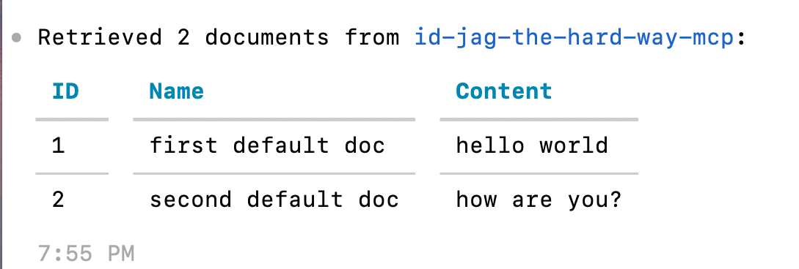

| 이전 | 현재 | 다음 |
|:---:|:---:|:---:|
| [AI Client Gateway](./14-ai-client-gateway.md) | **ID-JAG** | [소개](./00-README.md) |

<a id="id-jag--codex"></a>

# ID-JAG — Codex

AI Client Gateway에 Keycloak ID 토큰 (ID Token)을 ID-JAG로 교환할 권한을 부여합니다. 문서 요청을 다시 보내 성공하는지 확인한 뒤, 각 서비스가 토큰을 검증하는 과정을 로그로 살펴봅니다.

<!-- TOC depthFrom:2 depthTo:2 -->

- [`human.idjag-learner.codex`에 권한 부여](#grant-permissions-to-humanidjag-learnercodex)
- [문서 조회 확인](#verify)
- [동작 확인](#understand-the-result)
- [마무리](#finally)

<!-- /TOC -->

<a id="grant-permissions-to-humanidjag-learnercodex"></a>

## `human.idjag-learner.codex`에 권한 부여

`human.idjag-learner.codex` 서비스에는 사용할 대상 역할로 JAG를 교환할 권한이 필요합니다.

문서 접근용 `api` 도메인과 MCP 접근용 `mcp` 도메인에 JAG 교환 역할을 하나씩 만듭니다. 게이트웨이는 하나의 ID-JAG에 두 스코프 (Scope)를 함께 요청하고, 이를 수신 대상 (audience)이 `mcp`인 액세스 토큰 (Access Token)으로 교환합니다:

```sh
./tools/athenz/create-role.sh "api" "docs-getter-jag-exchanger"
./tools/athenz/create-role.sh "mcp" "mcp-accessor-jag-exchanger"
```

`api:role.docs-getter`와 `mcp:role.mcp-accessor`를 대상으로 `zts.jag_exchange` 액션을 허용합니다:

```sh
./tools/athenz/add-policy.sh "api" "docs-getter-jag-exchanger" "zts.jag_exchange" "role.docs-getter"
./tools/athenz/add-policy.sh "mcp" "mcp-accessor-jag-exchanger" "zts.jag_exchange" "role.mcp-accessor"
```

`human.idjag-learner.codex`를 두 역할의 멤버로 추가합니다:

```sh
./tools/athenz/add-role-member.sh "api" "docs-getter-jag-exchanger" "human.idjag-learner.codex"
./tools/athenz/add-role-member.sh "mcp" "mcp-accessor-jag-exchanger" "human.idjag-learner.codex"
```

```sh
#   ·  Adding Member human.idjag-learner.codex to Role: api:role.docs-getter-jag-exchanger...
#   ✔  human.idjag-learner.codex  →  api:role.docs-getter-jag-exchanger
#   ·  Adding Member human.idjag-learner.codex to Role: mcp:role.mcp-accessor-jag-exchanger...
#   ✔  human.idjag-learner.codex  →  mcp:role.mcp-accessor-jag-exchanger
```

<a id="verify"></a>

## 문서 조회 확인

새 권한으로 다시 연결하도록 Codex에서 새 채팅을 시작합니다:

```sh
/new
```

저번 장에서 나타났던 MCP 시작 경고가 사라집니다:



저번 장에서 실패했던 프롬프트를 다시 보냅니다:

```
get docs from k8s doc server!
```



응답에는 API가 반환한 문서가 포함되어야 합니다.

<a id="whats-happened"></a>

<a id="understand-the-result"></a>

## 동작 확인

로그에서 각 단계의 인가 검사를 확인할 수 있습니다. 게이트웨이는 액세스 토큰의 audience를 `mcp`로 지정하고 `mcp:role.mcp-accessor api:role.docs-getter`를 요청합니다. 이후 MCP Runtime Proxy가 `mcp.idthw-api-mcp`로 동작하여 토큰을 audience가 `api`인 토큰으로 교환하며, `api:role.docs-getter` 스코프만 남깁니다.

1. AI Client Gateway는 로그인한 사용자의 Keycloak ID 토큰을 확인하고, 이를 ID-JAG 토큰으로 교환한 뒤 Athenz 액세스 토큰을 발급받았습니다.

```sh
kubectl logs -n human deployment/codex-idjag-learner-ai-client-gateway --tail=30
```

```sh
# [Athenz ID-JAG] 🔑 Resolved ID token from bearer session (Claude Code path)
# [Athenz ID-JAG] 🔄 Attempting to exchange new ID-JAG with id-token for scope [api:role.docs-getter mcp:role.mcp-accessor] ...
# [Athenz ID-JAG] 🎯 Target ZTS for ID-JAG: https://athenz-zts-server.athenz:4443/zts/v1/oauth2/token
# [Athenz ID-JAG] 🎫 Granted scope in ID-JAG: "api:role.docs-getter mcp:role.mcp-accessor"
# [Athenz AT] Fetching Athenz Access Token using ID-JAG ...
# [Athenz AT] 🎯 Target ZTS for AT: https://athenz-zts-server.athenz:4443/zts/v1/oauth2/token
# [Athenz AT] 🔑 Successfully fetched Athenz Access Token. Granted scope: ["api:role.docs-getter","mcp-accessor"]
```

2. MCP Runtime Proxy는 보호된 호출을 전달하기 전에 토큰을 검증합니다. [검증 코드](../../components/mcp-runtime-proxy/src/auth.ts)는 `alg=RS256`과 `typ=at+jwt`만 허용하고, 신뢰하는 ZTS 서명 키로 서명을 검증하며, `exp`와 `nbf` 제한이 있으면 이를 확인합니다. 또한 audience가 `mcp`인지, `mcp:role.mcp-accessor` 스코프가 있는지 확인합니다.

MCP Runtime Proxy가 실행되는 `auth-proxy` 컨테이너를 확인합니다:

```sh
kubectl logs -n mcp deployment/mcp -c auth-proxy --tail=50
```

기본 텍스트 로그에서 `access token verified` 항목을 찾습니다. 이 항목은 위의 검사를 모두 통과한 뒤에만 기록됩니다. `audiences`, `scopes`, `keyId`, `expiresInSeconds`를 확인하고, 같은 `requestId`를 가진 `upstreamStatus=200`인 `request completed` 항목을 찾습니다. `mcp-accessor`처럼 도메인을 생략한 스코프는 audience가 `mcp` 하나뿐일 때만 허용합니다.

인증이 필요 없는 도구 목록 조회도 성공할 수 있으므로 `request completed`만으로 토큰 검증 여부를 확인할 수는 없습니다. JWT의 `alg` 헤더를 읽는 것만으로 서명이 검증되는 것도 아닙니다.

`auth-proxy` 컨테이너에 `LOG_FORMAT=json`을 설정하면 같은 이벤트가 `access_token_verified`와 `request_completed`로 표시되고, JSON 레코드에 `"upstreamStatus":200`이 포함됩니다. 이전 Runtime Proxy 이미지에서도 이 JSON 형식을 기본으로 사용합니다.

3. MCP Runtime Proxy는 `mcp.idthw-api-mcp`로 다운스트림 토큰 교환을 수행합니다. API 전용 `docs-getter` 토큰을 요청마다 고유한 파일에 쓰고, 파일 경로를 도구 호출에 넣습니다. `idthw-demo-api-mcp`는 API를 호출하기 전에 이 파일을 읽으며, 응답이 끝나면 프록시가 파일을 제거합니다.

<details>
<summary>Runtime Proxy의 토큰 교환 확인</summary>

```sh
kubectl logs -n mcp deployment/mcp -c auth-proxy --tail=20
```

스코프가 `api:role.docs-getter`인 `downstream access token published` 항목과 같은 요청의 `downstream access token removed` 항목을 찾습니다. 교환된 토큰의 audience는 `api`입니다.

</details>

4. API는 신뢰하는 ZTS 서명 키로 독립적으로 [교환된 토큰을 검증](../../components/idthw-demo-api/src/auth.ts)합니다. 토큰 유형, 유효기간, audience를 확인하고, 문서를 반환하기 전에 `api:role.docs-getter` 스코프를 요구합니다.

```sh
kubectl logs -n api deployment/api-server --tail=20
```

```sh
# Look for event "request_completed", method "GET", status 200.
```

프록시는 MCP 접근 권한을 확인하고, API는 문서 접근 권한을 확인합니다. 다운스트림 교환은 audience를 `mcp`에서 `api`로 바꾸고 문서 조회 스코프만 유지합니다.

<a id="finally"></a>

## 마무리

끝까지 따라와 주셔서 감사합니다. 이 튜토리얼이 도움이 되었기를 바랍니다.

사용자 로그인부터 위임된 API 접근까지 연결했습니다. Athenz 정책은 토큰 발급과 교환을 제어하고, 프록시와 API는 각 토큰의 audience와 스코프를 검증합니다. 역할의 멤버를 변경하면 ZTS가 변경을 반영한 뒤 새 토큰 발급에 적용합니다. 이미 발급된 토큰은 만료될 때까지 사용할 수 있습니다.

이 튜토리얼이 도움이 되었다면 GitHub의 두 저장소 중 한 곳에 ⭐를 남겨 주세요!

| 저장소                                                                       | 스타                                                                                                                                                                                                   | 포크                                                                                                                                                                                              |
|----------------------------------------------------------------------------------|---------------------------------------------------------------------------------------------------------------------------------------------------------------------------------------------------------|----------------------------------------------------------------------------------------------------------------------------------------------------------------------------------------------------|
| [원본 저장소](https://github.com/mlajkim/id-jag-the-hard-way)                | [](https://github.com/mlajkim/id-jag-the-hard-way/stargazers)                    | [](https://github.com/mlajkim/id-jag-the-hard-way/forks)                    |
| [Athenz 커뮤니티 포크](https://github.com/athenz-community/id-jag-the-hard-way) | [](https://github.com/athenz-community/id-jag-the-hard-way/stargazers) | [](https://github.com/athenz-community/id-jag-the-hard-way/forks) |

문제가 생기거나 궁금한 점이 있다면 [이슈를 남겨 주세요](https://github.com/mlajkim/id-jag-the-hard-way/issues).
