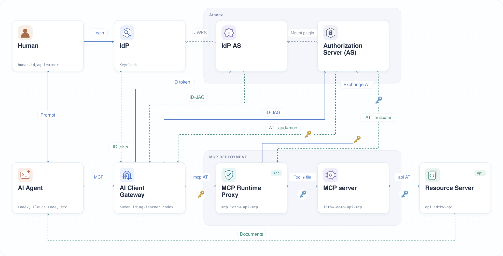

| 이전 | 현재 | 다음 |
|:---:|:---:|:---:|
| [AI Client Gateway](./14-ai-client-gateway.md) | **ID-JAG** | [소개](./00-README.md) |

<a id="id-jag--codex"></a>

# ID-JAG — Codex

AI Client Gateway에 Keycloak ID 토큰 (ID Token)을 ID-JAG로 교환할 권한을 부여합니다. 문서 요청을 다시 보내 성공하는지 확인한 뒤, 각 서비스가 토큰을 검증하는 과정을 로그로 살펴봅니다.

<!-- TOC depthFrom:2 depthTo:2 -->

- [`human.idjag-learner.codex`에 권한 부여](#humanidjag-learnercodex에-권한-부여)
- [문서 조회 확인](#문서-조회-확인)
- [동작 확인](#동작-확인)
- [마무리](#마무리)
- [맺음말](#맺음말)

<!-- /TOC -->

<a id="grant-permissions-to-humanidjag-learnercodex"></a>

## `human.idjag-learner.codex`에 권한 부여

`human.idjag-learner.codex` 서비스에는 사용할 대상 역할로 JAG를 교환할 권한이 필요합니다.

문서 접근용 `api` 도메인과 MCP 접근용 `mcp` 도메인에 JAG 교환 역할을 하나씩 만듭니다. 게이트웨이는 하나의 ID-JAG에 두 스코프 (Scope)를 함께 요청하고, 이를 수신 대상 (audience)이 `mcp`인 액세스 토큰 (Access Token)으로 교환합니다:

```sh
./tools/athenz/create-role.sh "api" "docs-getter-jag-exchanger"
./tools/athenz/create-role.sh "mcp" "mcp-accessor-jag-exchanger"
```

```sh
#   ·  Creating Role: api:role.docs-getter-jag-exchanger...
#   ✔  Role created: api:role.docs-getter-jag-exchanger
#   ·  Creating Role: mcp:role.mcp-accessor-jag-exchanger...
#   ✔  Role created: mcp:role.mcp-accessor-jag-exchanger
```

`api:role.docs-getter`와 `mcp:role.mcp-accessor`를 대상으로 `zts.jag_exchange` 액션을 허용합니다:

```sh
./tools/athenz/add-policy.sh "api" "docs-getter-jag-exchanger" "zts.jag_exchange" "role.docs-getter"
./tools/athenz/add-policy.sh "mcp" "mcp-accessor-jag-exchanger" "zts.jag_exchange" "role.mcp-accessor"
```

```sh
#   ·  Creating Policy: api:policy.docs-getter-jag-exchanger_zts_jag_exchange_role_docs-getter...
#   ✔  Policy created: api:policy.docs-getter-jag-exchanger_zts_jag_exchange_role_docs-getter
#   ·  Creating Policy: mcp:policy.mcp-accessor-jag-exchanger_zts_jag_exchange_role_mcp-accessor...
#   ✔  Policy created: mcp:policy.mcp-accessor-jag-exchanger_zts_jag_exchange_role_mcp-accessor
```

`human.idjag-learner.codex`를 두 역할의 멤버로 추가합니다:

```sh
./tools/athenz/add-role-member.sh "api" "docs-getter-jag-exchanger" "human.idjag-learner.codex"
./tools/athenz/add-role-member.sh "mcp" "mcp-accessor-jag-exchanger" "human.idjag-learner.codex"
```

```sh
#   ·  Adding Member human.idjag-learner.codex to Role: api:role.docs-getter-jag-exchanger...
#   ✔  human.idjag-learner.codex  →  api:role.docs-getter-jag-exchanger
#   ·  Adding Member human.idjag-learner.codex to Role: mcp:role.mcp-accessor-jag-exchanger...
#   ✔  human.idjag-learner.codex  →  mcp:role.mcp-accessor-jag-exchanger
```

<a id="verify"></a>

## 문서 조회 확인

새 권한으로 다시 연결하도록 Codex를 종료합니다:

```sh
/quit
```

터미널로 돌아오면 프로젝트 디렉터리에서 Codex를 다시 실행합니다:

```sh
codex
```

Codex에서 MCP 연결 상태를 확인합니다:

```sh
/mcp
```

```sh
# 🔌  MCP Tools
#
#   • id-jag-the-hard-way-mcp: connected (3 tools)
```

이제 `failed`가 표시되지 않고 도구 3개가 정상적으로 보입니다!

저번 장에서 실패했던 프롬프트를 다시 보냅니다:

```sh
Get docs with id-jag-the-hard-way-mcp
```


응답에는 API가 반환한 문서가 포함되어야 합니다.

<a id="whats-happened"></a>

<a id="understand-the-result"></a>

## 동작 확인

AI Client Gateway는 로그인한 사용자의 Keycloak ID 토큰을 확인하고, 이를 ID-JAG 토큰으로 교환한 뒤 Athenz 액세스 토큰을 발급받았습니다.

게이트웨이는 요청과 응답도 기록하므로, 토큰 교환 메시지만 골라 최근 7줄을 확인합니다:

```sh
kubectl logs deploy/codex-idjag-learner-ai-client-gateway -n human -c ai-client-gateway --tail=100 \
  | grep -E '^\[Athenz (ID-JAG|AT)\]' \
  | tail -n 7
```

```sh
# [Athenz ID-JAG] 🔑 Resolved ID token from bearer session (Claude Code path)
# [Athenz ID-JAG] 🔄 Attempting to exchange new ID-JAG with id-token for scope [api:role.docs-getter mcp:role.mcp-accessor] ...
# [Athenz ID-JAG] 🎯 Target ZTS for ID-JAG: https://athenz-zts-server.athenz:4443/zts/v1/oauth2/token
# [Athenz ID-JAG] 🎫 Granted scope in ID-JAG: "api:role.docs-getter mcp:role.mcp-accessor"
# [Athenz AT] Fetching Athenz Access Token using ID-JAG ...
# [Athenz AT] 🎯 Target ZTS for AT: https://athenz-zts-server.athenz:4443/zts/v1/oauth2/token
# [Athenz AT] 🔑 Successfully fetched Athenz Access Token. Granted scope: ["api:role.docs-getter","mcp-accessor"]
```

<a id="finally"></a>

## 마무리

🎉 축하합니다! "ID-JAG The Hard Way" 튜토리얼을 끝까지 완료했습니다.

사용자 로그인부터 위임된 API 접근까지 연결했습니다. Athenz 정책은 토큰 발급과 교환을 제어하고, 프록시와 API는 각 토큰의 audience와 스코프를 검증합니다. 역할의 멤버를 변경하면 ZTS가 변경을 반영한 뒤 새 토큰 발급에 적용합니다. 이미 발급된 토큰은 만료될 때까지 사용할 수 있습니다.

지금까지 만든 전체 흐름은 다음과 같습니다:



<a id="closing"></a>

## 맺음말

이 튜토리얼이 도움이 되었다면 GitHub의 두 저장소 중 한 곳에 ⭐를 남겨 주세요!

| 저장소                                                                       | 스타                                                                                                                                                                                                   | 포크                                                                                                                                                                                              |
|----------------------------------------------------------------------------------|---------------------------------------------------------------------------------------------------------------------------------------------------------------------------------------------------------|----------------------------------------------------------------------------------------------------------------------------------------------------------------------------------------------------|
| [원본 저장소](https://github.com/mlajkim/id-jag-the-hard-way)                | [](https://github.com/mlajkim/id-jag-the-hard-way/stargazers)                    | [](https://github.com/mlajkim/id-jag-the-hard-way/forks)                    |
| [Athenz 커뮤니티 포크](https://github.com/athenz-community/id-jag-the-hard-way) | [](https://github.com/athenz-community/id-jag-the-hard-way/stargazers) | [](https://github.com/athenz-community/id-jag-the-hard-way/forks) |

문제가 생기거나 궁금한 점이 있다면 [이슈를 남겨 주세요](https://github.com/mlajkim/id-jag-the-hard-way/issues).
