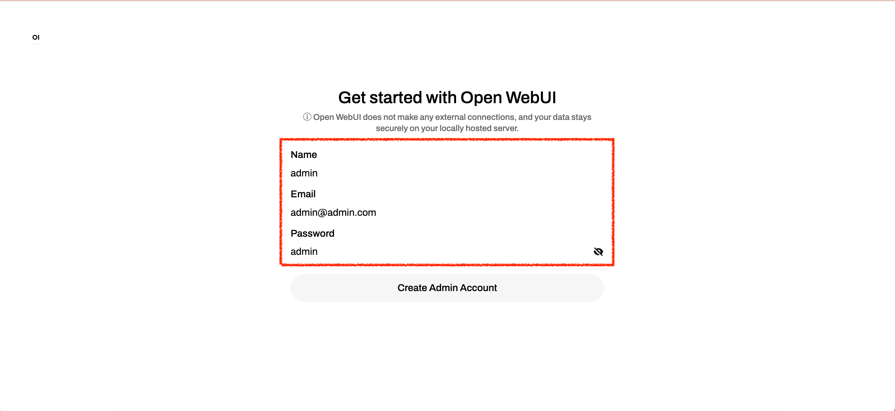
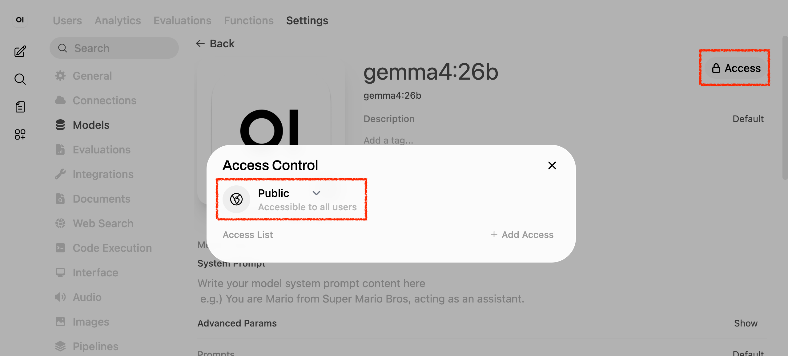

|               Previous               |    Current     |                   Next                   |
|:------------------------------------:|:--------------:|:----------------------------------------:|
| [AI Agent](../09-ai-agent.md) | **Open WebUI** | [Protect MCP Server](./10-protect-mcp-server.md) |

# Open WebUI

> [!WARNING]
> This path runs model inference locally with Ollama. Memory and performance requirements depend on the model, context length, and hardware. The configurations below are examples that have been tested, not minimum requirements.
>
> This path has been verified on the following hardware:
>
> |      OS       |          CPU          | Memory |    LLM     |      Status      |
> |:-------------:|:---------------------:|:------:|:----------:|:----------------:|
> |  Tahoe 26.2   |        M3 Pro         |  36GB  | gemma4:e4b | Verified Working |
> | Ubuntu 24 LTS | Intel Core i7-11700KF |  32GB  | gemma4:e4b | Verified Working |
>
> To use hosted model inference, choose [Claude Code](../09-ai-agent.md) or [Codex CLI](../codex/09-ai-agent.md). Those clients run locally, but do not require Ollama or a local model for their hosted-model setup.

Install Open WebUI, connect it to the MCP service, and retrieve documents using the learner's API access token.

<!-- TOC depthFrom:2 depthTo:2 -->

- [Install Ollama](#install-ollama)
- [Install Gemma 4 with Ollama](#install-gemma-4-with-ollama)
- [Install Open WebUI](#install-open-webui)
- [Open Open WebUI](#open-open-webui)
- [Register MCP Server as a Tool Server in Open WebUI](#register-mcp-server-as-a-tool-server-in-open-webui)
- [Verify](#verify)
- [Verify Working](#verify-working)
- [Understand the Result](#understand-the-result)
- [Next Steps](#next-steps)

<!-- /TOC -->

## Install Ollama

Install Ollama on your host using the [instructions for your operating system](https://ollama.com/download). Start Ollama, then verify that its CLI is available:

```sh
ollama --version
```

## Install Gemma 4 with Ollama

> [!NOTE]
> See the [Gemma model documentation](https://ai.google.dev/gemma/docs/core) for model specifications and memory requirements.

In this tutorial, we will use Gemma 4's `gemma4:e4b` as our AI model:

```sh
ollama pull gemma4:e4b
```

## Install Open WebUI

Deploy Open WebUI as the chat interface. Its container image includes the required runtime and dependencies.


<a id="create-namespace-for-webui"></a>

### Create the Open WebUI Namespace

First, create the `ai` namespace:

```sh
kubectl create ns ai
```

### Deploy Open WebUI in K8s

> [!NOTE]
> Open WebUI runs inside Kubernetes and must reach Ollama on your host. The host address depends on your Docker and operating system setup. If no models appear, check the Ollama URL under **Admin Panel > Settings > Connections** and follow the [Open WebUI connection troubleshooting guide](https://docs.openwebui.com/troubleshooting/connection-error/).

Deploy Open WebUI:

> [!NOTE]
> If you are using kind, pre-loading the image can speed things up significantly:
>
> ```sh
> docker pull ghcr.io/open-webui/open-webui:main
> kind load docker-image --name "${KIND_CLUSTER_NAME:-$(kubectl config current-context | sed 's/^kind-//')}" ghcr.io/open-webui/open-webui:main
> ```

```sh
kubectl create deploy open-webui -n ai \
  --image=ghcr.io/open-webui/open-webui:main
```

Use HTTP polling for live chat updates. This is more reliable when Open WebUI is accessed through `kubectl port-forward` and prevents completed responses from appearing only after a page refresh:

```sh
kubectl set env deployment/open-webui -n ai \
  ENABLE_WEBSOCKET_SUPPORT=false
```

Expose the deployment:

```sh
kubectl expose deploy open-webui -n ai --port 8080 --name open-webui
```

```sh
# service/open-webui exposed
```

<a id="deploy-pvc-for-the-open-webui"></a>

### Persist Open WebUI Data

First, create a very simple `pvc`:

```sh
cat <<EOF | kubectl apply -f -
apiVersion: v1
kind: PersistentVolumeClaim
metadata:
  name: open-webui-data-pvc
  namespace: ai
spec:
  accessModes: [ "ReadWriteOnce" ]
  resources:
    requests:
      storage: 1Gi
EOF
```

```sh
# persistentvolumeclaim/open-webui-data-pvc created
```

Mount the volume we just created:

```sh
kubectl patch deploy open-webui -n ai --patch "$(cat <<'EOF'
spec:
  template:
    spec:
      containers:
        - name: open-webui
          volumeMounts:
            - name: open-webui-data
              mountPath: /app/backend/data
      volumes:
        - name: open-webui-data
          persistentVolumeClaim:
            claimName: open-webui-data-pvc
EOF
)"
```

```sh
# deployment.apps/open-webui patched
```

## Open Open WebUI

> [!NOTE]
> The first startup can take several minutes while the image downloads and the application initializes.
>
> You may also see errors like `Error from server (NotFound): namespaces "idp" not found` or `unable to forward port because pod is not running` in the port-forward terminal — these are expected at this stage and can be ignored.

Open Open WebUI in your browser:

```sh
_open_webui_port=$(./tools/port.sh open-webui)
./tools/open.sh "http://localhost:${_open_webui_port}"
```

Create the first account, which becomes the Open WebUI administrator. For this local walkthrough, the examples use:

- `admin@admin.com`
- `admin`

However, the credentials are up to you.



## Register MCP Server as a Tool Server in Open WebUI

The MCP server listens on the pod's loopback address by default. Keep `./tools/keep-k8s-port-forward.sh` running so Open WebUI can reach MCP through your host. With Docker Desktop, print the URL to use:

```sh
_mcp_port=$(./tools/port.sh mcp)
echo "http://host.docker.internal:${_mcp_port}"
```

If your Docker setup uses a different host address for Ollama, use that address here with the MCP port printed above.

Fetch a fresh access token with audience `api` and scope `api:role.docs-getter` using the learner identity from chapter 07:

```sh
_scope="api:role.docs-getter"
_my_access_token=$(./tools/athenz/fetch-access-token.sh \
  "./keys/idjag-learner.crt" \
  "./keys/idjag-learner.key" \
  "${_scope}" \
  "./keys/idjag-learner.jwt")
```

Go to `User Icon` > `Admin Panel` > `Settings` > `Integrations` > `Manage Tool Servers` > `+ Icon` to register the MCP server as a tool server.

- Name: `API MCP Server`
- Description: `MCP server for API that holds documentation`
- URL: Use the host URL printed above (normally `http://host.docker.internal:24443`)
- OpenAPI spec: `/openapi.json`
- Auth type: `Bearer`
- API key: Paste the freshly issued token saved in `./keys/idjag-learner.jwt`, without the `Bearer ` prefix
- Access: Change to `Public`

The OpenAPI operations are `POST /tools/get_k8s_docs`, `POST /tools/post_k8s_doc`, and `POST /tools/delete_k8s_doc`. Each operation takes the tool arguments as a JSON object. Open WebUI sends the configured token in the Authorization header, and the MCP server forwards it to the API.

Before we ask the AI agent, let's quickly add the tool as the default tool server, so that you do not have to manually add the tool every time.

Go to `User Icon` > `Admin Panel` > `Settings` > `Models`,

Select the edit (Pencil) Icon.

Select `Access` > `Private` then change to `Public` (saved automatically):



Then in `tools` section, select the tool that we just created as the following:


## Verify

Open the registered tool server and confirm that its OpenAPI specification lists these operations:

- `get_k8s_docs`
- `post_k8s_doc`
- `delete_k8s_doc`

## Verify Working

Start a new chat with the document tool enabled and ask:

```sh
Get docs with the API MCP Server
```

The tool should return status `200` and the document list. If the API rejects an expired token, repeat the token issuance step above, replace the API key in the tool server settings with the fresh token, save, and start a new chat.

## Understand the Result

Discovery reads tool definitions without calling the API. When Open WebUI calls `get_k8s_docs`, the MCP server forwards the API token from that request's Authorization header. The API validates the token and its document-read permission.


## Next Steps

The AI client can now retrieve documents through MCP. In the next chapter, we will add Runtime Proxy to validate access tokens before allowing tool execution.

Next: [Protect MCP Server](./10-protect-mcp-server.md)
