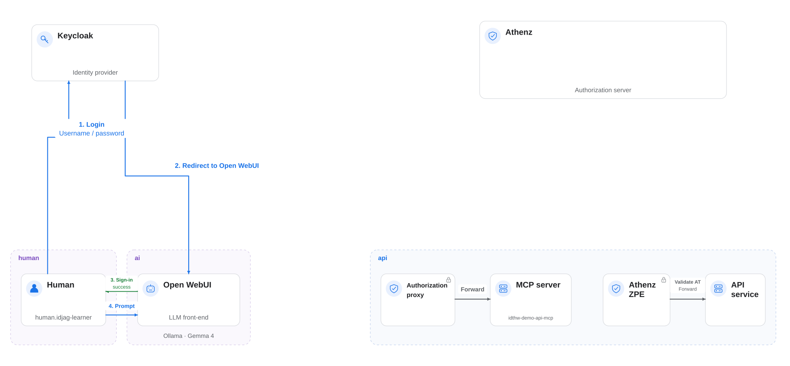

|                     Previous                     |              Current               |                              Next                              |
|:------------------------------------------------:|:----------------------------------:|:--------------------------------------------------------------:|
| [Token Exchange](./11-token-exchange.md) | **Identity Provider — Open WebUI** | [Trusted Identity Provider](./13-trusted-identity-provider.md) |

# Identity Provider — Open WebUI

Configure [Keycloak](https://www.keycloak.org/) as the identity provider for Open WebUI with the following steps. You will create a learner account and sign in to Open WebUI through Keycloak.

<!-- TOC depthFrom:2 depthTo:2 -->

- [Deploy Keycloak in K8s](#deploy-keycloak-in-k8s)
- [Open Keycloak in Your Browser](#open-keycloak-in-your-browser)
- [Register the Keycloak Client](#register-the-keycloak-client)
- [Create the Learner Account](#create-the-learner-account)
- [Configure the Token Lifespan](#configure-the-token-lifespan)
- [Add Keycloak Settings to Open WebUI](#add-keycloak-settings-to-open-webui)
- [Sign in as `idjag-learner`](#sign-in-as-idjag-learner)
- [Approve the Learner Account](#approve-the-learner-account)
- [Return to the `idjag-learner` Browser](#return-to-the-idjag-learner-browser)
- [Review the Result](#review-the-result)
- [Next Steps](#next-steps)

<!-- /TOC -->

## Deploy Keycloak in K8s

Create the Keycloak namespace:

```sh
kubectl create ns idp
```

Deploy Keycloak:

```sh
kubectl create deployment keycloak --image=quay.io/keycloak/keycloak:latest -n idp
```

Set the administrator credentials and start Keycloak in development mode:

```sh
_keycloak_admin=$(./tools/config.sh keycloak admin)
_keycloak_admin_password=$(./tools/config.sh keycloak admin-password)

kubectl patch deploy keycloak -n idp --patch "$(cat <<EOF
spec:
  template:
    spec:
      containers:
        - name: keycloak
          imagePullPolicy: IfNotPresent
          args:
            - start-dev
          env:
            - name: KEYCLOAK_ADMIN
              value: "${_keycloak_admin}"
            - name: KEYCLOAK_ADMIN_PASSWORD
              value: "${_keycloak_admin_password}"
EOF
)"
```

Create a PersistentVolumeClaim (PVC) to preserve Keycloak data across pod restarts:

```sh
cat <<EOF | kubectl apply -f -
apiVersion: v1
kind: PersistentVolumeClaim
metadata:
  name: keycloak-data-pvc
  namespace: idp
spec:
  accessModes: [ "ReadWriteOnce" ]
  resources:
    requests:
      storage: 1Gi
EOF
```

Mount the volume we just created:

```sh
kubectl patch deploy keycloak -n idp --patch "$(cat <<'EOF'
spec:
  template:
    spec:
      containers:
        - name: keycloak
          volumeMounts:
            - name: keycloak-data
              mountPath: /opt/keycloak/data
      volumes:
        - name: keycloak-data
          persistentVolumeClaim:
            claimName: keycloak-data-pvc
EOF
)"
```

And finally expose the deployment:

```sh
kubectl expose deployment keycloak --port=8080 -n idp
```

<a id="open-keycloak-on-browser"></a>

## Open Keycloak in Your Browser

> [!NOTE]
> If you are using `kind` and facing `ImagePullBackOff`, load the image manually:
>
> ```sh
> docker pull quay.io/keycloak/keycloak:latest
> kind load docker-image quay.io/keycloak/keycloak:latest
> ```
>
> On **Apple Silicon (arm64)** this may still fail with a content digest error. Use a single-platform build instead:
>
> ```sh
> docker buildx build --platform linux/arm64 --load --provenance=false \
>   -t keycloak:kind-load - <<'EOF'
> FROM quay.io/keycloak/keycloak:latest
> EOF
> kind load docker-image keycloak:kind-load
> ```
>
> Then patch the deployment to use `keycloak:kind-load` as the image.

Make sure the Keycloak pod is running before opening the browser:

```sh
kubectl wait -n idp \
  --for=condition=ready pod \
  --selector=app=keycloak \
  --timeout=180s
```

Open your browser and log in using admin for both the username `admin` and password `admin`:

```sh
_keycloak_port=$(./tools/port.sh keycloak)
./tools/open.sh "http://localhost:${_keycloak_port}"
```


<a id="setup-client"></a>

## Register the Keycloak Client

In Keycloak, a `Client` represents an application that requests authentication on behalf of a user. Since the service identity name of the AI client will be `ai.open-webui`, we will use that as the client name.

> [!NOTE]
> We use the default `master` realm for this tutorial.

Register the client with Keycloak:

```sh
_open_webui_port=$(./tools/port.sh open-webui)
./tools/keycloak/create-client.sh \
  ai.open-webui \
  "http://localhost:${_open_webui_port}/oauth/oidc/callback" \
  "http://localhost:${_open_webui_port}"
```

You should see a confirmation screen similar to this:


<a id="setup-user"></a>

## Create the Learner Account

Let's create a human user account to represent you:

```sh
OPEN_UI=true ./tools/keycloak/create-user.sh \
  idjag-learner \
  idjag-learner@athenz.io \
  ID-JAG \
  Learner
```

<a id="setup-id_token-expiration-date"></a>

## Configure the Token Lifespan

> [!TIP]
> Set the realm token lifespan to four hours for this walkthrough. The helper updates Keycloak's `accessTokenLifespan` setting. Choose a lifespan appropriate to your security requirements outside this learning environment.

```sh
./tools/keycloak/set-token-lifespan.sh 14400
```

```sh
#   ·  Fetching Keycloak admin token...
#   ·  Setting access token lifespan to 14400s in realm master...
#   ✔  Access token lifespan set to 14400s (4h)
#   ✔  Opened: http://localhost:34443/admin/master/console/#/master/realm-settings/tokens
```


## Add Keycloak Settings to Open WebUI

The Open WebUI deployed in K8s does not yet have Keycloak configured. We need to patch the deployment with the required environment variables.

First, store the client secret as a K8s secret:

```sh
./tools/keycloak/create-client-k8s-secret.sh ai.open-webui ai keycloak-client-secret
```

Patch the Open WebUI deployment with Keycloak settings:

```sh
_open_webui_port=$(./tools/port.sh open-webui)
_keycloak_port=$(./tools/port.sh keycloak)

kubectl patch deploy open-webui -n ai --patch "$(cat <<EOF
spec:
  template:
    spec:
      containers:
        - name: open-webui
          env:
            - name: ENABLE_OAUTH_SIGNUP
              value: "true"
            - name: OAUTH_CLIENT_ID
              valueFrom:
                secretKeyRef:
                  name: keycloak-client-secret
                  key: client-id
            - name: OAUTH_CLIENT_SECRET
              valueFrom:
                secretKeyRef:
                  name: keycloak-client-secret
                  key: client-secret
            - name: OPENID_PROVIDER_URL
              value: "http://keycloak.idp:8080/realms/master/.well-known/openid-configuration"
            - name: OAUTH_PROVIDER_NAME
              value: "Keycloak"
            - name: OAUTH_SCOPES
              value: "openid email profile"
            - name: OPENID_REDIRECT_URI
              value: "http://localhost:${_open_webui_port}/oauth/oidc/callback"
        
        - name: keycloak-proxy
          image: alpine/socat
          command: ["socat"]
          args: ["tcp-listen:${_keycloak_port},fork,reuseaddr", "tcp-connect:keycloak.idp:8080"]
EOF
)"
```

> [!NOTE]
> `OPENID_PROVIDER_URL` uses the in-cluster Keycloak service address (`keycloak.idp:8080`) instead of `localhost`, so Open WebUI can reach Keycloak from inside the cluster.


## Sign in as `idjag-learner`

Wait for the Open WebUI pod to be ready after the patch:

```sh
kubectl rollout status deploy/open-webui -n ai
```

Open a separate browser profile or private window for `idjag-learner` so the learner and administrator sessions stay separate.

```sh
_open_webui_port=$(./tools/port.sh open-webui)
./tools/open.sh "http://localhost:${_open_webui_port}" incognito=true
```

You will see a new login panel with a **Continue with Keycloak** button:


Click **Continue with Keycloak** and sign in with the learner account:

- `Username`: `idjag-learner`
- `Password`: `password`


<a id="accept-the-account"></a>

## Approve the Learner Account

Return to the browser where you are logged in as the `admin` user.

```sh
_open_webui_port=$(./tools/port.sh open-webui)
./tools/open.sh "http://localhost:${_open_webui_port}"
```

Navigate to `http://localhost:${_open_webui_port}/admin/users/overview`


Click `Edit User` for the `idjag-learner`, then change `Pending` to `User`, and click **Save**.


## Return to the `idjag-learner` Browser

Switch back to the browser window for `idjag-learner` and refresh the page.

```sh
_open_webui_port=$(./tools/port.sh open-webui)
./tools/open.sh "http://localhost:${_open_webui_port}" incognito=true
```

You should now be successfully logged into the interface.


<a id="whats-done"></a>

## Review the Result

Keycloak now authenticates the learner account for Open WebUI:



<a id="whats-next"></a>

## Next Steps

Open WebUI now uses Keycloak for sign-in, but Athenz does not yet trust its ID tokens. In the next chapter, you will configure Athenz to accept and verify them.

Next: [Trusted Identity Provider](./13-trusted-identity-provider.md)
