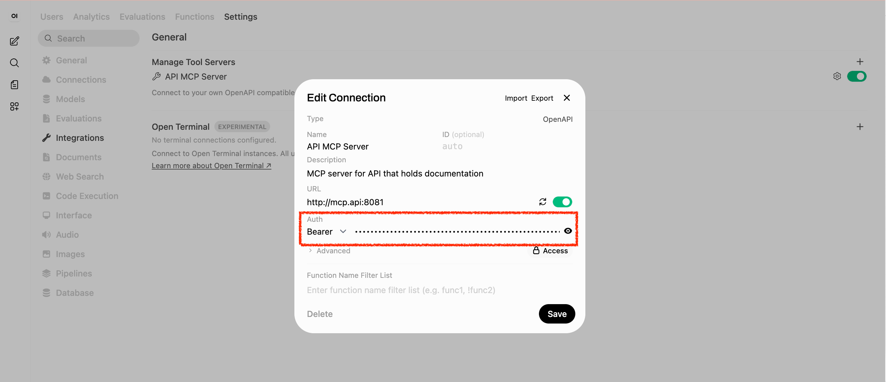
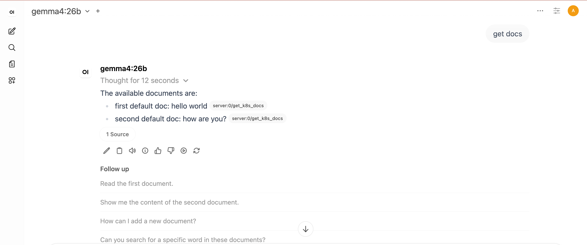

|                 Previous                 |               Current               |                      Next                      |
|:----------------------------------------:|:-----------------------------------:|:----------------------------------------------:|
| [Token Exchange](./11-token-exchange.md) | **Protect MCP Server — Open WebUI** | [Identity Provider](./13-identity-provider.md) |

# Protect MCP Server — Open WebUI

In this tutorial, we will secure the MCP server using an Authorization Server (Athenz), just as we did with the API Server.

<!-- TOC depthFrom:2 depthTo:2 -->

- [Run Authorization Proxy for MCP Hub](#run-authorization-proxy-for-mcp-hub)
- [Service Cert for MCP Hub ZPU](#service-cert-for-mcp-hub-zpu)
- [Update the MCP Service to Point to the Proxy](#update-the-mcp-service-to-point-to-the-proxy)
- [Verify](#verify)
- [Fix Insufficient Permission](#fix-insufficient-permission)
- [Fetch a New Access Token for the New Role](#fetch-a-new-access-token-for-the-new-role)
- [Attach the Access Token & Configure the New Authorization Server](#attach-the-access-token--configure-the-new-authorization-server)
- [Verify](#verify-1)
- [Review Summary of Changes](#review-summary-of-changes)
- [What's next?](#whats-next)

<!-- /TOC -->

## Run Authorization Proxy for MCP Hub

We will deploy an authorization proxy for the MCP server managed by MCP Hub. The proxy checks the access token before forwarding requests to the MCP server:

```yaml
kubectl patch deploy k8s-doc-server -n mcp-hub --patch "$(cat <<'EOF'
spec:
  template:
    spec:
      containers:
        - name: auth-proxy
          image: ghcr.io/mlajkim/mcp-authorization-proxy:latest
          imagePullPolicy: Always
          env:
            - name: SERVER_PORT
              value: "8082"
            - name: MCP_TARGET_URL
              value: "http://localhost:8081"
            - name: MCP_RESOURCE
              value: "k8s-doc-server"
          ports:
            - containerPort: 8082
EOF
)"
```

## Service Cert for MCP Hub ZPU

The ZPU sidecar needs a service identity in the `mcp-hub` domain so it can fetch and evaluate the MCP Hub policies locally.

```sh
./tools/athenz/create-private-key.sh "./keys/mcp-zpu"
./tools/athenz/create-service.sh "mcp-hub" "mcp-zpu" "./keys/mcp-zpu.public.key"
./tools/athenz/enable-cert-provider.sh "mcp-hub" "mcp-zpu"
./tools/athenz/fetch-cert.sh "mcp-hub" "mcp-zpu" "./keys/mcp-zpu.key" "v1"

kubectl -n mcp-hub delete secret mcp-hub-zpu-cert --ignore-not-found
kubectl -n mcp-hub create secret generic mcp-hub-zpu-cert \
  --from-file=cert=./keys/mcp-zpu.crt \
  --from-file=key=./keys/mcp-zpu.key \
  --from-file=ca=./athenz_dist/certs/ca.cert.pem
```

Attach the ZPU sidecar so the proxy can evaluate policies locally:

```yaml
kubectl patch deploy k8s-doc-server -n mcp-hub --patch "$(cat <<'EOF'
spec:
  template:
    spec:
      containers:
        - name: auth-proxy
          volumeMounts:
            - name: mcp-hub-policies
              mountPath: /app/policies
              readOnly: true

        - name: zpu
          image: ghcr.io/mlajkim/zpu:latest
          imagePullPolicy: Always
          env:
            - name: ZPU_DOMAIN
              value: "mcp-hub"
            - name: ZTS_URL
              value: "https://athenz-zts-server.athenz:4443/zts/v1"
            - name: ZPU_INTERVAL_SECONDS
              value: "5"
          volumeMounts:
            - name: mcp-hub-policies
              mountPath: /policies
            - name: mcp-hub-zpu-cert
              mountPath: /var/run/athenz/zpu
              readOnly: true

      volumes:
        - name: mcp-hub-policies
          emptyDir: {}
        - name: mcp-hub-zpu-cert
          secret:
            secretName: mcp-hub-zpu-cert
            defaultMode: 0400
EOF
)"
```

## Update the MCP Service to Point to the Proxy

We have a service `k8s-doc-server` that watches the `k8s-doc-server` server right now, with selector: `Selector: app=k8s-doc-server`:

```sh
kubectl describe svc k8s-doc-server -n mcp-hub
```

We are going to change the service `k8s-doc-server` to watch the authorization proxy instead, but with the same port and name:

```sh
kubectl delete svc k8s-doc-server -n mcp-hub
kubectl expose deploy k8s-doc-server -n mcp-hub --port 8081 --target-port 8082 --name k8s-doc-server
```

## Verify

Follow the steps below to verify the setup.

Now, let's test if the new authorization proxy forwards our request to the original MCP Server. (Spoiler: This request is expected to fail)

```
get docs!
```

It will fail with an error similar to the following:


This happens because the Authorization Proxy server we just configured requires the `access` action on the `mcp-hub:k8s-doc-server` resource, which we haven't granted yet. This permission check is illustrated in the architecture diagram below:


## Fix Insufficient Permission

To authorize access to the authorization server, our identity service (`human.idjag-learner`) must have the following permissions:

- resource: `k8s-doc-server` on domain `mcp-hub`
- action: `access`

Since we haven't prepared any roles or policies yet, let's create an explicit role named `mcp-accessor` and attach an access policy for the `k8s-doc-server` resource.

```sh
./tools/athenz/create-role.sh "mcp-hub" "mcp-accessor"
```

Next, attach the policy to the role:

```sh
./tools/athenz/add-policy.sh "mcp-hub" "mcp-accessor" "access" "k8s-doc-server"
```

Finally, add you `human.idjag-learner` principal to the role:

```sh
./tools/athenz/add-role-member.sh "mcp-hub" "mcp-accessor" "human.idjag-learner"
```

## Fetch a New Access Token for the New Role

Now, let's generate a new Access Token containing both scopes (space-separated values):

- `mcp-hub:role.mcp-accessor`: to access the MCP Authorization Server
- `api:role.docs-getter`: to access `get /docs` endpoint

```sh
_scope="mcp-hub:role.mcp-accessor api:role.docs-getter"
_my_access_token=$(./tools/athenz/fetch-access-token.sh \
  "./keys/idjag-learner.crt" \
  "./keys/idjag-learner.key" \
  "${_scope}" \
  "./keys/mcp-hub_mcp-accessor_api_docs-getter.jwt")

cat "./keys/mcp-hub_mcp-accessor_api_docs-getter.jwt"
```

Note that the scope now includes both roles. This is because we need an Access Token that passes both authorization layer:

- Able to call `GET /api/docs` (Or `get` on `api:docs`)
- Able to access MCP Server (Or `access` on `mcp-hub:k8s-doc-server`)

Check your access token with `scp` including both scopes:

```json
"scp": [
  "docs-getter",
  "mcp-accessor"
],
...
```

## Attach the Access Token & Configure the New Authorization Server

Navigate to `User Icon` > `Admin Panel` > `Settings` > `Integrations`, and click the configure icon for the API MCP Server.

Then, attach the access token exactly as we did previously.



## Verify

Follow the steps below to verify the setup.

Now, test the AI Agent with the exact same prompt that failed previously:

```
get docs!
```

And we successfully get the docs from the API MCP Server!



Check the MCP server logs to see what happened:

```sh
kubectl logs deploy/k8s-doc-server -n mcp-hub -c k8s-doc-server
```

The permission check is illustrated in the architecture diagram below:


## Review Summary of Changes

First, we deployed the Authorization Proxy Server (indicated by the red dotted box), which checks for `access` to the `mcp-hub:k8s-doc-server` resource. To grant this access, we created a new `mcp-accessor` role under the `mcp-hub` domain and attached a policy matching the authorization server's requirements. As a result, the MCP server can only be accessed by an authenticated user holding an access token with the `mcp-accessor` scope—a key application of the Principle of Least Privilege.


## What's next?

Up until now, we have been logging into the AI Client Agent using an admin account. In an enterprise environment, individual employees are assigned separate accounts to maintain control and security over the AI Client Agent—sharing the admin account is out of the question. In the next tutorial, we will deploy [Keycloak](https://www.keycloak.org/) as an Identity Provider (IdP) for our AI Client Agent, enabling users to sign in with non-admin (standard) accounts.

Next: [Identity Provider](./13-identity-provider.md)
