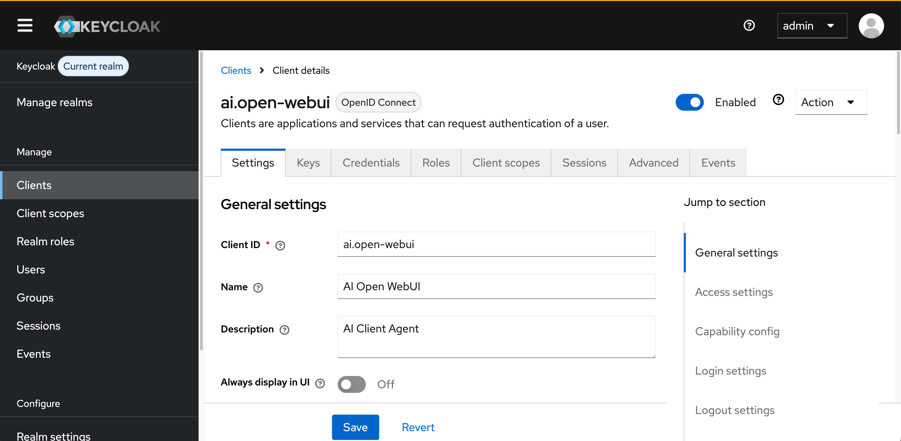
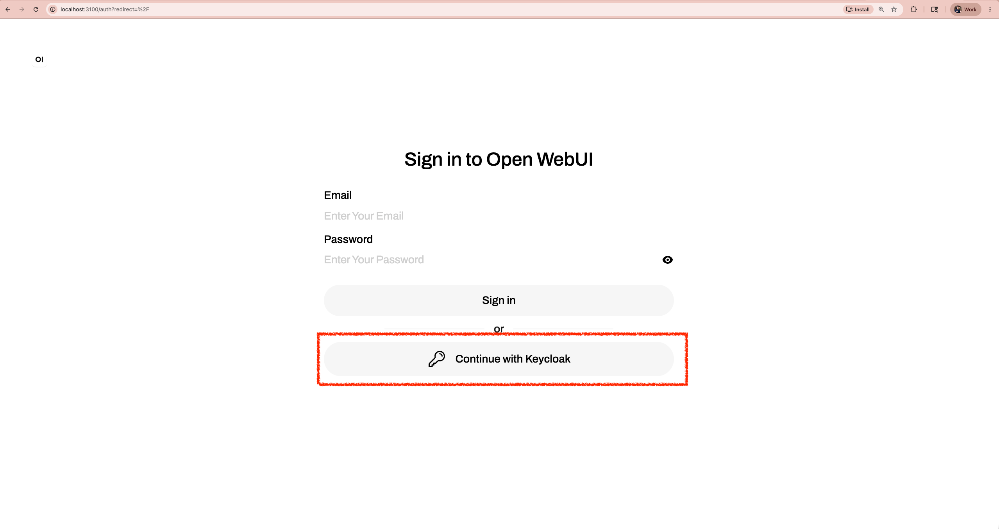
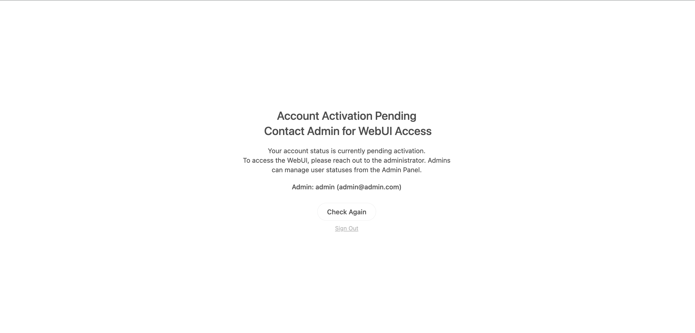
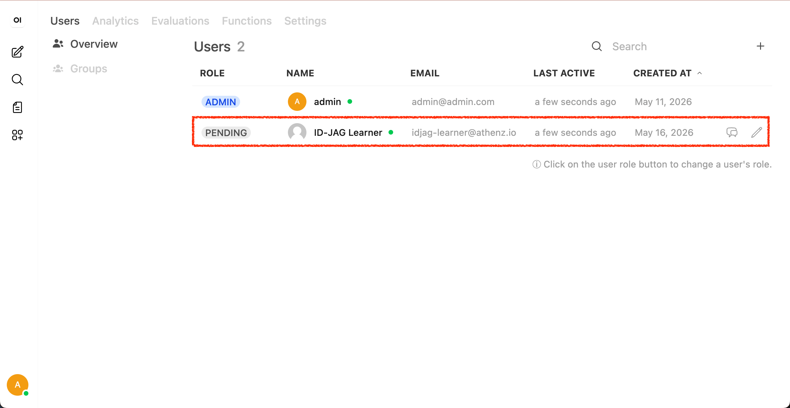
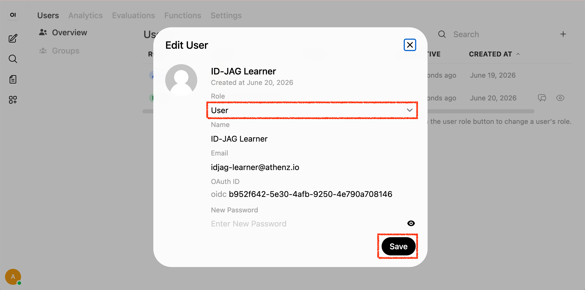
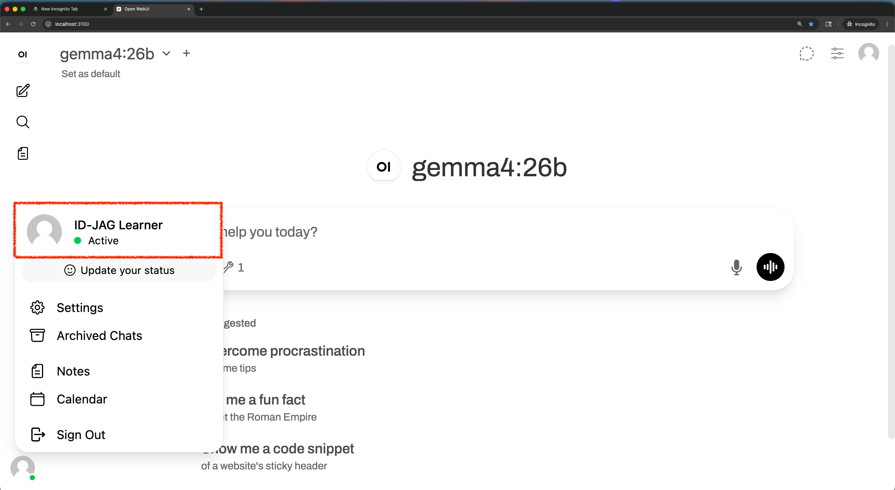
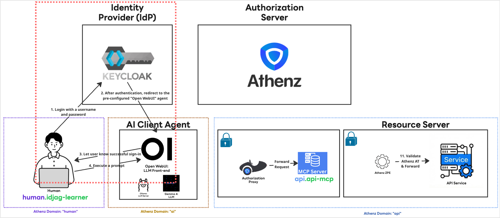

|                     Previous                     |              Current               |                              Next                              |
|:------------------------------------------------:|:----------------------------------:|:--------------------------------------------------------------:|
| [Protect MCP Server](./12-protect-mcp-server.md) | **Identity Provider — Open WebUI** | [Trusted Identity Provider](./14-trusted-identity-provider.md) |

# Identity Provider — Open WebUI

In this tutorial, we will configure [Keycloak](https://www.keycloak.org/) as an Identity Provider (IdP) for our AI Client Agent, enabling users to sign in with non-admin (standard) accounts.

<!-- TOC depthFrom:2 depthTo:2 -->

- [Deploy Keycloak in K8s](#deploy-keycloak-in-k8s)
- [Open Keycloak on Browser](#open-keycloak-on-browser)
- [Setup Client](#setup-client)
- [Setup User](#setup-user)
- [Setup id_token expiration date](#setup-id_token-expiration-date)
- [Add Keycloak Settings to Open WebUI](#add-keycloak-settings-to-open-webui)
- [Sign in as `idjag-learner`](#sign-in-as-idjag-learner)
- [Accept the account](#accept-the-account)
- [Return to the `idjag-learner` Browser](#return-to-the-idjag-learner-browser)
- [What's done?](#whats-done)
- [What's next?](#whats-next)

<!-- /TOC -->

## Deploy Keycloak in K8s

First of all, Create a namespace for Keycloak:

```sh
kubectl create ns idp
```

Then deploy the keycloak:

```sh
kubectl create deployment keycloak --image=quay.io/keycloak/keycloak:latest -n idp
```

Then, make sure that the keycloak has the correct ENV so that you can login as admin:

```sh
_keycloak_admin=$(./tools/config.sh keycloak admin)
_keycloak_admin_password=$(./tools/config.sh keycloak admin-password)

kubectl patch deploy keycloak -n idp --patch "$(cat <<EOF
spec:
  template:
    spec:
      containers:
        - name: keycloak
          imagePullPolicy: IfNotPresent
          args:
            - start-dev
          env:
            - name: KEYCLOAK_ADMIN
              value: "${_keycloak_admin}"
            - name: KEYCLOAK_ADMIN_PASSWORD
              value: "${_keycloak_admin_password}"
EOF
)"
```

In kubernetes, the data may be ephemeral so we need some kind of data storage to contain the IdP so that even if you restart your PC, and once you rerun the server your data is preserved.

First, create a very simple `pvc`:

```sh
cat <<EOF | kubectl apply -f -
apiVersion: v1
kind: PersistentVolumeClaim
metadata:
  name: keycloak-data-pvc
  namespace: idp
spec:
  accessModes: [ "ReadWriteOnce" ]
  resources:
    requests:
      storage: 1Gi
EOF
```

Mount the volume we just created:

```sh
kubectl patch deploy keycloak -n idp --patch "$(cat <<'EOF'
spec:
  template:
    spec:
      containers:
        - name: keycloak
          volumeMounts:
            - name: keycloak-data
              mountPath: /opt/keycloak/data
      volumes:
        - name: keycloak-data
          persistentVolumeClaim:
            claimName: keycloak-data-pvc
EOF
)"
```

And finally expose the deployment:

```sh
kubectl expose deployment keycloak --port=8080 -n idp
```

## Open Keycloak on Browser

> [!NOTE]
> If you are using `kind` and facing `ImagePullBackOff`, load the image manually:
>
> ```sh
> docker pull quay.io/keycloak/keycloak:latest
> kind load docker-image quay.io/keycloak/keycloak:latest
> ```
>
> On **Apple Silicon (arm64)** this may still fail with a content digest error. Use a single-platform build instead:
>
> ```sh
> docker buildx build --platform linux/arm64 --load --provenance=false \
>   -t keycloak:kind-load - <<'EOF'
> FROM quay.io/keycloak/keycloak:latest
> EOF
> kind load docker-image keycloak:kind-load
> ```
>
> Then patch the deployment to use `keycloak:kind-load` as the image.

Make sure the Keycloak pod is running before opening the browser:

```sh
kubectl wait -n idp \
  --for=condition=ready pod \
  --selector=app=keycloak \
  --timeout=180s
```

Open your browser and log in using admin for both the username `admin` and password `admin`:

```sh
_keycloak_port=$(./tools/port.sh keycloak)
./tools/open.sh "http://localhost:${_keycloak_port}"
```


## Setup Client

In Keycloak, a `Client` represents an application that requests authentication on behalf of a user. Since the service identity name of the AI client will be `ai.open-webui`, we will use that as the client name.

> [!NOTE]
> We use the default `master` realm for this tutorial.

Register the client with Keycloak:

```sh
_open_webui_port=$(./tools/port.sh open-webui)
./tools/keycloak/create-client.sh \
  ai.open-webui \
  "http://localhost:${_open_webui_port}/oauth/oidc/callback" \
  "http://localhost:${_open_webui_port}"
```

You should see a confirmation screen similar to this:



## Setup User

Let's create a human user account to represent you:

```sh
./tools/keycloak/create-user.sh \
  idjag-learner \
  idjag-learner@athenz.io \
  ID-JAG \
  Learner
```

## Setup id_token expiration date

> [!TIP]
> For this tutorial, it is okay to set the `id_token` lifespan to `4 hours`. In production, you must consider the appropriate lifespan based on your security requirements.

```sh
./tools/keycloak/set-token-lifespan.sh 14400
```

## Add Keycloak Settings to Open WebUI

The Open WebUI deployed in K8s does not yet have Keycloak configured. We need to patch the deployment with the required environment variables.

First, store the client secret as a K8s secret:

```sh
./tools/keycloak/create-client-k8s-secret.sh ai.open-webui ai keycloak-client-secret
```

Patch the Open WebUI deployment with Keycloak settings:

```sh
_open_webui_port=$(./tools/port.sh open-webui)
_keycloak_port=$(./tools/port.sh keycloak)

kubectl patch deploy open-webui -n ai --patch "$(cat <<EOF
spec:
  template:
    spec:
      containers:
        - name: open-webui
          env:
            - name: ENABLE_OAUTH_SIGNUP
              value: "true"
            - name: OAUTH_CLIENT_ID
              valueFrom:
                secretKeyRef:
                  name: keycloak-client-secret
                  key: client-id
            - name: OAUTH_CLIENT_SECRET
              valueFrom:
                secretKeyRef:
                  name: keycloak-client-secret
                  key: client-secret
            - name: OPENID_PROVIDER_URL
              value: "http://keycloak.idp:8080/realms/master/.well-known/openid-configuration"
            - name: OAUTH_PROVIDER_NAME
              value: "Keycloak"
            - name: OAUTH_SCOPES
              value: "openid email profile"
            - name: OPENID_REDIRECT_URI
              value: "http://localhost:${_open_webui_port}/oauth/oidc/callback"
        
        - name: keycloak-proxy
          image: alpine/socat
          command: ["socat"]
          args: ["tcp-listen:${_keycloak_port},fork,reuseaddr", "tcp-connect:keycloak.idp:8080"]
EOF
)"
```

> [!NOTE]
> `OPENID_PROVIDER_URL` uses the in-cluster Keycloak service address (`keycloak.idp:8080`) instead of `localhost`, so Open WebUI can reach Keycloak from inside the cluster.


## Sign in as `idjag-learner`

Wait for the Open WebUI pod to be ready after the patch:

```sh
kubectl rollout status deploy/open-webui -n ai
```

In this tutorial, when you login to Open WebUI with the non-admin account (i.e. `idjag-learner`), you will open a different browser or incognito mode.

```sh
_open_webui_port=$(./tools/port.sh open-webui)
./tools/open.sh "http://localhost:${_open_webui_port}" incognito=true
```

You will see a new login panel with a **Continue with Keycloak** button:



Click it, and you will be prompted to log in. Use the credentials we created.

Then you will be prompted to add member

- `Username`: `idjag-learner`
- `Password`: `password`



## Accept the account

Return to the browser where you are logged in as the `admin` user.

```sh
_open_webui_port=$(./tools/port.sh open-webui)
./tools/open.sh "http://localhost:${_open_webui_port}"
```

Navigate to `http://localhost:${_open_webui_port}/admin/users/overview`



Click `Edit User` for the `idjag-learner`, then change `Pending` to `User`, and click **Save**.



## Return to the `idjag-learner` Browser

Switch back to the browser window for `idjag-learner` and refresh the page.

```sh
_open_webui_port=$(./tools/port.sh open-webui)
./tools/open.sh "http://localhost:${_open_webui_port}" incognito=true
```

You should now be successfully logged into the interface.



## What's done?

We have installed Keycloak (Red dotted box) locally and configured it as an identity provider for our AI Client Agent. This way, non-admin user can sign in with his/her own account:



## What's next?

We have let our AI Client agent to trust Keycloak as an IdP. But we have not yet configured Authorization Server to trust Keycloak as IdP. In the next tutorial, we will set up our Authorization Server to trust Keycloak.

Next: [Trusted Identity Provider](./14-trusted-identity-provider.md)
