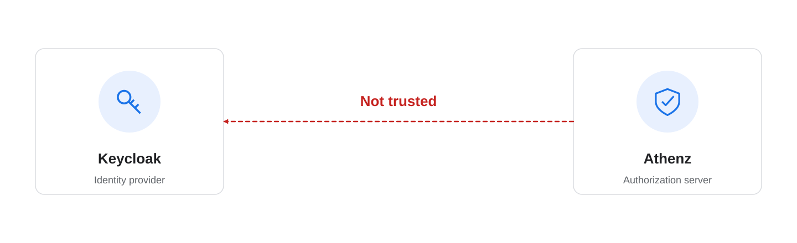
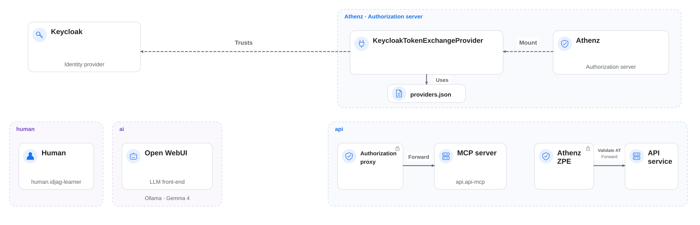

|                    Previous                    |                  Current                   |                      Next                      |
|:----------------------------------------------:|:------------------------------------------:|:----------------------------------------------:|
| [Identity Provider](./12-identity-provider.md) | **Trusted Identity Provider — Open WebUI** | [AI Client Gateway](./14-ai-client-gateway.md) |

# Trusted Identity Provider — Open WebUI

As an Authorization Server, Athenz cannot accept ID tokens from just any Identity Provider (IdP). An Athenz administrator must explicitly configure which IdPs it trusts.

In the previous chapter, you deployed Keycloak, but Athenz does not yet trust it. In this chapter, you will configure Athenz to trust Keycloak and validate its ID tokens so they can be exchanged for ID-JAGs.

<!-- TOC depthFrom:2 depthTo:2 -->

- [Understand the Trust Configuration](#understand-the-trust-configuration)
- [Install Plugin into the ZTS Server](#install-plugin-into-the-zts-server)
- [Connect Keycloak with the Plugin](#connect-keycloak-with-the-plugin)
- [Configure ZTS to Load the Plugin](#configure-zts-to-load-the-plugin)
- [Review the Result](#review-the-result)
- [Next Steps](#next-steps)

<!-- /TOC -->

<a id="learn-what-to-do"></a>

## Understand the Trust Configuration

This deployment is not yet configured to trust Keycloak. To exchange a Keycloak ID token for an ID-JAG, you need to:

1. Install the Keycloak token exchange provider plugin.
2. Configure the issuer and signing-key endpoint.
3. Configure ZTS to load the provider settings.



## Install Plugin into the ZTS Server

Mount the Keycloak token exchange provider JAR into the ZTS server:

```sh
kubectl patch deployment athenz-zts-server \
  -n athenz \
  --patch-file components/keycloak_token_exchange_provider/hack/static/zts-plugin-jar-mount-patch.yaml
```

```sh
# deployment.apps/athenz-zts-server patched
```

Wait for the rollout:

```sh
kubectl rollout status deployment/athenz-zts-server -n athenz
```

```sh
# Waiting for deployment "athenz-zts-server" rollout to finish: 0 of 1 updated replicas are available...
# deployment "athenz-zts-server" successfully rolled out
```

> [!NOTE]
> This command applies the following patch YAML: [zts-plugin-jar-mount-patch.yaml](../../components/keycloak_token_exchange_provider/hack/static/zts-plugin-jar-mount-patch.yaml)

Verify that the JAR file has been successfully mounted inside the Athenz server container:

```sh
kubectl -n athenz exec deployment/athenz-zts-server \
  -c athenz-zts-server \
  -- sh -c "ls -al /opt/athenz/zts/lib/jars | grep keycloak"
```

```sh
# -rw-r--r-- 1 root   root      3237 May  1 14:26 keycloak-token-provider.jar
```

We have now mounted the `KeycloakTokenExchangeProvider` plugin JAR in the ZTS server:


## Connect Keycloak with the Plugin

Although the plugin is installed, it doesn't automatically know where our IdP is located. We need to provide it with the IdP's connection details. In Athenz, this is done by creating a `providers.json` file. This file links the IdP's endpoints to the plugin's Java class name (`com.mlajkim.athenz.KeycloakTokenExchangeProvider`).

First, let's create this configuration file as a Kubernetes ConfigMap:

```sh
cat <<EOF | kubectl apply -f -
apiVersion: v1
kind: ConfigMap
metadata:
  name: zts-providers-config
  namespace: athenz
data:
  providers.json: |
    [
      {
        "issuerUri": "http://localhost:34443/realms/master",
        "jwksUri": "http://keycloak.idp:8080/realms/master/protocol/openid-connect/certs",
        "providerClassName": "com.mlajkim.athenz.KeycloakTokenExchangeProvider"
      }
    ]
EOF
```

```sh
# configmap/zts-providers-config created
```

<a id="verify-successfully-installed-plugin"></a>

## Configure ZTS to Load the Plugin

Verify that the ZTS server has access to the `jwksUri`:

```sh
kubectl -n athenz exec deployment/athenz-zts-server -c athenz-zts-server -- sh -c "curl -k http://keycloak.idp:8080/realms/master/protocol/openid-connect/certs | jq ."
```

The response should contain a nonempty `keys` array. This example omits the remaining key fields; key IDs and the number of keys vary by environment:

```sh
# {
#   "keys": [
#     {
#       "kid": "<key-id>",
#       ...
#     }
#   ]
# }
```

Next, patch the Athenz ZTS deployment to mount this configuration map:

```sh
kubectl patch deployment athenz-zts-server \
  -n athenz \
  --patch-file components/keycloak_token_exchange_provider/hack/static/zts-providers-config-patch.yaml
```

```sh
# deployment.apps/athenz-zts-server patched
```

Wait a few seconds, then verify that the file is present in the container:

```sh
kubectl -n athenz \
  exec deployment/athenz-zts-server \
  -c athenz-zts-server \
  -- sh -c "cat /opt/athenz/zts/conf/providers.json"
```

```sh
# [
#   {
#     "issuerUri": "http://localhost:34443/realms/master",
#     "jwksUri": "http://keycloak.idp:8080/realms/master/protocol/openid-connect/certs",
#     "providerClassName": "com.mlajkim.athenz.KeycloakTokenExchangeProvider"
#   }
# ]
```

Set `athenz.zts.oauth_provider_config_file` in the ZTS ConfigMap so ZTS loads the mounted provider configuration.

We need to append the `athenz.zts.oauth_provider_config_file` property to the ZTS configuration map, so it looks like this:


Edit the ConfigMap with Vim:

1. Run the following command in your terminal:

```sh
KUBE_EDITOR=vim kubectl edit configmap athenz-zts-conf -n athenz
```

2. Type `/zts.prop` and hit **Enter** to search for the properties section.
1. Press the `o` key to open a new line below the cursor and enter Insert mode.
1. Press **Space** four times to indent the line by four spaces (if Vim adds indentation automatically, adjust it to four spaces in total)
1. Paste the following configuration line (using `Cmd + V` on Mac or `Ctrl + V` on Linux/Windows):

```sh
athenz.zts.oauth_provider_config_file=/opt/athenz/zts/conf/providers.json
```

6. Press the **Esc key** to exit Insert mode.
1. Type `:wq!` and hit **Enter** to save and close the file.

If successful, you will see the following confirmation log in your terminal:

```sh
# configmap/athenz-zts-conf edited
```

Finally, restart the ZTS server so it can load the new configuration:

```sh
kubectl -n athenz rollout restart deployment athenz-zts-server
```

```sh
# deployment.apps/athenz-zts-server restarted
```

Verify the configuration is loaded successfully:

```sh
kubectl logs -n athenz deployment/athenz-zts-server -c athenz-zts-server | grep "oauth_provider_config_file"
```

```sh
# 12:34:56.233 [main] INFO  c.y.a.c.s.util.config.ConfigManager - configuration "athenz.zts.oauth_provider_config_file" created
```

Please note that the plugin we installed automatically formats the `preferred_username` claim from the OAuth token into the Athenz principal format `human.[preferred_username]`. You can customize the plugin's source code if your environment requires a different mapping behavior.

<a id="review-summary-of-changes"></a>

## Review the Result

We installed the `KeycloakTokenExchangeProvider` plugin, which takes the ID token generated by Keycloak, validates its claims, and securely returns the authenticated identity to Athenz:



<a id="whats-next"></a>

## Next Steps

Athenz now trusts Keycloak ID tokens. In the next chapter, you will deploy AI Client Gateway and configure Open WebUI to send tool requests through it.

Next: [AI Client Gateway](./14-ai-client-gateway.md)
