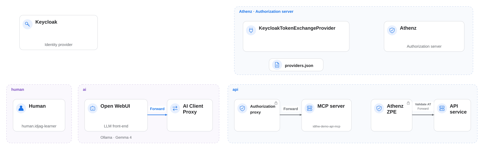
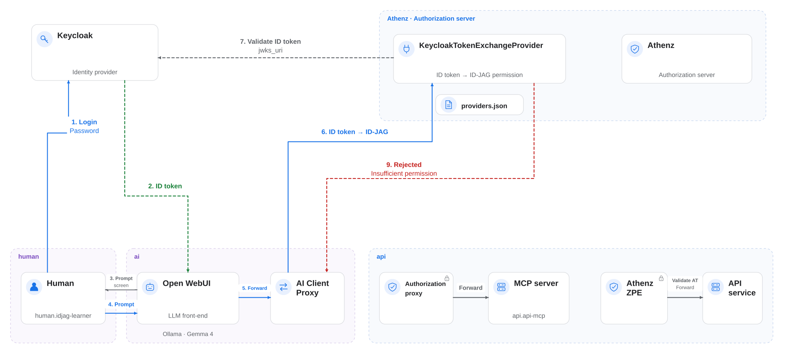

|                            Previous                            |              Current               |           Next           |
|:--------------------------------------------------------------:|:----------------------------------:|:------------------------:|
| [Trusted Identity Provider](./13-trusted-identity-provider.md) | **AI Client Gateway — Open WebUI** | [ID-JAG](./15-id-jag.md) |

# AI Client Gateway — Open WebUI

Deploy AI Client Gateway between Open WebUI and the protected MCP service with the following steps:

<!-- TOC depthFrom:2 depthTo:2 -->

- [Understand ID-JAG](#understand-id-jag)
- [Understand How the ID-JAG Specification Helps Us](#understand-how-the-id-jag-specification-helps-us)
- [Deploy AI Client Gateway in K8s](#deploy-ai-client-gateway-in-k8s)
- [Check the Logs](#check-the-logs)
- [Generate the Required Certificates](#generate-the-required-certificates)
- [Mount the Secret](#mount-the-secret)
- [Review the Result](#review-the-result)
- [Modify the Tool Target](#modify-the-tool-target)
- [Verify](#verify)
- [Understand the Result](#understand-the-result)
- [Next Steps](#next-steps)

<!-- /TOC -->

<a id="learn-about-id-jag"></a>

## Understand ID-JAG

ID-JAG (Identity Assertion JWT Authorization Grant) is an IETF draft specification used in Cross-App Access. It lets a client use an ID token to request authorization for API access on behalf of the signed-in user.

You can learn more about the specifics here:

- [Identity Assertion JWT Authorization Grant - IETF](https://datatracker.ietf.org/doc/draft-ietf-oauth-identity-assertion-authz-grant/)
- [Why ID-JAG is the future of AI agent security - LY Corp. Tech Blog](https://techblog.lycorp.co.jp/en/20260417a)

## Understand How the ID-JAG Specification Helps Us

Keycloak issues an ID token when you sign in. The gateway uses it in two exchanges:

1. Exchange the ID token for an ID-JAG addressed to the ZTS authorization server URL, `https://athenz-zts-server.athenz:4443/zts/v1`.
2. Exchange that ID-JAG for an access token with audience `mcp` and both the MCP and required API scopes.

`ai.open-webui` is the gateway's service identity, not the ID-JAG audience. The gateway obtains tokens for the signed-in user, so you no longer paste an Athenz access token into the tool settings. ZTS still checks the user's roles and the gateway's exchange permissions.

## Deploy AI Client Gateway in K8s

The AI Client Gateway belongs in the `ai` namespace alongside Open WebUI — it is part of the AI-side infrastructure, not the human-side client.

Deploy the AI Client Gateway:

```sh
kubectl create deploy ai-client-gateway -n ai \
  --image=ghcr.io/mlajkim/ai-client-gateway:latest
```

Configure the gateway to forward requests to the MCP service:

```yaml
kubectl patch deploy ai-client-gateway -n ai --patch "$(cat <<'EOF'
spec:
  template:
    spec:
      containers:
        - name: ai-client-gateway
          imagePullPolicy: Always
          env:
            - name: UPSTREAM_BASE_URL
              value: "http://mcp.mcp:8081"
            - name: ATHENZ_ACCESS_TOKEN_AUDIENCE
              value: "mcp"
            - name: ZTS_URL
              value: "https://athenz-zts-server.athenz:4443/zts/v1"
EOF
)"
```

`ATHENZ_ACCESS_TOKEN_AUDIENCE=mcp` selects the recipient of the access token carrying MCP and API scopes. The ID-JAG audience remains the ZTS URL.

Expose the deployment so it can be accessed:

```sh
kubectl expose deploy ai-client-gateway -n ai --port 3101 --name ai-client-gateway
```

## Check the Logs

Let's check if the AI Client Gateway started successfully:

```sh
kubectl logs deploy/ai-client-gateway -n ai
```

You will likely encounter an error similar to this:

```sh
# ...
# Error: ENOENT: no such file or directory, open '...certs/ai-client-gateway.crt'
# ...
```

The gateway requires its X.509 certificate and private key to authenticate to ZTS. The next steps create and mount those files.

## Generate the Required Certificates

Create the `ai.open-webui` service identity and its certificate for the gateway.

First, create a directory and generate the RSA key pair:

```sh
mkdir -p ./components/ai_client_gateway/certs
./tools/athenz/create-private-key.sh "./components/ai_client_gateway/certs/ai-client-gateway"
```

```sh
#   ·  Generating RSA key pair for: ./components/ai_client_gateway/certs/ai-client-gateway...
#   ✔  Keys generated: ./components/ai_client_gateway/certs/ai-client-gateway.key, ./components/ai_client_gateway/certs/ai-client-gateway.public.key
```

Next, we will create a Top-Level Domain (TLD) named `ai` since we haven't created it yet:

```sh
./tools/athenz/create-tld.sh "ai"
```

```sh
#   ·  Creating TLD: ai...
#   ✔  TLD created: ai
```

Now, register the service open-webui under the `ai` domain using the public key we just generated:

```sh
./tools/athenz/create-service.sh "ai" "open-webui" "./components/ai_client_gateway/certs/ai-client-gateway.public.key"
```

```sh
#   ·  Registering Service: ai.open-webui...
#   ✔  Service registered: ai.open-webui
```

Enable the certificate provider for this service:

```sh
./tools/athenz/enable-cert-provider.sh "ai" "open-webui"
```

```sh
#   ·  Enabling ZTS Certificate Provider for ai.open-webui...
#   ✔  ZTS Certificate Provider enabled for ai.open-webui
```

Generate the X.509 Certificate:

```sh
./tools/athenz/fetch-cert.sh "ai" "open-webui" "./components/ai_client_gateway/certs/ai-client-gateway.key" "v1"
```

```sh
#   ·  Fetching X.509 Certificate for ai.open-webui...
#   ✔  Certificate saved to: ./components/ai_client_gateway/certs/ai-client-gateway.crt
```

Finally, the `ai_client_gateway` requires the Athenz CA certificate. Copy it from the `athenz_dist/certs` directory:

```sh
cp ./athenz_dist/certs/ca.cert.pem ./components/ai_client_gateway/certs/ca.crt
```

Verify that all necessary certificates have been created:

```sh
ls -al ./components/ai_client_gateway/certs/
```

```sh
# total 24
# drwxr-xr-x   5 mlajkim  staff   160 May 2 16:47 .
# drwxr-xr-x  13 mlajkim  staff   416 May 2 16:43 ..
# -rw-r--r--   1 mlajkim  staff  1834 May 2 16:49 ca.crt
# -rw-r--r--   1 mlajkim  staff  1716 May 2 16:47 ai-client-gateway.crt
# -rw-------   1 mlajkim  staff  1675 May 2 16:43 ai-client-gateway.key
# -rw-r--r--   1 mlajkim  staff   451 May 2 16:43 ai-client-gateway.public.key
```

## Mount the Secret

Now, create a Kubernetes secret using the generated certificates:

```sh
kubectl -n ai delete secret ai-client-gateway-cert --ignore-not-found
kubectl -n ai create secret generic ai-client-gateway-cert \
  --from-file=ai-client-gateway.crt=./components/ai_client_gateway/certs/ai-client-gateway.crt \
  --from-file=ai-client-gateway.key=./components/ai_client_gateway/certs/ai-client-gateway.key \
  --from-file=ca.crt=./components/ai_client_gateway/certs/ca.crt
```

```sh
#   ✔  Secret created: ai/ai-client-gateway-cert
```

Mount the Secret to the Deployment:

```yaml
kubectl patch deploy ai-client-gateway -n ai --patch "$(cat <<'EOF'
spec:
  template:
    spec:
      containers:
        - name: ai-client-gateway
          volumeMounts:
            - name: certs
              mountPath: /app/certs
              readOnly: true
      volumes:
        - name: certs
          secret:
            secretName: ai-client-gateway-cert
EOF
)"
```

Check the logs again to ensure it started successfully:

```sh
kubectl logs deploy/ai-client-gateway -n ai
```

```sh
# 🚀 OpenWebUI OpenAPI Gateway listening on 0.0.0.0:3101
# 🔗 Upstream API: http://mcp.mcp:8081
# 🌍 Public Base URL: http://ai-client-gateway.ai:3101
# 🔑 Athenz ZTS Endpoint: https://athenz-zts-server.athenz:4443/zts/v1
```

<a id="whats-done"></a>

## Review the Result

AI Client Gateway is now deployed. Next, configure Open WebUI to send tool requests through it:



## Modify the Tool Target

Instead of pointing the Open WebUI directly to the MCP server, we will route it through our new `ai_client_gateway`.

Open the Open WebUI in your browser:

```sh
_open_webui_keycloak_port=54443
open http://localhost:$_open_webui_keycloak_port
```

1. Log in to Open WebUI using an admin account (required to modify integrations).
1. Navigate to `User Icon` > `Admin Panel` > `Settings` > `Integrations`.
1. Click the configuration icon for the API MCP Server.
1. Make the following changes:
  - Change the tool server URL to `http://ai-client-gateway.ai:3101`.
  - Set **Auth** to **OAuth**.


## Verify

Follow the steps below to verify the setup.

Login as `idjag-learner`:

```sh
_open_webui_port=$(./tools/port.sh open-webui)
./tools/open.sh "http://localhost:${_open_webui_port}" incognito=true
```


Now, test the setup by asking the AI agent:

```
Get docs!
```

The request should fail because the gateway does not yet have ID-JAG exchange permission:


<a id="whats-happened"></a>

## Understand the Result

The user is signed in, and the gateway authenticates to ZTS as `ai.open-webui`. ZTS rejects the exchange because that service lacks `zts.jag_exchange` permission for the requested MCP and API roles.



<a id="whats-next"></a>

## Next Steps

Sign-in succeeds, but Athenz rejects the gateway's ID-JAG request. In the next chapter, you will grant the gateway the required exchange permissions and retry the document request.

Next: [ID-JAG](./15-id-jag.md)
