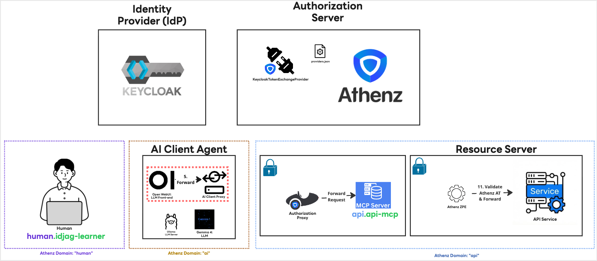
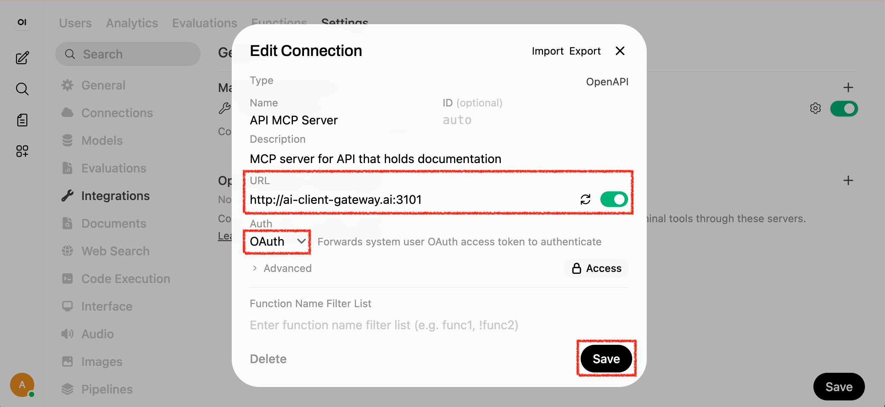
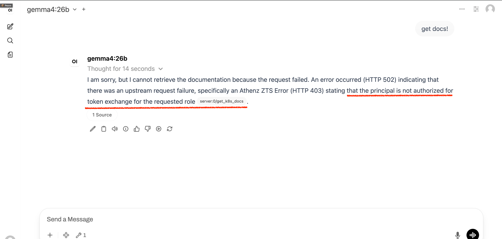
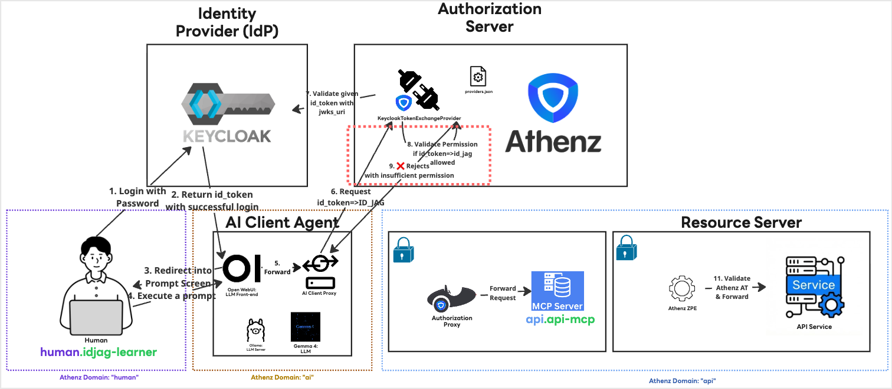

|                            Previous                            |              Current               |           Next           |
|:--------------------------------------------------------------:|:----------------------------------:|:------------------------:|
| [Trusted Identity Provider](./14-trusted-identity-provider.md) | **AI Client Gateway — Open WebUI** | [ID-JAG](./16-id-jag.md) |

# AI Client Gateway — Open WebUI

In this tutorial, we will deploy the `AI Client Gateway`, which acts as an intermediary layer between:

- Open WebUI (The AI Client Agent)
- MCP Server (Authorization Proxy)

with the following steps:

<!-- TOC depthFrom:2 depthTo:2 -->

- [Learn about ID-JAG?](#learn-about-id-jag)
- [Understand How the ID-JAG Specification Helps Us](#understand-how-the-id-jag-specification-helps-us)
- [Deploy AI Client Gateway in K8s](#deploy-ai-client-gateway-in-k8s)
- [Check the Logs](#check-the-logs)
- [Generate the Required Certificates](#generate-the-required-certificates)
- [Mount the Secret](#mount-the-secret)
- [What's done?](#whats-done)
- [Modify the Tool Target](#modify-the-tool-target)
- [Verify](#verify)
- [What's happened?](#whats-happened)
- [What's next?](#whats-next)

<!-- /TOC -->

## Learn about ID-JAG?

ID-JAG (Identity Assertion JWT Authorization Grant) is a proposed authorization standard, primarily championed by companies like Okta. It extends the trust model of Single Sign-On (SSO) into the realm of API access. In short, it applies the trust established with an Identity Provider (IdP) during SSO to secure API access between applications, or between an AI agent and a backend service.

You can learn more about the specifics here:

- [Identity Assertion JWT Authorization Grant - IETF](https://datatracker.ietf.org/doc/draft-ietf-oauth-identity-assertion-authz-grant/)
- [Why ID-JAG is the future of AI agent security - LY Corp. Tech Blog](https://techblog.lycorp.co.jp/en/20260417a)

## Understand How the ID-JAG Specification Helps Us

When you log in via `Keycloak`, it generates an ID Token that represents your identity. Through the ID-JAG process, we can dynamically handle permissions without manual token management. Specifically, we can:

1. Exchange the initial ID Token for an ID-JAG token scoped to a new audience, `ai.open-webui`.
1. Fetch an Access Token with the audience `api` (and its required scopes) using the `ai.open-webui` ID-JAG token.

This means we no longer have to manually insert an Access Token for each tool in the UI. Furthermore, tools can be securely shared among all users in the AI Client Agent without any manual intervention.

## Deploy AI Client Gateway in K8s

The AI Client Gateway belongs in the `ai` namespace alongside Open WebUI — it is part of the AI-side infrastructure, not the human-side client.

Deploy the AI Client Gateway:

```sh
kubectl create deploy ai-client-gateway -n ai \
  --image=ghcr.io/mlajkim/ai-client-gateway:latest
```

Configure the `ai-client-gateway` to watch the MCP server:

```yaml
kubectl patch deploy ai-client-gateway -n ai --patch "$(cat <<'EOF'
spec:
  template:
    spec:
      containers:
        - name: ai-client-gateway
          imagePullPolicy: Always
          env:
            - name: UPSTREAM_BASE_URL
              value: "http://k8s-doc-server.mcp-hub:8081"
            - name: ZTS_URL
              value: "https://athenz-zts-server.athenz:4443/zts/v1"
EOF
)"
```

Expose the deployment so it can be accessed:

```sh
kubectl expose deploy ai-client-gateway -n ai --port 3101 --name ai-client-gateway
```

## Check the Logs

Let's check if the AI Client Gateway started successfully:

```sh
kubectl logs deploy/ai-client-gateway -n ai
```

You will likely encounter an error similar to this:

```sh
# Error: ENOENT: no such file or directory, open '...certs/ai-client-gateway.crt'
#     at Object.openSync (node:fs:563:18)
#     at Object.readFileSync (node:fs:447:35)
```

This happens because the AI Client Gateway requires a TLS certificate to connect to Athenz Server securely.

## Generate the Required Certificates

Let's generate the necessary keys and certificate that represents `ai_client_gateway` service.

First, create a directory and generate the RSA key pair:

```sh
mkdir -p ./ai_client_gateway/certs
./tools/athenz/create-private-key.sh "./ai_client_gateway/certs/ai-client-gateway"
```

```sh
#   ·  Generating RSA key pair for: ./ai_client_gateway/certs/ai-client-gateway...
#   ✔  Keys generated: ./ai_client_gateway/certs/ai-client-gateway.key, ./ai_client_gateway/certs/ai-client-gateway.public.key
```

Next, we will create a Top-Level Domain (TLD) named `ai` since we haven't created it yet:

```sh
./tools/athenz/create-tld.sh "ai"
```

```sh
#   ·  Creating TLD: ai...
#   ✔  TLD created: ai
```

Now, register the service open-webui under the `ai` domain using the public key we just generated:

```sh
./tools/athenz/create-service.sh "ai" "open-webui" "./ai_client_gateway/certs/ai-client-gateway.public.key"
```

```sh
#   ·  Registering Service: ai.open-webui...
#   ✔  Service registered: ai.open-webui
```

Enable the certificate provider for this service:

```sh
./tools/athenz/enable-cert-provider.sh "ai" "open-webui"
```

```sh
#   ·  Enabling ZTS Certificate Provider for ai.open-webui...
#   ✔  ZTS Certificate Provider enabled for ai.open-webui
```

Generate the X.509 Certificate:

```sh
./tools/athenz/fetch-cert.sh "ai" "open-webui" "./ai_client_gateway/certs/ai-client-gateway.key" "v1"
```

```sh
#   ·  Fetching X.509 Certificate for ai.open-webui...
#   ✔  Certificate saved to: ./ai_client_gateway/certs/ai-client-gateway.crt
```

Finally, the `ai_client_gateway` requires the Athenz CA certificate. Copy it from the `athenz_dist/certs` directory:

```sh
cp ./athenz_dist/certs/ca.cert.pem ./ai_client_gateway/certs/ca.crt
```

Verify that all necessary certificates have been created:

```sh
ls -al ./ai_client_gateway/certs/
```

```sh
# total 24
# drwxr-xr-x   5 mlajkim  staff   160 May 2 16:47 .
# drwxr-xr-x  13 mlajkim  staff   416 May 2 16:43 ..
# -rw-r--r--   1 mlajkim  staff  1834 May 2 16:49 ca.crt
# -rw-r--r--   1 mlajkim  staff  1716 May 2 16:47 ai-client-gateway.crt
# -rw-------   1 mlajkim  staff  1675 May 2 16:43 ai-client-gateway.key
# -rw-r--r--   1 mlajkim  staff   451 May 2 16:43 ai-client-gateway.public.key
```

## Mount the Secret

Now, create a Kubernetes secret using the generated certificates:

```sh
kubectl -n ai delete secret ai-client-gateway-cert --ignore-not-found
kubectl -n ai create secret generic ai-client-gateway-cert \
  --from-file=ai-client-gateway.crt=./ai_client_gateway/certs/ai-client-gateway.crt \
  --from-file=ai-client-gateway.key=./ai_client_gateway/certs/ai-client-gateway.key \
  --from-file=ca.crt=./ai_client_gateway/certs/ca.crt
```

```sh
#   ✔  Secret created: ai/ai-client-gateway-cert
```

Mount the Secret to the Deployment:

```yaml
kubectl patch deploy ai-client-gateway -n ai --patch "$(cat <<'EOF'
spec:
  template:
    spec:
      containers:
        - name: ai-client-gateway
          volumeMounts:
            - name: certs
              mountPath: /app/certs
              readOnly: true
      volumes:
        - name: certs
          secret:
            secretName: ai-client-gateway-cert
EOF
)"
```

Check the logs again to ensure it started successfully:

```sh
kubectl logs deploy/ai-client-gateway -n ai
```

```sh
# 🚀 OpenWebUI OpenAPI Gateway listening on 0.0.0.0:3101
# 🔗 Upstream API: http://k8s-doc-server.mcp-hub:8081
# 🌍 Public Base URL: http://ai-client-gateway.ai:3101
# 🔑 Athenz ZTS Endpoint: https://athenz-zts-server.athenz:4443/zts/v1
```

## What's done?

We just installed `AI Client Agent` (Highlighted in Red) which Open WebUI can talk to as a tool :



## Modify the Tool Target

Instead of pointing the Open WebUI directly to the MCP server, we will route it through our new `ai_client_gateway`.

Open the Open WebUI in your browser:

```sh
_open_webui_keycloak_port=54443
open http://localhost:$_open_webui_keycloak_port
```

1. Log in to Open WebUI using an admin account (required to modify integrations).
1. Navigate to `User Icon` > `Admin Panel` > `Settings` > `Integrations`.
1. Click the configuration icon for the API MCP Server.
1. Make the following changes:
  - Change the MCP Authorization Server URL to the proxy URL: http://ai-client-gateway.ai:3101
  - Change the `Auth` to `Oauth`



## Verify

Follow the steps below to verify the setup.

Login as `idjag-learner`:

```sh
_open_webui_port=$(./tools/port.sh open-webui)
./tools/open.sh "http://localhost:${_open_webui_port}" incognito=true
```


Now, test the setup by asking the AI Agent:

```
Get docs!
```

The request will deliberately fail as following:



## What's happened?

We created a certificate for `ai.open-webui`, but this service does not yet have the necessary permissions in Athenz to exchange your Keycloak ID Token into an ID-JAG token (indicated by the red box in your architecture diagram). Because the gateway cannot assert your identity, the request is denied.



## What's next?

In the next tutorial, we will fix this permission error by granting the proper token exchange policies, allowing us to successfully execute the end-to-end prompt.

Next: [ID-JAG](./16-id-jag.md)
