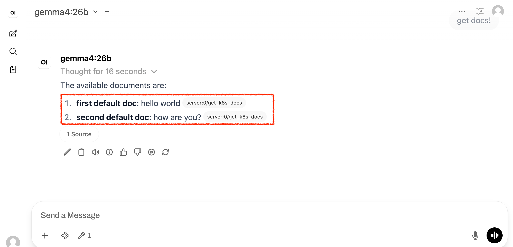
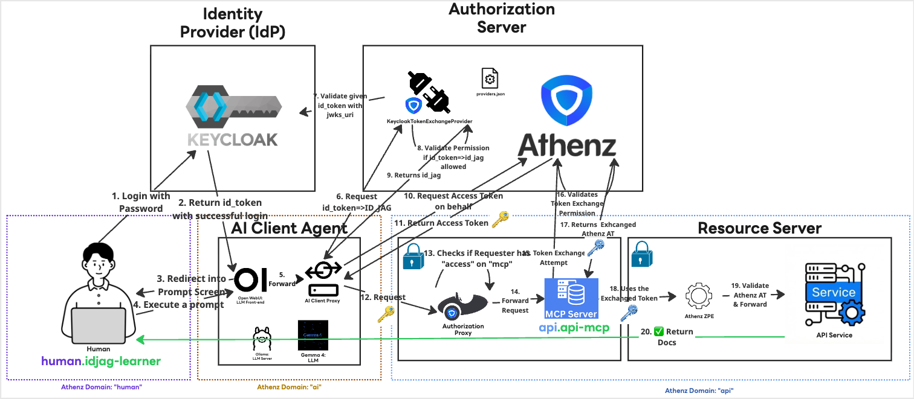

|                    Previous                    |         Current         |                      Next                      |
|:----------------------------------------------:|:-----------------------:|:----------------------------------------------:|
| [AI Client Gateway](./15-ai-client-gateway.md) | **ID-JAG — Open WebUI** | *None: You are at the end of the tutorial! 🎉* |

# ID-JAG — Open WebUI

In this tutorial, we will finally resolve the authorization issues encountered in the previous step. We will configure the proper token exchange policies in Athenz, allowing the AI Client Gateway to successfully exchange your Keycloak ID Token for an ID-JAG token. Once these permissions are in place, we will execute the end-to-end prompt to confirm the integration works seamlessly.

<!-- TOC depthFrom:2 depthTo:2 -->

- [Grant Permissions to `ai.open-webui`](#grant-permissions-to-aiopen-webui)
- [Verify](#verify)
- [What's happened?](#whats-happened)
- [Finally](#finally)

<!-- /TOC -->

## Grant Permissions to `ai.open-webui`

Because `ai.open-webui` acts on behalf of our user (`human.idjag-learner`), we need to explicitly authorize it to exchange the login ID Token for an ID-JAG token. We must also grant it the necessary access within the `api` domain.

First, create a role under domain `api`:

```sh
./tools/athenz/create-role.sh "api" "token-exchangable-ai-agents"
```

In Athenz, you must allow the `zts.jag_exchange` action on the target roles. First, attach this policy for `role.docs-getter`:
The `ai.open-webui` (AI Agent) also needs permission to perform a token exchange into the `api:role.mcp-accessor` role. Add that policy as well:


```sh
./tools/athenz/add-policy.sh "api" "token-exchangable-ai-agents" "zts.jag_exchange" "role.docs-getter"
./tools/athenz/add-policy.sh "api" "token-exchangable-ai-agents" "zts.jag_exchange" "role.mcp-accessor"
```

```sh
#   ·  Creating Policy: api:policy.zts.jag_exchange...
#   ✔  Policy created: api:policy.zts.jag_exchange
```


```sh
./tools/athenz/add-policy.sh "api" "token-exchangable-ai-agents" "zts.jag_exchange" "role.mcp-accessor"
```

Next, add the `ai.open-webui` as a member of this new token exchange role:

```sh
./tools/athenz/add-role-member.sh "api" "token-exchangable-ai-agents" "ai.open-webui"
```

```sh
#   ·  Adding Member ai.open-webui to Role: api:role.token-exchangable-ai-agents...
#   ✔  ai.open-webui  →  api:role.token-exchangable-ai-agents
```

> [!NOTE]
> Notice that the `ai.open-webui` client agent does not require direct permissions to fetch an Access Token against `api:role.docs-getter` or `api:role.mcp-accessor`. It only needs the `zts.jag_exchange` permission to perform the token exchange on the user's behalf.

## Verify

Follow the steps below to verify the setup.

Now, return to the AI Agent UI and test the exact same prompt that failed previously:

```
get docs!
```



## What's happened?

Congratulations! 🎉 You have completed the full ID-JAG tutorial.

Here is a brief overview of how it all worked:

1. You signed in to Open WebUI as `idjag-learner` via Keycloak, which issued an **ID Token**.
2. The **AI Client Gateway** intercepted the request and exchanged the ID Token for an **ID-JAG token** via Athenz ZTS.
3. Athenz ZTS validated the token against the `token-exchangable-ai-agents` role and issued a scoped **Access Token**.
4. The gateway forwarded the request to the **MCP Server** with the Access Token attached.
5. The **MCP Authorization Proxy** validated the token and forwarded it to the MCP Server.
6. The MCP Server performed its own token exchange to call the **API Server**, which returned the data.

At every hop, the Principle of Least Privilege was enforced — each component only held the minimum permissions it needed.



## Finally

Thank you for following along. Hope it was helpful.

If you found this tutorial helpful, please consider giving the repository a ⭐ on GitHub!

[](https://github.com/mlajkim/id-jag-the-hard-way)

If you run into any issues or have questions, feel free to [open an issue](https://github.com/mlajkim/id-jag-the-hard-way/issues).
